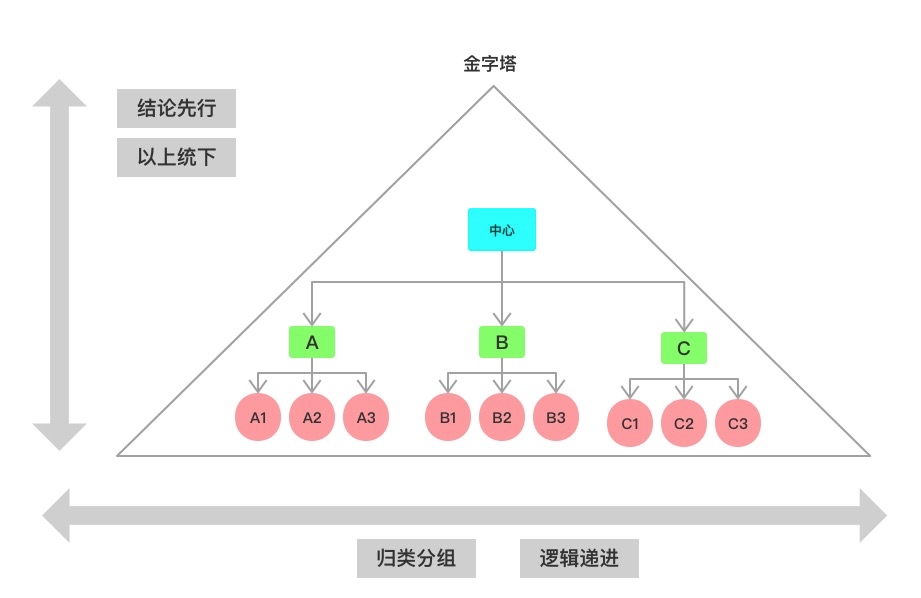
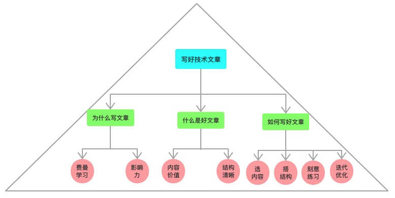

如何写出高质量的技术文章
======

很多同学都很好奇，怎样才能写出一篇高质量的文章？

我们邀请了2020 ATA的年度优秀作者们和一些经常上头条的热文作者，
他们每个人产出的文章阅读量都在几万以上，他们会和大家一起聊聊自己写技术文章的方法和技巧，
包括文章的框架、思路、撰写的套路、模板等等，帮同学们一起提升写作能力。

**------**
对于一个从小不喜欢语文、不喜欢阅读、作文很少及格的理科生来说，做梦也没想到，有一天我会写一篇文章教人如何写文章：）

# 1.为什么要写文章
**懂了，不一定能说出来，说的出来，不一定能写出来。**
这就是写文章最大的好处，官方术语叫“费曼教学法”。
写文章是一个逼迫自己深入理解问题、把问题想清楚，整理好思路，并能清晰表达出来的过程。
其本质是一种自我学习、自我提升、构建知识体系的最佳方法。

除此之外，写文章还有一个副产品——帮助我们扩大影响力。
就拿我来说，我大概是在4年前，开始有规划的搭建自己的知识体系，包括阅读、记笔记、写文章、分享。

在这期间，我连续3年获得ATA的最佳年度作者，上ATA头条的文章也不少。
另外，阿里技术公众号，也发表了我10篇左右文章，其中有2篇入选了创刊最佳文章，很多篇文章都有3万+阅读的不错表现。

基于这些总结沉淀，我在人民邮电出版社出版了一本书《代码精进之路：从码农到工匠》，我本人也凭借本书获得了人邮IT类年度最佳作者。

# 2.什么是好的技术文章
ATA最近在尝试搞一个优质文章标准，里面对好文章的判断是：“文章框架完整、思考深入清晰、正文至少80%以上为原创技术干货。”
这引起了不少的争议。

有争议很正常，没有争议才奇怪呢，好的技术文章，就和好的技术绩效一样，主观性太强......很难有一个客观标准。

如果硬要对文章质量进行量化的话，有些指标可能有帮助。 比如ATA文章来的浏览量、点赞数、评论数、收藏数等指标。
有用，但也只是参考作用，最后还是需要人的评判。

所以抛开这些因素不看，我认为好的技术文章至少应该满足两个条件：
1. 一个是要传达有价值的信息。
2. 另一个是要结构和逻辑清晰，具备一定可读性和可理解性。

在此基础之上，如果能做到有文采、够风趣那就更好了。

# 3.如何写好技术文章
## 3.1.内容有用
一篇好文章，一本好书，最重要的是要让读者有获得感，要对读者有用，要言之有物。

这里的“物”可大可小，不一定非要是一个很大的命题，恰恰相反，一篇文章的篇幅有限，能把一件“小事情”说清楚就已经很不错了。

我在ATA发表过一篇文章——《阿里缩写和专业术语大全》，做的事情很简单，就是把我在阿里碰到的缩写都都整理成册。
就这么一篇“小文章”，却成了我最火的篇ATA文章，有将近100K的阅读，3K的点赞。

为什么大家会如此关注这篇没有“技术含量”的文章？很简单，很多人都有好奇心，大家都希望了解缩写背后的全称和来历，这正是这篇文章的价值所在。

类似的，像云原生技术介绍、前端技术体系大全、新人入职手册、《马总演讲集》等都属于这种信息整合类的文章。

除此之外，那些有自己技术见解和思考，敢说真话的文章，也会受到大家的欢迎。

比如，我觉得很多技术团队不应该有架构师这个岗位，所以写了《人人都是架构师：架构是一种能力，不是title！》。
我觉得很多的软件复杂度来自于工程师的乱作为，比如滥用流程引擎，
治理复杂度的根本是抽象思维和结构化思维，于是写了《一文教会你如何写复杂业务代码》。

这些文章之所以受到欢迎，是因为引起了很多同学的共鸣，对他们有帮助。

## 3.2.结构清晰
有了好的内容，还要注意文章的结构。就像一道菜，要讲究色香味俱全，
即使有了最好的食材，但是做出来的样子一团糟，也会影响食欲，称不上是一道好菜。

关于结构，我推荐你去看一本书——《金字塔原理》，我本人也写过不少关于结构化思维的文章。
金字塔原理教导我们在写作、表达的时候，要构建清晰的结构。

对于一篇文章来说，金字塔的顶点是中心论点——通常就是文章的标题。
围绕着这个中心论点，我们可以用多个观点去支撑中心论点，如果表达的内容很多，观点还可以进一步往下细分。
形成一个“以上统下、逻辑递进”的金字塔结构。

通过这种形式写出的文章，就会显得逻辑清晰，结构紧凑。

对于技术文章来说，我们可以考虑使用3W2H模型来帮助我们构建结构。
比如我要写一篇关于抽象能力的文章，就可以通过以下角度去说：
1. What：什么是抽象；
2. Why：抽象为什么重要；
3. How：如何进行抽象；
4. Where：抽象可以用在什么地方；
5. How much：抽象到什么程度；

同样，我现在正在写的这篇文章，我也是通过这种方式来搭建结构的：

## 3.3.刻意练习
开篇说过了，我以前没有写作的习惯，小时候语文作文也经常不及格。
后面竟然出版了自己的书，说明写作作为一项技能，是可以习得的，是可以通过练习提高的。

因为写的多了，练习的多了，水平自然就会提高。
然而，所谓的《刻意练习》（也是一本书），不是简单的重复，而是要给自己阶段性的设定更高的目标，这样才会持续的进步。

比如，我现在已经能比较流畅的写作，我就会去追求如何把文章写的更加引人入胜。
在《风格感觉：21世纪写作指南》里面提到一篇文章，它的开头是这样写的：“我们都会死，我们是幸运的...”，
像这种冲突感和悬念，就会很自然的吸引读者继续阅读下去。

我这篇文章也借用了同样的手法：）

## 3.4.迭代优化
写文章和写代码有非常多相似的地方。我会经常拿写文章和写代码做类比。
比如，文章和代码都需要结构清晰。又如，好的系统不是设计出来的，是迭代出来的。
好的文章也是如此，需要不断的打磨、修改，我的很多文章都是经过多次修改，重新编排结构，补充删除信息，调整措词，直到我觉得满意为止。

就拿现在这篇文章来说，也是修改了好几版，第一遍的时候内容很散点，结构也不清晰，有点纠结，不知道要如何写下去，
后面想到一个“以身作则”的方法，即这篇文章本身应该就可以作为一个sample来介绍如何写文章。
带着这个思路，迭代几次之后，就逐渐成了一篇像样的文章了。

所以，重要的是要敢于去“动笔”，不要担心一开始的粗枝烂叶，万事开头难，写着...写着... 你就有感觉了。

