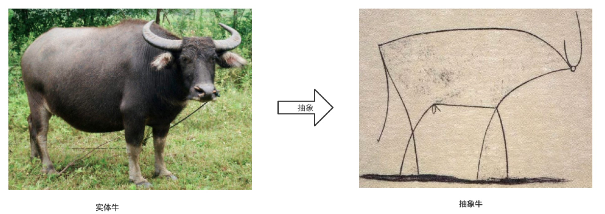
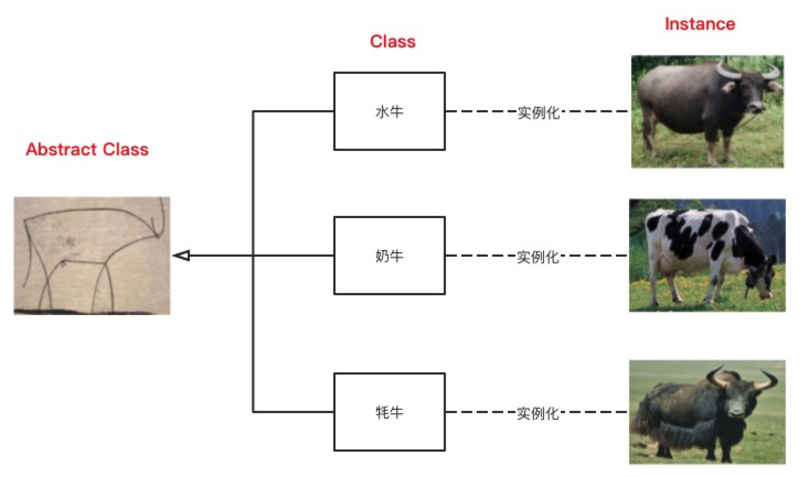
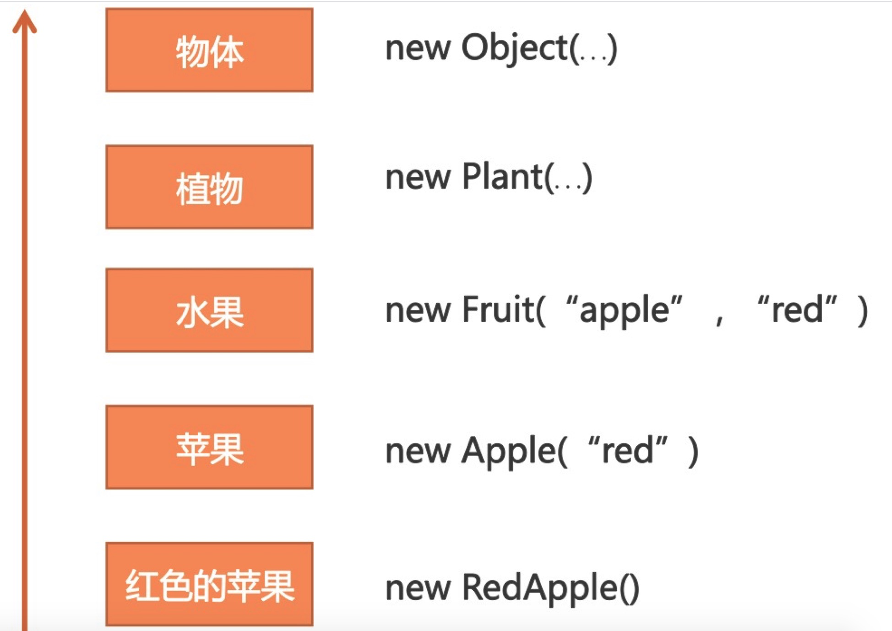
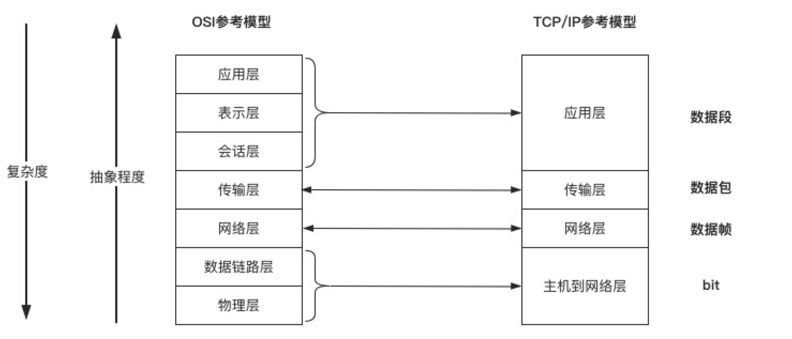
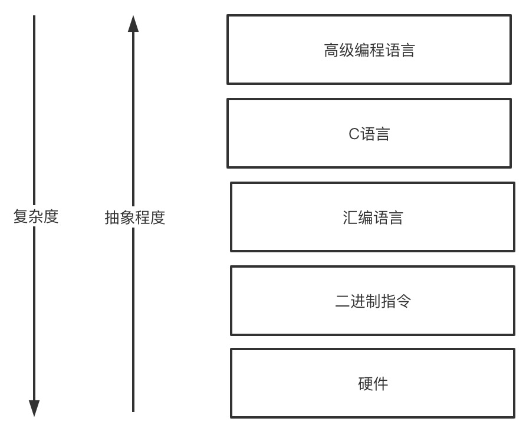

思维能力：抽象思维
======

**抽象思维**是我们工程师最重要的思维能力。因为软件技术本质上就是一门抽象的艺术。

我们每天都要动用抽象思维，对问题域进行分析、归纳、综合、判断、推理。
从而抽象出各种概念，挖掘概念和概念之间的关系，对问题域进行建模，然后通过编程语言实现业务功能。
所以，我们大部分的时间并不是在写代码，而是在梳理需求，理清概念。

在我接触的工程师中，能深入理解抽象概念的并不多，能把抽象和面向对象、架构设计进行有机结合，
能用抽象思维进行问题分析、化繁为简的同学更是凤毛麟角。

对于我本人而言，每当我对抽象有进一步的理解和认知，我都能切身感受到它给我在编码和设计上带来的质的变化。
如果时间可以倒流的话，我希望在职业生涯的早期，就能充分意识到抽象的重要性，能多花时间认真的研究它，深刻的理解它，这样应该可以少走很多弯路。

# 1.什么是抽象
关于**抽象的定义**，百度百科是这样说的：
> **抽象是从众多的事物中抽取出共同的、本质性的特征，而舍弃其非本质的特征的过程。**
> 具体地说，**抽象就是人们在实践的基础上，对于丰富的感性材料通过去粗取精、去伪存真、由此及彼、由表及里的加工制作，形成概念、判断、推理等思维形式，以反映事物的本质和规律的方法。**
> 实际上，抽象是与具体相对应的概念，具体是事物的多种属性的总和，因而**抽象是由具体事物的多种属性中舍弃了若干属性而固定了另一些属性的思维活动。**

“抽”就是抽离，“象”就是具象，字面上理解抽象。
**抽象的过程就是从“具象”事物中归纳出共同特征，“抽取”得到一般化（Generalization）的概念的过程。**

为了更好的方便你理解**抽象**，让我们先来看一幅毕加索的画。如下图所示，图的左边是一头水牛，是具象的，右边是毕加索的画，是抽象的。
怎么样，是不是感觉自己一下子理解了**抽象画的含义**。

可以看到，抽象牛只有几根线条，不过这几根线条是做了高度抽象之后的线条，过滤了水牛的绝大部分细节，保留了牛**最本质特征**，比如牛角，牛头，牛鞭、牛尾巴等等。
这种对细节的舍弃使得“抽象牛”具有更好的泛化（Generalization）能力。可以说，**抽象更接近问题的本质。**
也就是说所有的牛都逃不过这几根线条。

# 2.抽象是哲科思维的基础
**抽象思维是思维的高级形式**，为什么这么说呢？西方哲学诞生于古希腊，古人仰望星空，开始思索世界本源的问题，
从具象的“水、火、气”，到毕达哥拉斯的“数”，类似于老子所说的“道生一，一生二，二生三，三生万物”，到德谟克利特的原子论，再到柏拉图的“理念世界”。
**哲学的发展史就是形象思维到抽象思维、从感性到理性的发展史。**

这种把抽象概念作为世界本真的看法，也是古希腊哲学家柏拉图的最重要哲学思想。柏拉图认为，我们所有用感觉感知到的事物，都源于相应的理念。
我们的思考，对概念的表达都离不开**语言**。

# 3.抽象和语言概念是一体的
关于**抽象思维**，我们可以看到这样的定义：
> **抽象思维**，又称**词（概念）的思维**或者逻辑思维，**是指用词（概念）进行判断、推理并得出结论的过程。**
> **抽象思维以_词（概念）_为中介来反映现实。**
> 这是思维的最本质特征，也是人的思维和动物心理的根本区别。

之所以**把抽象思维称为词思维或者概念思维，是因为语言和抽象是一体的。**
我们只能通过语言才能表达抽象的概念，我们只有通过语言才能进行逻辑判断和推理。

当我们说“牛”的时候，说的就是“牛”的抽象，他代表了所有牛共有的特征。
同样，当你在程序中创建Cow这个类的时候，道理也是一样。
在生活中，我们只见过一头一头具象的牛，“牛”作为抽象的存在，即看不见也摸不着。

所以**语言**在我们的设计中如此重要的原因，我一直在团队中，要求大家使用**通用语言（Ubiquitous Language）**进行沟通交流。
实践证明，这种方法极大的提升了大家的协作效率，因为只有大家对**概念**的认知一致，沟通交流起来自然也就方便了。

这也是为什么，我在做设计和代码审查（Code Review）的时候，会特别**关注命名是否合理**的原因。
因为**命名的好坏**，在很大程度上反应了我们**对一个概念的思考是否清晰**，我们的**抽象是否合理**。
反应在代码上就是，代码的可读性、可理解性是不是良好，以及我们的设计是不是到位。

就像Stack Overflow的创始人Joel Spolsky所说的：
“起一个好名字应该很难，因为，一个好名字需要把要义浓缩在一到两个词。
（Creating good names is hard, but it should be hard, because a great name captures essential meaning in just one or two words）。”

是的，这个浓缩的过程就是**抽象的过程**。
我不止一次的发现，当我觉得一个地方的命名有些别扭的时候，往往就意味着要么这个地方我没有思考清楚，要么是我的抽象弄错了。

我想强调的是**语言是明晰概念的基础，也是抽象思维的基础。**
在构建一个系统时，值得我们花很多时间去斟酌、去推敲语言。
在我做过的一个项目中，就曾为一个关键实体讨论了两天，因为那是一个新概念，尝试了很多名字，始终感觉到别扭、不好理解。
随着我们讨论的深入，对问题域理解的深入，我们最终找到了一个相对比较合适的名字，才肯罢休。

这样的斟酌是有意义的，因为**明晰关键概念，是我们设计中的重要工作。**
虽然不合理的命名，不合理的抽象也能实现业务功能。但其代价就是维护系统时，极高的认知负荷。
随着时间的推移，就没人能搞懂系统的设计了。

# 4.面向对象的基础是抽象
## 4.1.面向对象技术
**面向对象技术**作为当今最重要的软件工程技术，实际上是由三个部分组成，
分别是**OOA（Object Oriented Analysis：面向对象分析），OOD（Object Oriented Design：面向对象设计）和OOP（Object Oriented Programming：面向对象编程）**。

**OOA是一种分析方法，利用从问题域的词汇表中找到的类和对象来分析需求。**
也就是我们日常说的“找名词”，当然实际情况不仅仅是找名词这么简单。
更多的时候，我们需要使用抽象思维从杂多的需求中，**挖掘关键概念和实体**。

**OOD是一种设计方法，包括面向对象分解的过程和表示法。**
这种**表示法用于展现被设计系统的逻辑模型和物理模型、静态模型和动态模型。**
通常是使用UML提供的那套表示法工具。

OOP是一种实现的方法，在这种方法中，程序被组织成许多相互协作的类，类之间会通过继承、组合、使用形成一定的**层次结构**。

**OOA、OOD和OOP之间的关系是，OOA的结果可以帮助我们设计OOD的模型，而OOD的结果可以作为蓝图，最后利用OOP方法最终实现一个系统。**

由此可见，面向对象技术是和传统的结构化设计方法是不同的：它要求以一种不同的方式来思考问题。
这种思考方式对我们抽象能力提出了更高的要求，因为不管是**OOA的问题域分析**，还是**OOD和OOP的对象建模，编程实现**，都离不开**抽象思维**。

## 4.2.如何判断抽象设计是否良好
评判一种**抽象设计**是否良好，抽象的品质，可以通过它的**耦合、内聚、充分性和完整性**来度量。

1. **耦合**：强耦合使系统变得复杂。因为如果模块与其他模块过度相关，它就难以独立地被理解、变化或修正，通过降低耦合，可以降低复杂性。
   在耦合和继承的概念之间存在着矛盾关系，继承引入了严重的耦合。一方面，我们希望类之间弱耦合，另一方面，继承又能帮助我们处理抽象之间的共性。
2. **内聚**：最不希望出现的内聚就是偶然性内聚。最希望出现的内聚是**功能性内聚**。
3. **充分性、完整性**：所谓充分，是指类或模块应该记录某个抽象足够多的特征，从而允许有意义的交互。否则将使组件变得无用。
   例如，如果我们设计Set（集合）类，应该包含相关集合操作，如果忘记加入元素的操作，Set就不可用。

## 4.3.重复代码是抽象的缺失
如果说**抽象的本质是共性**的话，那么代码中的重复代码，是不是就意味着抽象的缺失呢？

简单分析，不难发现，**此处我们是缺失了两个概念**：一个是用来**表达搜索条件的类**——SearchCondition；另一个是用来**组装搜索条件的类**——SearchConditionAssembler。
只有配合命名，显性化的将这两个概念表达出来，才是一个完整的重构。

由此可见，**提取重复代码只是我们重构工作的第一步。对重复代码进行_概念抽象_，寻找有意义的命名才是我们工作的重点。**

因此，每一次遇到重复代码的时候，你都应该感到兴奋，想着，这是一次锻炼抽象能力的绝佳机会。

# 5.抽象的层次性
## 5.1.什么是抽象的层次性
回到毕加索的抽象画，如下图所示，如果映射到面向对象编程，抽象牛就是抽象类（Abstract Class），代表了所有牛的抽象。
抽象牛可以泛化成更多的牛，比如水牛、奶牛、牦牛等。
每一种牛都代表了一类（Class）牛，对于每一类牛，我们可以通过实例化，得到一头具体的牛实例（Instance）。

从这个简单的案例中，我们可以得到抽象的三个特点：
1. 第一，**抽象是忽略细节的**。抽象类是最抽象的，忽略的细节也最多，就像抽象牛，只是几根线条而已。
   在代码中，这种抽象可以是Abstract Class，也可以是Interface。
2. 第二，**抽象代表了共同性质**。类（Class）代表了一组实例（Instance）的共同性质，抽象类（Abstract Class）代表了一组类的共同性质。
   对于我们上面的案例来说，这些共同性质就是抽象牛的那几根线条。
3. 第三，**抽象具有层次性**。抽象层次越高，内涵越小，外延越大，也就是说它的涵义越小，泛化能力越强。
   比如，牛就要比水牛更抽象，因为它可以表达所有的牛，水牛只是牛的一个种类（Class）。

抽象的这种层次性，是除了抽象概念之外，另一个我们必须要深入理解的概念。
因为小到一个方法要怎么写，大到一个系统要如何架构，以及我们后面要介绍的结构化思维，都离不开抽象层次的概念。

在进一步介绍**抽象层次**之前，我们先来理解一下**外延和内涵**的意思：
> **抽象是以概念（词语）来反映现实的过程，每一个概念都有一定的外延和内涵。**
> **概念的外延就是适合这个概念的一切对象的范围，而概念的内涵就是这个概念所反映的对象的本质属性的总和。**
> 例如“平行四边形”这个概念，它的外延包含着一切正方形、菱形、矩形以及一般的平行四边形，
> 而它的内涵包含着一切平行四边形所共有的“有四条边，两组对边互相平行”这两个本质属性。
>
> 一个概念的内涵愈广，则其外延愈狭；反之，内涵愈狭，则其外延愈广。
> 例如，“平行四边形”的内涵是“有四条边，两组对边互相平行”，而“菱形”的内涵除了这两条本质属性外，还包含着“四边相等”这一本质属性。
> “菱形”的内涵比“平行四边形”的内涵广，而“菱形”的外延要比“平行四边形”的外延狭。

每一个抽象层次都有它的用途，对于我们来说，如何拿捏这个抽象层次是对我们设计能力的考验，抽象层次太高和太低都不行。

为了提升**抽象层次**，我们可以把RedApple类改成Apple类，让颜色变成Apple的属性，这样红色和绿色的苹果就都能表达了。
再继续往上抽象，我们还可以得到水果类、植物类等。再往上抽象就是生物、物质了。

你可以看到，抽象层次越高，内涵越小，外延越大，泛化能力越强。然而，其代价就是**业务语义**表达能力越弱。

具体要抽象到哪个层次，要视具体的情况而定了。
比如这个程序是专门研究苹果的可能到Apple就够了，如果是卖水果的可能需要到Fruit，如果是植物研究的可能要到Plant，但很少需要到Object。

越抽象，越通用，可扩展性越强，然而其语义的表达能力越弱。越具体，越不好延展，然而其语义表达能力很强。
所以，**对于_抽象层次_的权衡，是我们系统设计的关键所在，也是区分普通程序员和优秀程序员的关键所在。**

## 5.2.软件中的分层抽象无处不在
**越是复杂的问题越需要_分层抽象_，分层是分而治之，抽象是问题域的合理划分和概念语义的表达。**
不同层次提供不同的抽象，下层对上层隐藏实现细节，通过这种层次结构，我们才有可能应对像网络通信、云计算等超级复杂的问题。

网络通信是互联网最重要的基础实施，但同时它又是一个很复杂的过程，你要知道把数据包传给谁——IP协议，你要知道在这个不可靠的网络上出现状况要怎么办——TCP协议。
有这么多的事情需要处理，我们可不可以在一个层次中都做掉呢？当然是可以的，但显然不科学。
因此，ISO制定了网络通信的七层参考模型，每一层只处理一件事情，低层为上层提供服务，直到应用层把HTTP，FTP等方便理解和使用的协议暴露给用户。

**编程语言的发展史也是一个典型的_分层抽象_的演化史。**

机器能理解的只有机器语言，即各种二进制的01指令。如果我们采用01的输入方式，其编程效率极低。
所以我们用汇编语言抽象了二进制指令。然而汇编还是很底层，于是我们用C语言抽象了汇编语言。
而高级语言Java是类似于C这样低级语言的进一步抽象，这种逐层抽象极大的提升了我们的编程效率。

## 5.3.强制类型转换是抽象层次有问题
**面向对象设计**里面有一个著名的**SOLID原则**是由Bob大叔（Robert Martin）提出来的，其中的L代表LSP，就是Liskov Substitution Principle（里氏替换原则）。
简单来说，**里氏替换原则**就是子类应该可以替换任何父类能够出现的地方，并且经过替换以后，代码还能正常工作。

思考一下，我们在写代码的过程中，什么时候会用到强制类型转换呢？
当然是LSP不能被满足的时候，也就是说子类的方法超出了父类的类型定义范围，为了能使用到子类的方法，只能使用类型强制转换将类型转成子类类型。

这里问题出在哪里？对于这样的代码我们要如何去优化呢？仔细分析一下，我们可以发现，根本原因是因为isSweet和isJuicy的抽象层次不够。
站在更高抽象层次也就是Fruit的视角看，我们挑选的就是可口的水果，只是具体到苹果我们看甜度，具体到西瓜我们看水分而已。

因此，解决方法就是对isSweet和isJuicy进行抽象，并提升一个**抽象层次**，在Fruit上创建一个isTasty()的抽象方法，然后让苹果和西瓜类分别去实现这个抽象方法就好了。

所以，每当我们在程序中准备使用instanceof做类型判断，或者用cast做强制类型转换的时候。每当我们的程序不满足LSP的时候。
你都应该警醒一下，好家伙，这又是一次锻炼抽象能力的绝佳机会。

# 6.如何提升抽象思维能力
抽象思维能力是我们人类特有的、与生俱来的能力。
除了上面说的在编码过程中可以锻炼抽象能力之外，我们还可以通过一些其他的练习，不断的提升我们的抽象能力。

## 6.1.多阅读
为什么阅读书籍比看电视更好呢？因为图像比文字更加具象，**阅读的过程可以锻炼我们的抽象能力、想象能力，**
而看画面的时候会将你的大脑铺满，较少需要抽象和想象。

这也是为什么我们不提倡让小孩子过多的暴露在电视或手机屏幕前的原因，因为这样不利于他抽象思维的锻炼。

抽象思维的差别让孩子们的学习成绩从初中开始分化，许多不能适应这种抽象层面训练的，就去读技校了，
因为技校比大学会更加具象：车铣刨磨、零部件都能看得见摸得着。

## 6.2.多总结沉淀
小时候不理解，**语文老师为什么总是要求我们总结段落大意、中心思想什么的。**
现在回想起来，**这种思维训练在基础教育中是非常必要的，**其实质就是**帮助学生提升抽象思维能力**。

**记录也是很好的总结习惯。** 就拿**读书笔记**来说，最好不要原文摘录书中的内容，而是要**用自己的话总结归纳书中的内容**，
可以**加深理解**，还可以**提升自己的抽象思维能力。**

**系统的记录笔记，做总结沉淀，构建自己的知识体系。**
这种思维训练的好处显而易见，可以说我之前写的《从码农到工匠》和现在正在写的《程序员必备的思维能力》都离不开我总结沉淀的习惯。

## 6.3.命名训练
每一次的变量命名、方法命名、类命名都是一次难得的抽象思维训练机会，前面已经说过了，
语言和抽象是一体的，命名的好坏直接反应了我们的问题域思考的是否清晰，反应了我们抽象的是否合理。

现实情况是，我们很多的工程师常常忽略了命名的重要性，只要能实现业务功能，名字从来就不是重点。

实际上，这是对系统的不负责任，也是对自己的不负责任，更是对后期维护系统的人不负责任。
写程序和写文章有很大的相似性，本质上都是在用语言阐述一件事情。
试想下，如果文章中用的都是些词不达意的句子，这样的文章谁能看得懂，谁又愿意去看呢。

同样，我一直强调代码要显性化的表达业务语义，其中命名在这个过程中扮演了极其重要的角色。
为了代码的可读性，为了系统的长期可维护性，为了我们自身抽象思维的训练，
我们都不应该放过任何一个带有歧义、表达模糊、语义不清的命名。

## 6.4.领域建模训练
对于技术同学，我们还有一个非常好的提升抽象能力的手段——领域建模。
当我们对问题域进行分析、整理和抽象的时候，当我们对领域进行划分和建模的时候，实际上也是在锻炼我们的抽象能力。

我们可以对自己工作中的问题域进行建模，当然也**可以通过阅读一些优秀源码背后的模型设计来学习如何抽象、如何建模。**
比如，我们知道Spring的核心功能是Bean容器，那么在看Spring源码的时候，
我们可以着重去看它是如何进行Bean管理的？它使用的核心抽象是什么？
不难发现，Spring是使用了BeanDefinition、BeanFactory、BeanDefinitionRegistry、BeanDefinitionReader等核心抽象实现了Bean的定义、获取和创建。
抓住了这些核心抽象，我们就抓住了Spring设计主脉。

除此之外，我们还可以进一步深入思考，它为什么要这么抽象？这样抽象的好处是什么？
以及它是如何支持XML和Annotation（注解）这两种关于Bean的定义的。

这样的抽象思维锻炼和思考，对提升我们的抽象能力和建模能力非常重要。
关于这一点，我深有感触，初入职场的时候，当我尝试对问题域进行抽象和建模的时候，会觉得无从下手，建出来的模型也感觉很别扭。
然而，经过长期的、刻意的学习和锻炼之后，很明显可以感觉到我的建模能力和抽象能力都有很大的提升。
不但分析问题的速度更快了，而且建出来的模型也更加优雅了。

# 7.小结
抽象思维是程序员最重要的思维能力，抽象的过程就是寻找共性、归纳总结、综合分析，提炼出相关概念的过程。
语言和抽象是一体的，抽象思维也叫词思维，因为抽象的概念只能通过语言才能表达出来。
抽象是有层次性的，抽象层次越高，内涵越小，外延越大，扩展性越好；反之，抽象层次越低，内涵越大，外延越小，扩展性越差，但语义表达能力越强。
对抽象层次的拿捏，体现了我们的设计功力，视具体情况而定，抽象层次既不能太高，也不能太低。
重复代码意味着抽象缺失，强制类型转换意味着抽象层次有问题，我们可以利用这些信号来重构代码，让代码重新变的优雅。
我们可以通过刻意练习来提升抽象能力，这些练习包括阅读、总结、命名训练、建模训练等。

# 8.课后作业练习
深入理解状态机的工作原理，挖掘里面的关键概念和实体，自己实现一个简洁、高效的状态机，将知识转化为能力。

## 8.1.作业注意事项
a.一定要注意核心抽象的是什么？
b.抽象到了哪一层？

