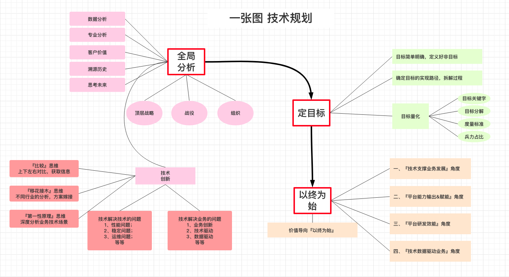
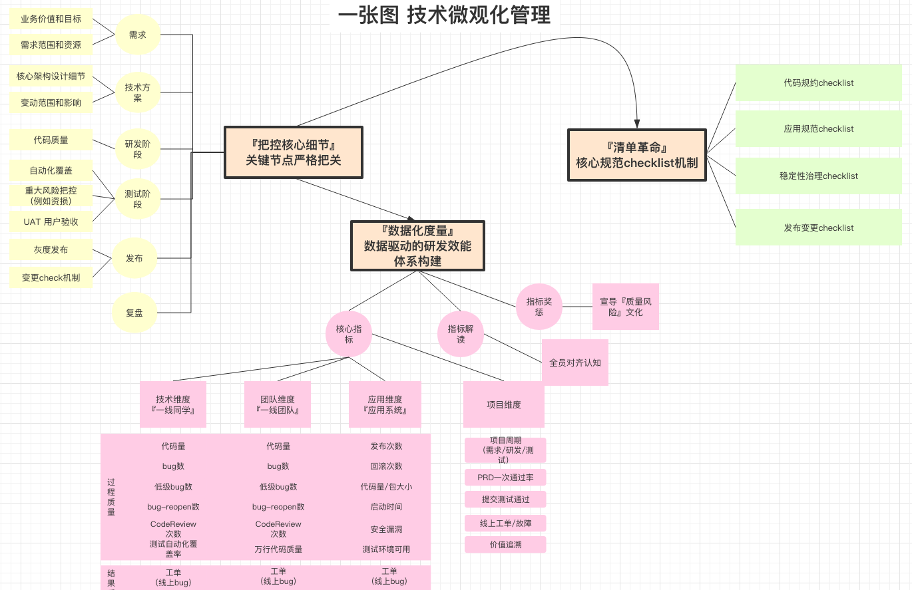
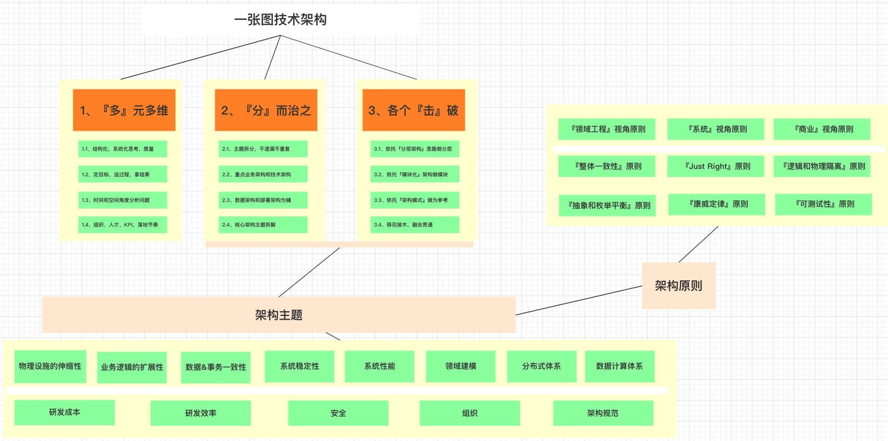
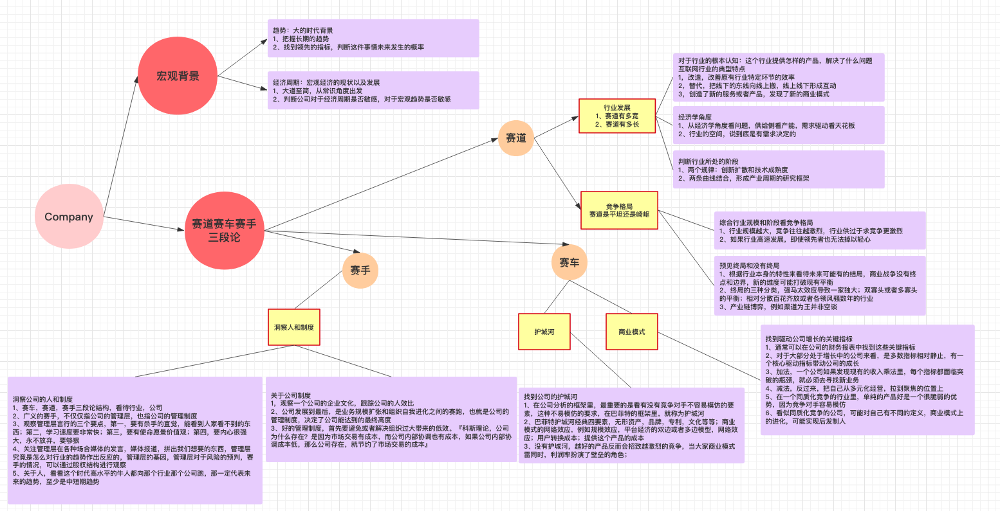

工程技术三板斧：关于技术规划、管理、架构的思考
======

# 一、前言-为什么有这篇文章
大约半年前，开始总结自己关于工程技术的一些核心要点，关于规划，关于技术管理以及架构，三方面的一些心得，
结合自己团队的现状，结合自己对于周边做的比较好的同学的观察，于是有了这几张图。
最近半年，这几张图断断续续发给自己团队小伙伴，也发给了周边的同事，大家反馈还可以，
其中的架构三板斧，在ArchSummit上也做了简单介绍，大家或多或少有些共鸣，所以想做一个全局的分享。
总体产出偏个人视角，肯定带有严重的个人色彩，所以仅供参考。
总体这篇文章分为五个部分，第一，关于技术规划，第二，关于技术管理，第三，关于架构执行，
第四，个人发展的点线面体，第五，研究公司行业，赛车赛道，赛手三段论。

# 二、关于技术规划三板斧
技术规划是P7+以上的同学必不可少的，规划做的好，
对于个人对于团队都能够起到比较好的正向引导的作用，大家整体的目标感会好很多。
第一部分是全局分析，这个需要溯源历史，需要思考未来，对于未来有一定的预判，
同时能够基于数据基于专业做分析，也能够基于客户价值做分析，同时结合顶层的战略，结合公司的战役情况，当然也要分析组织的现状。
第二部分是定目标，这一部分非常关键，定义好目标以及定义好非目标，哪些事情是不做的也要讲明白，确认目标的实现路径，做好拆解。
最后一部分是以终为始，从最终结果的角度，来溯源开始，从技术支撑业务发展，平台能力输出或者赋能，平台研发效能，技术数据驱动业务等不同的角度审视结果。
另外关于创新，可以有几个不同维度的方法，例如通过上下左右的比较，比较思维法来获取信息，
例如移花接木，通过不同行业的分析来完成方案的嫁接，例如第一性思考，深度分析业务以及技术的场景，产出最后的方案。

# 三、关于技术管理三板斧
这里的管理，不是团队管理，是指技术本身的管理，其实最近一年多，一直在倡导一件事情，就是**技术的微观化管理**，
技术和其他的事务不太一样，一旦宏观化管理，不能Deep Dive细节，就非常容易引发各种各样的问题，例如研发质量，例如研发效率降低，架构孵化。
总体提供三个方面，第一是把控核心细节，软件工程这些年，其实本质是没变的，不管是偏互联网的部分还是偏企业级的部分，
核心的关键细节是需要严格把关的。另外就是数据化度量，通过数据驱动研发体系的重建，
通过质量风险文化的宣导以及核心指标的跟进，起到督导的作用。
最后就是清单革命，清单革命是一本书的名字，这里借用过来，合适是checklist，
不管是代码规约，应用规范还是稳定性治理等，都容易由于不重视或者不check而逐渐孵化，
这时候，一个好的checklist非常关键重要。

# 四、关于技术架构三板斧
关于架构，其实像架构模式，TOGAF架构，互联网架构等讲解的书是不少的，
但是从架构本身，是有一些通用的方法的，但是方法一旦通用，就会偏虚无缥缈，
总体分为三部分，第一是多元多维，这个概念是来自穷查理宝典，最开始是放在第三的，
后来我挪了一下顺序，因为架构需要良好的上下文输入，需要思考时间和空间维度，需要思考组织人才和KPI，
需要思考目标过程和结果，这些和架构本身关系不大，但是关联到架构是否能够良好的落地。
第二个和第三个是相辅相成的，核心是分而治之，各个击破，架构本身是解决问题的过程，
问题太复杂了，只能采用分而治之的办法了，怎么分，利用金字塔的原理，不遗漏不重复，
重点在业务架构和技术架构，同时在数据化上也有思考，之后按照架构主题做拆分。
另外怎么击破，分层架构和模块化架构，是比较通用的两个方法，同时业界也有架构模式的参照，也可以有一些移花接木的方法，
另外，关键架构主题和架构模式，也可以有checklist，方便在做架构的时候，通过清单对照不漏掉重要部分。

# 五、关于赛车赛道赛手三段论
去年六七月份，针对市面上已有的物流机器人公司，做了一个全局的分析，
当时分析这些公司的官方，分析公司招聘的JD，分析公司创始人的分享，
感觉在分析公司上，应该有一些方法论的，正当尝试总结的时候，有一天早晨打开得到，
正好推荐了一个专栏，一名证券公司的分析师讲怎么快速搞懂一家公司的，
看了一下介绍，正好就是我想要的，于是听了一下，感觉挺不错，对于公司的分析提供了一个方法。
一个前提，就是分析宏观的背景，例如经济形势等，接下来是三部分，
赛道很容易理解，就是这个行业发展的情况，赛道够不够宽，赛道够不够长，
第二个就是赛车，公司有没有核心的商业模式以及核心竞争力，
第三个就是赛手，公司的人和文化，这个也非常重要。

# 六、关于点线面体的思考
曾鸣老师的智能商业，是讲解互联网比较有深度的一本书，中间有一篇文章是讲点线面体的，觉得很不错，
从公司战略角度，是需要点线面体的角度思考的，个人发展战略，
其实也可以使用点线面体的方法，具体很容易理解，这里就不赘述，直接做一个引用。
『点线面体，是一种全新的战略定位思考方法。这些年，很多人经常来找我讨论公司的下一步应该怎么做。
讨论多了我慢慢发现，传统的战略理论框架有很多不适应现在新的环境了。
**战略的最核心是定位**，很多人都耳熟能详。
定位最传统的理论框架是波特提出来的成本领先、差异化和利基市场的竞争战略。
虽然在未来这种定位还是大家需要去思考的，但实际上在网络时代有更重要的问题要先回答』。

# 七、总结
过去半年的一些总结，前面三张图，断断续续也改了几版，现在share出来，做个简单分享，希望能够起到抛砖引玉的作用。
写这篇文章，也有一点私心，想夹带一点广告的，自己19年1月份，从菜鸟转入到国际战场，11年入职以来第一次转岗，
从全球化战略上来讲，应该阿里最长远的战略，未来5年8年国际化的业务肯定会波澜壮阔。
当前开始Lead基础技术架构，基于全球特性、阿里巴巴云化以及中台架构，构建下一代的基础技术架构，
包含但是不局限于微服务应用架构治理，数据架构治理，全球单元技术，容灾技术，区域化多租户，
以及端到端的用户体验受损提升，全球网络流量调度，数据智能探索，
同时全面基于云探索CloudNative，Serverless以及Reactive等架构的落地，
做到领先业界5年的基础技术架构，对于基础技术感兴趣的同学可以随时咖啡。

