思维能力：结构化思维
======

在日常工作中，我们时常会碰到这样的情况，有的人讲一件事情的时候逻辑非常混乱，说了很多事情的罗列，却说不到重点。
有的人写代码，本身的业务逻辑并没有多复杂，但呈现出的代码却像一堆线团，混乱不堪，无法理解。
这些都是典型的缺少结构化思维的表现，导致我们在写作（包括写代码）、沟通、表达的时候，思维混乱，逻辑不清。

**结构化思维是一种从无序到有序、从混乱到清晰的思维能力，可以帮助我们快速加工处理繁杂的信息，提炼要点，从而更加清晰的表达。**
本文作为思维能力的第二篇，我会系统的跟大家说说结构化思维。

# 1.什么是结构
结构可以说是万物之本。大到宇宙星系，小到尘埃颗粒，任何事物都有其特定的结构，这些事物也是通过其特定的结构来体现其存在的价值和意义。

在系统论中，系统是处在一定环境下各组成部分的整体，我们把这各个组成部分，称之为系统的要素。
很显然，系统不只是要素的简单加和，而是有什么内在的东西实现了各要素的普遍联系。
**我们就把这种各要素的组织形式（要素之间的关系）称之为结构。**

**系统的性质是由结构决定的。** 要素的内容是不稳定的，可能随时会被替换。
就像忒休斯之船，虽然船的木板被换掉了，但只要船的结构没有变，其仍然是忒休斯之船；中国的两千年封建历史也是一样，皇帝（要素）一个接一个的换，
但是本质上，其背后的皇权剥削制度没有变，旧社会的结构没有变，所以皇帝的更替，并没有改变封建社会的本质。

我们通常说的“**结构性问题**”，就是指那些底层的、难以改变的根本性问题。
经济上的结构性问题就是作为经济这个系统的结构的经济制度，分配制度和所有制等等出现了问题。

在零售通期间，我做过一个价格的项目，当时的想法是试图通过价格管控，来让平台商品的价格更有竞争力。
然而深入思考不难发现，价格只是表象问题，**在冰山之下，深层次还是结构问题**——
即在相当长时间内，我们没办法改变品牌商现有分销渠道结构，不能让渠道更扁平化，不能提升供应链效率。
只是一味的盯着价格是注定很难成功的。

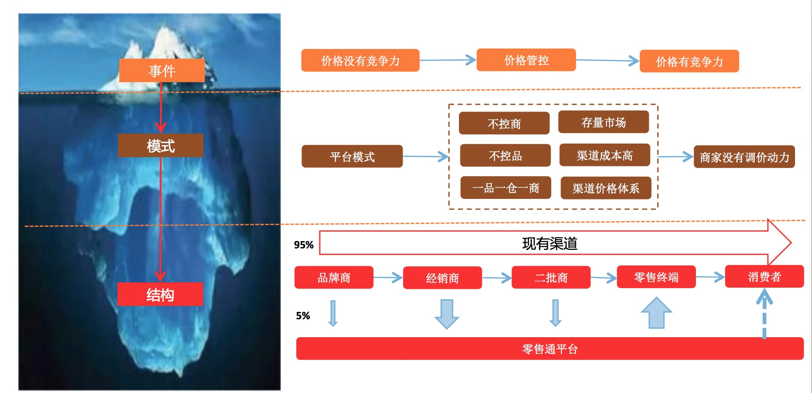

**架构的核心也是结构。** 我曾经说过，**所谓的架构就是“要素+结构”。**
比如，组织的要素是员工，而组织架构就是规定了员工和员工之间的协作关系。
又如，应用系统的要素是程序单元（类、包、组件、模块），而应用架构所要解决的就是如何处理这些程序单元之间的关系结构。

# 2.什么是结构化思维
结构如此重要，它反映了系统要素的组织形式，决定了系统性质。
那有没有一种方法来帮助我们发现结构，或者帮助我们搭建结构呢？

有的，这就是我们接下来要介绍的结构化思维。**所谓的结构化思维，就是从无序到有序的一种思考过程，
将搜集到的信息、数据、知识等素材按一定的逻辑进行分析、整理，呈现出有序的结构，继而化繁为简。
有结构的信息更适合大脑记忆和理解。**

我们的整个知识体系、科学研究都是建立在对感性经验的归纳整理，发现内在规律的基础之上，其本质就是发现结构（要素即之间关系）的过程。
混乱的杂多表象没有规律，形成不了知识，我们的大脑也没有办法处理，大脑天生喜欢有规律、有结构的信息。

我们可以做一个小测验，尝试用10秒钟记住下面20个数字。

是不是感觉很难？很多人应该都记不住。
换一种方式，让你同样记住下面的这20个数字，再试试能否记住？

是不是觉得很简单，别说3秒钟，1秒钟也可以。
事实上，这是两组同样的数字，只是排列方式不一样，第一组是无序的，第二组有序的（有结构），也更有规律。

为什么你很难记住第一组却能够轻松记住第二组呢？因为它更符合我们大脑的使用习惯。

人类大脑在处理信息的时候，有两个特点：

第一，不能一次太多，太多信息会让我们的大脑觉得负荷过大；乔治·米勒在他的论文《奇妙的数字7±2》中提出，
人类大脑短期记忆无法一次容纳7个以上的记忆项目，比较容易记住的是3个项目，当然最容易的是1个。

第二，喜欢有规律的信息。有规律的信息能减少复杂度，Mitchell Waldrop在《复杂》一书中，
提出一种用信息熵来进行复杂性度量的方法，所谓信息熵就是一条信息包含信息量的大小。
举个例子，假设一条消息由符号A、C、G和T组成。如果序列高度有序，很容易描述，例如“A A A A A A A … A”，则熵为零。而完全随机的序列则有最大熵值。

综上所述，我们之所以能够轻松记忆第二组数字，是因为其有结构、有规律，从而降低了复杂度和记忆负担。
面对无序的20个数字，其熵值最大，相当于要记住20个记忆项目，这远超我们一般人短期记忆的上线，因此，很难记住。
而倒序排列的20个数字，**我们实际上只要记忆两个项目：一个是有0倒9的20个数字，另一个是他们是倒序排列的。**

概括来说，**结构化思维是一种以逻辑（事物内在规律）为基础，从无序到有序搭建结构的思维过程。
其目的是减少复杂度和认知成本，** 因为大脑更喜欢概念少、有规律的信息。

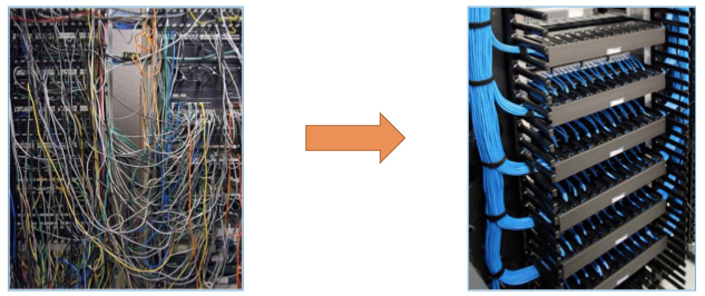

# 3.为什么是金字塔结构
说到结构化思维，就不得不提到结构化思维的圣经——芭芭拉·明托的《金字塔原理》。
这本书我反复读过多遍，在业界也有很好的口碑，美团王兴说：“仔细认真读完这本书，是员工在美团能否成功的基本功。
它是美团四大名著之首，也是美团能力跃迁，职级晋升的官方推荐必读书籍，它就是《金字塔原理》”

上文已经说过，结构化思维很有用，但为什么是金字塔结构呢？
这和我们大脑的思维过程有关，人类很早以前就认识到，大脑会自动将发现的所有事物以某种秩序组织起来。
基本上，大脑会认为同时发生的任何事物之间都存在某种联系，并且会将这些事物某种逻辑模式组织起来。

可以做一个实验，观察下面的图示，你看到了什么？

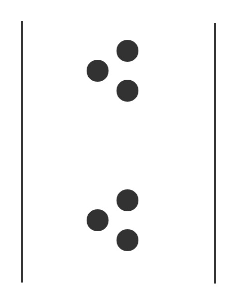

无论是谁，一看到上面的6个墨点，都会认为共有两组墨点，每组3个。这是因为人类大脑天性所致，
**大脑会认为同时发生的任何事物之间都存在某种联系，并且会将事物按某种逻辑模式组织起来。**
这种“联系”指的是某种类似的共同点或所处的位置比较接近。

这种将事物组成**逻辑单元**无疑具有很大的作用。我们更容易记住那些具有逻辑关系的东西，而遗忘那些散点的东西。
为了说明这一点，请看下面几组彼此之间并无关联的词，并尝试记住右边这些词。

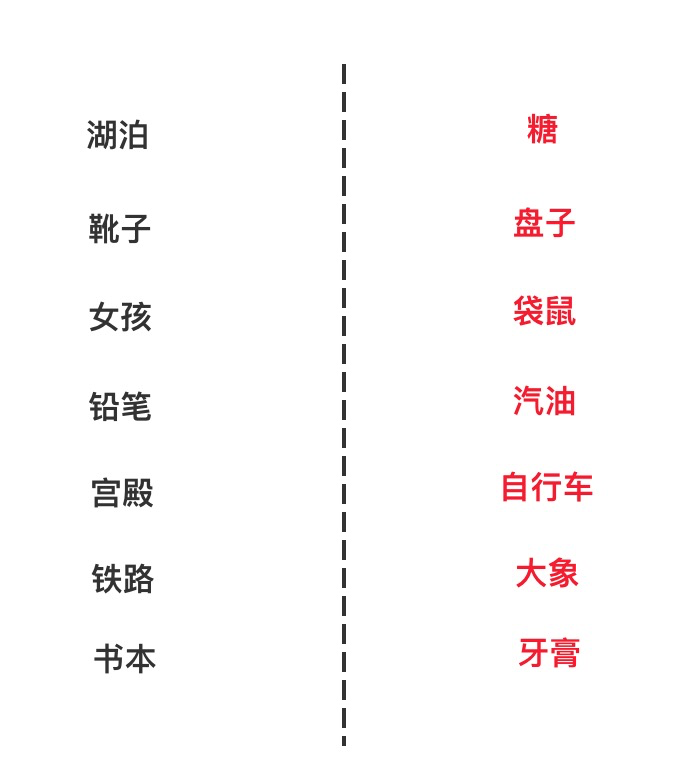

是不是发现很难记住。现在，换一种方式，你试着设想一个可能使每两个词发生联系的情景，联想并将其“组织”在一起，
譬如：糖在湖水中溶解，或靴子立在盘子上，女孩和袋鼠打架，在宫殿里骑自行车，等等。
然后将右边的一列词盖住，只看左边一列词。你是否能够比较容易的记起右边对应的词？
大多数人应该都可以毫不费力地做到这一点。

我之前有一个马拉西亚的博士朋友，他有一项“超强大脑”的技能，就是可以用10分钟记住一整副打乱的扑克牌。
我很佩服他有这样非凡的记忆力。问他是怎么做到的？他告诉我，并不是因为他很厉害，
他只是把扑克牌进行了“图像化”，然后再编一个故事，把这些“图像”联系起来，
比如J这个牌是一把伞，8是个胖子，这样8J在他的故事里，就变成了一个打伞的胖子。
通过这种逻辑关联，任何普通的人通过训练，都可以记住打乱的52张扑克牌。

这个例子，在一次验证了逻辑关系的重要性，**“有逻辑”和“没有逻辑”对我们大脑的理解和记忆起着至关重要的作用。**

同样，当你在听别人讲话、看文章、阅读代码的时候，也会发生类似的组织思想的现象。
你会讲同时出现的或位置相邻的几个思想相联系，努力用某种逻辑模式组织他们。
这种逻辑模式必定是金字塔结构的，因为只有金字塔结构才能够满足大脑的两个需求：
* 概念不能多：大脑一次记忆很难超过7个思想、概念或项目。
* 有逻辑关系：大脑容易记住有逻辑关系的事物。

也就是说，如果我们能按照金字塔的结构准备我们的演讲、写文章、写代码，
因为其满足我们大脑处理信息的特点——概念不能多，有逻辑关系，我们的听众和读者会更容易理解我们要表达的思想。
对应到我们工程领域，即**满足金字塔原理的代码，其可读性和可理解性会极大的被增强，**
代码也是一种表达，很多人以为代码是写给机器执行的，实际上，代码是写给人读的，只是偶尔会被机器执行。

这里，我们先来看一个简单案例，感受一下金字塔的作用。
假如你要出门，你老婆说家里冰箱空了，顺便买一点牛奶、鸡蛋和苹果回来。
你说：“好的，还需要别的吗？”她说：“咸鸭蛋和橘子也可以买一点。
”当你刚要出门的时候，她说：“好久没有吃葡萄了，如果能带点葡萄就更好了。”

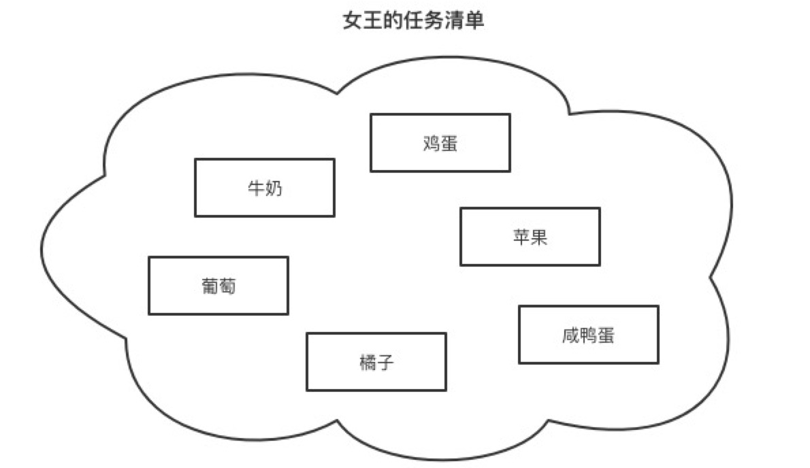

我敢保证，面对这样的“女王采购清单”，没有几个人能完成任务。
然而，如果换一种表述方式：我们要买水果和蛋奶，水果要买——葡萄、橘子、苹果。蛋奶要买——牛奶、鸡蛋、咸鸭蛋。
新的表述方式实际上就是构建了一个金字塔结构，是对零散的信息进行了归纳抽象，形成了一个以上统下的**金字塔结构**。

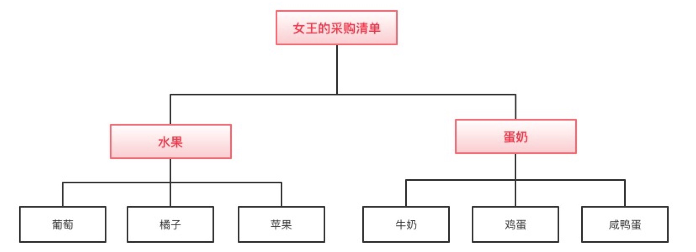

这种转变的关键就在于结构，这个金字塔结构满足了我们大脑处理信息的要求：
1. **寻找逻辑关系**
在上面的结构里面，我们首先对需要采购的物品进行了归类分组，
这里的逻辑关系是葡萄、苹果、橘子是一类的，都属于水果；牛奶、鸡蛋、咸鸭蛋是一类的，都属于蛋奶。
这种分类是为了我们接下来抽象概念做准备，并且是符合逻辑认知的。

2. **概念不能多**
找出逻辑关系，分组归类只是结构化的第一步，接下来我们还要对分组进行抽象概括，提升一个抽象层次，
将原来大脑需要处理的6个概念（葡萄、苹果、橘子、牛奶、鸡蛋、咸鸭蛋），减少为2个概念（水果、蛋奶）。
由于处于较高层次上的思想总是能提示其下面一个层次的思想，因而也更容易记住。

可以说，我们所有的思维过程都离不开这样的分组（分析）、概括（综合），以将大脑中的信息组成一个有互相关联的金字塔组成的巨大金字塔群。
**我们平时说的构建自己的知识体系，实际上就是在构建这个巨大的金字塔结构。**

实际上，我们平时使用的思维导图，也是一种金字塔的结构化思维，只是其展现形式不一定是上下结构的金字塔，
也可能是左侧分布、右侧分布、或者左右分布的，不管其形状如何，
**只要它满足从“中心主题”出发，具有层次树状结构，都属于金字塔结构的范畴，都应该满足搭建金字塔结构的逻辑要求。**

# 4.金字塔结构里的逻辑
逻辑是指对象之间的关系，这个关系可以是演绎关系、因果关系、空间关系、程度关系、并列关系、类比关系等等。
**所谓的“有逻辑”，就是这个“关系”是合乎理性的，道理是通顺的。逻辑是我们认知的基础，在结构中起着至关重要的作用。**
好的结构，离不开清晰、有效的逻辑，只有理清逻辑关系，才能正真的化繁为简，否则即使你搭建了结构，依然逃不脱那一片混沌。

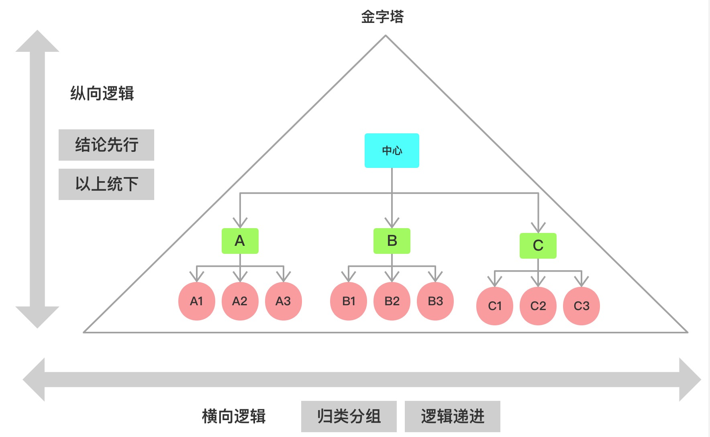

在金字塔结构中，总体上有两个方向的逻辑关系，即纵向逻辑关系和横向逻辑关系。
一个好的金字塔结构，需要在纵向关系上满足**结论先行、以上统下**；
在横向关系上，满足**归类分组、逻辑递进**这四个基本原则。用一句话概括，就是“**论证类比**”。
1. **纵向：纵向是层次关系，上一层次思想是对其下一层次思想的概括，下一层次是对上一层次的解释和支持。**
  a. **结论先行（“论”）**：所谓结论先行，就是要先抛结论。
  这一点在沟通的时候尤其重要，很多人铺垫说了半天，也不说结论.... 写代码也是一样，
  主方法的名称就是中心论点，子方法是对主方法的结构化分解。
  b. **以上统下（“证”）**：金字塔是一种层次结构，上层是对下层的统领和抽象，
  比如水果是对苹果、橘子的抽象，所以是在它们上面一层。
2. **横向：横向是关联关系，每组中的思想必须属于同一逻辑范畴，必须按照逻辑顺序组织。**
  a. **归类分组（“类”）**：将内容相似的思想归为一类，为进一步归纳抽象做好准备。
  b. **逻辑递进（“比”）**：分组中的思想需要有逻辑递进关系，即它们必须属于同一个逻辑范畴，且满足一定的逻辑顺序。

## 4.1.纵向逻辑关系
金字塔的纵向上，**体现的主要是金字塔的层次关系**。
在构建这个层次关系的过程中，我们需要动用我们在组织思想时，仅有的两个逻辑推理能力：演绎逻辑和归纳逻辑。
也就是我们所谓的**形式逻辑**。

### 4.1.1.演绎逻辑
**演绎逻辑是一个从一般到特殊的过程。我们通常说的“大前提、小前提、结论”的三段论形式就是典型的演绎逻辑。**
例如“所有人都会死，苏格拉底是一个人，因此，苏格拉底会死。” 
大前提是“所有人都会死”，小前提是“苏格拉底是一个人”，结论是“苏格拉底会死。” 
这是一种必然性推理（保真推理），因为其结论就包含在前提之中，“所有人会死”本身就包含“苏格拉底会死”。

演绎是一种线性的推理方式，最终是为了得出一个由逻辑词“因此”引出的结论。
**在金字塔结构中，位于演绎论证过程上一层次的思想是对演绎过程的概括，** 重点是在演绎推理过程的最后一步，即“因此”引出的结论。
比如针对下面这个演绎示例：

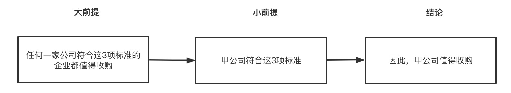

“甲公司值得收购”是这个演绎推理的结论，遵循**结论先行**的原则，在表述的时候，我们应该先抛结论。
试想下，你在汇报工作的时候说“甲公司是一个非常不错的公司，它在A方面....有这样的....表现，在B方面....是行业里的前几名....” 
你这样滔滔不绝10分钟，别人也不知道你说甲公司好的目的是什么。
所以更好的做法是结论先行——“甲公司值得收购，因为，第一....第二....第三...."，
按照金字塔原理的结构组织方式——上一层次的思想是对演绎过程的概括，我们可以得到如下的结构：

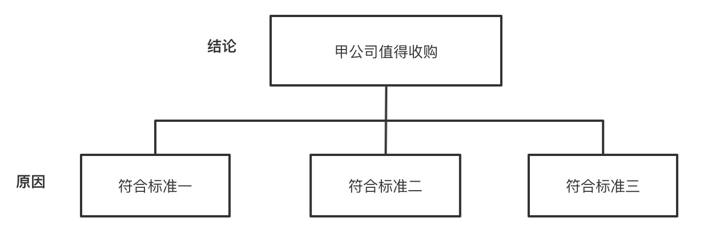

需要注意的是在表述中，大前提有时候会被省略，变成默认假设。
比如对于该示例，我们通常会省略大前提，直接说“甲公司符合这三项标准，因此，甲公司值得收购”。

### 4.1.2.归纳逻辑
**归纳逻辑比演绎逻辑要难，因为归纳需要我们有很好的抽象能力，抽象出新的概念，去统领其下面的子概念。**
在归纳的时候，大脑去要去发现事物（思想、事件、事实）具有共性、共同点，然后将其归类到同一个组中，并说明其共性。
归纳逻辑不是线性的，它需要在已有信息的基础上，提升一个抽象层次，得到新概念。

比如，苹果和橘子的上一个抽象层次是“水果”，这种抽象层次的提升，可以让“水果”在纵向关系上统领苹果和橘子。
“水果”这个新概念的抽象需要我们具备相关的知识背景。比如一个4岁的小孩还不知道“水果”的概念，就不能做出这样的抽象。
另外，抽象有时候还需要创造性和想象力，比如我问你“金鱼和激光笔有什么共性？”，你可能会觉得有点莫名其妙，
这是一个脑筋急转弯题，答案是“它们都不会吹口哨”，这样的答案需要我们有一定的想象力和幽默感。

虽然归纳逻辑比演绎逻辑要难，但是作为我们人类仅有的两种形式逻辑思维之一的归纳，
是我们发现新知识的唯一途径，也是科学研究的基础。
**它能帮助我们发现隐藏在信息中的因果关系，对于那些具有普遍效应的因果关系，我们可以提升为“理论”和“定律”。**
比如牛顿通过苹果的下落，发现地球上所有的物体都在受到地球的“吸引”，通过重力的假说，他发现了“万有引力定律”。
虽然我们现在知道引力并不存在，它只是时空弯曲的结果。这也是归纳法的局限之处，因为不能穷举实例，
比如即使你发现了一万只、一百万只天鹅是白的，你也不能断言——所有的天鹅都是白的，
所以通过归纳法得到的“知识”，都是盖然的，是一种概率度。毕竟，太阳明天还能从东方升起也只是一个概率问题。
因此，归纳法永远也得不到像演绎法那样保真的、有效的论证。

这也是为什么有很多哲学家吐槽归纳法，认为归纳法虽然可以得到新知识，但是因为不能穷举，所以永远也得不到真理。
然而，演绎法虽然可以保真，但因为结论是蕴含在大前提里面，又不能产出新知识。
最后推导出如果有真理存在的话，真理只能是先验的（先于我们感觉经验，先天存在于我们的意识之中）。

你可能有点疑惑，你上面说的这些归纳逻辑和结构化思维有什么联系呢？
的确，关于归纳逻辑的更多讨论，已经远远超出本文的范畴，有兴趣的可以去了解一下相关逻辑学知识（比如欧文·柯匹的《逻辑学导论》）。
在此，我特地说明一下，这里所说的归纳和逻辑学里的归纳逻辑稍有不同，主要说的是寻找共性，抽象概括，从特殊到一般的思维能力。
和逻辑学里面的归纳论证——通过确定问题，提出假说，收集事实，检验结果的科学研究方法是不一样的。

## 4.2.横向逻辑关系
**横向上，我们要保证每组思想必须属于同一逻辑范畴，并按照逻辑顺序进行组织。**
即你组织在一起的思想不是随意堆放在一起，而是你看到了其中的逻辑关系，才将其“挑选”出来组织在一起。
实际上，大脑在进行归纳分组的逻辑分析时，只有以下3种分析活动：
1. 时间顺序：例如解决问题的3个步骤。
2. 空间顺序：例如组成某公司的3个部门，化整为零（将整体分解为部分）等都是空间顺序。
3. 程度顺序：某公司存在的最严重的3个问题。

### 4.2.1.时间顺序
时间顺序，是最容易理解的逻辑顺序，也是使用最广泛的思想分组。
在要按照采取行动的顺序（第一步、第二步、第三步....）依次表达达到某一结果必须采取的行动。

例如，你准备负责一个线下活动的安排，那么就可以考虑按照时间顺序，
从活动前、活动中、活动后这种流程的思考方式入手，梳理每个流程中能做什么事，并将之拆解为可执行的细节。
这种有思考方向有条理的思维方式能让你更有效率地解决工作上遇到的难题。

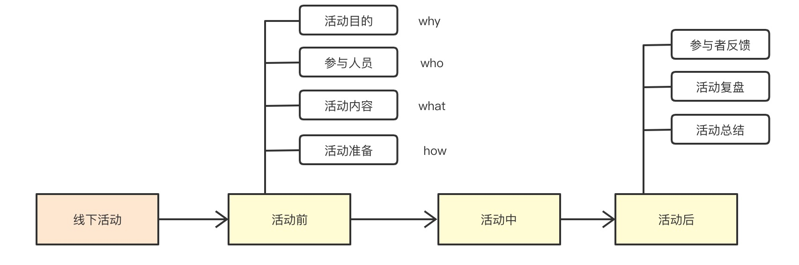

### 4.2.2.空间顺序
空间顺序，是一种化整为零的分解，比如对公司组成部门和地理位置的分解。
再将整某个整体（不论是客观存在的还是概念性的整体）划分为不同的部分时，你必须保证划分后的各部分符合以下要求：
1. 各部分之间相互独立（mutually exclusive），没有重叠，有排他性。
2. 所有部分完全穷尽（collectively exhaustive），没有遗漏。

这两个要求简称是MECE原则。

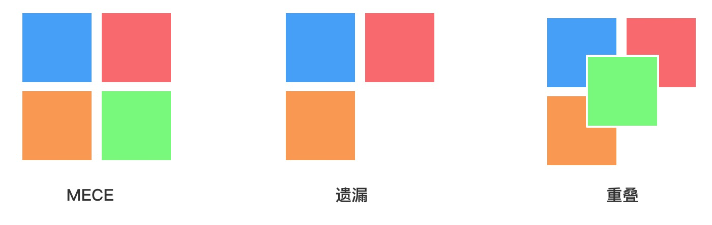

例如，我们要对衣服进行分类，如果按照季节和风格进行分类，就会出现互相重叠，并且不能穷尽的情况，也就不满足MECE。
这种分类是逻辑混乱的。

我们可以按季节分：春秋装，冬装，夏装。除了这3类之外，没有其他季节了，这个就是穷举不遗漏，彼此之前又相互独立没有交叉。

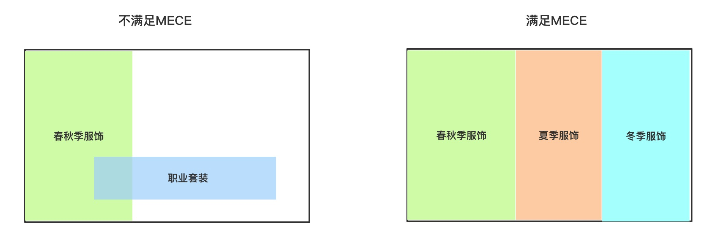

### 4.2.3.程度顺序
程度顺序，也称为重要性顺序。是你对一组因为具有某种共同特点而被聚集在一起的事务所采用的顺序。
如：3个问题，3个原因，3个因素等。在为事物分组时，你可能会说：“这家公司存在3个问题。” 
这时，你的大脑自动将这个3个问题和其它问题隔开。也就是说，这个3个问题是你认为这个公司最严重、最迫切需要解决的问题，
于此同时，公司可能还存在很多其它的问题，你只挑选这3个，是因为这3个最重要。
在排序的时候，最好是先重要后次要（first thing first），先强后弱。

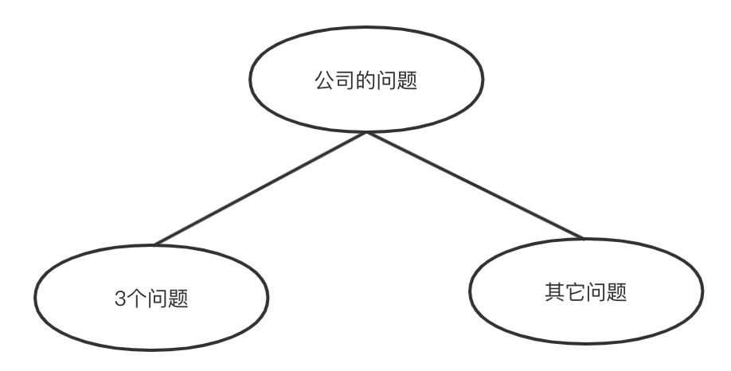

实际上，我们大脑能进行的逻辑分析活动只有4种，演绎（演绎推理）、归纳（发现因果关系）、分析（化整为零）和综合（总结概括）。
比如我说电脑是有显示器、主板、硬盘、显卡等组成的是合乎“化整为零”逻辑的。
我说苹果、鸡蛋都是水果，是不合乎“归纳”逻辑的。苹果和鸡蛋不是一个类别的，不是一个范畴的东西。

逻辑是我们构建结构的底层基础，缺少逻辑的结构是经不起推敲的。
明晰了结构中的逻辑关系之后，是时候该搭建结构，利用结构化思维解决问题的时候了。

# 5.如何构建结构
我们在解决问题的时候，一般有两种方法：**一种是从目标出发沿着不同的路径分解，探求问题的答案；
另一种是把各种信息聚合起来，得出一个正确结论或解决方案。**
这两种方法也是我们构建金字塔结构时仅有的两种方法：一是自上而下的搭建金字塔结构，即问题分解，也叫疑问回答分解；
二是自下而上搭建金字塔结构，即概括总结做聚合。

## 5.1.自上而下
当我们明确知道要解决的问题是什么的时候，可以考虑自上而下的方式，对问题进行拆解。
比如你要去准备竞聘，这是一个非常的明确的目标，就比较合适做自上而下的分解。

### 5.1.1.2W1H法
对于写一篇有明确主题的文章也是一样。比如前段时间，技术协会的同学邀请我写一篇教技术同学“如何写好技术文章”的文章。
对于这样的命题作文，我们就可以通过自上而下的方式对问题进行拆解，对于大部分的技术文章，
我们都可以通过What（是什么），Why（为什么），How（怎么做）来构建结构，也就是2W1H。
**2W1H是构建结构最常用，也是最有用的框架之一，因为它涉及到一个问题的最核心的3个要素，**
这和毛主席教导我们说要发现问题、分析问题、解决问题是一致的，其实都是在说“是什么”、“为什么”、和“怎么做”三个方面。

有了2W1H这个思考框架，我对“如何写好技术文章”进行了自上而下的结构搭建，接下来，写出这篇元技能文章，也就不是什么难事了：
1. 为什么写文章：1）写文章是费曼学习法。2）写文章可以增加影响力。
2. 什么是好文章：1）内容有价值。2）结构要清晰。
3. 如何写好文章：1）选择好内容。2）搭建清晰的结构。3）刻意练习。4）迭代优化。

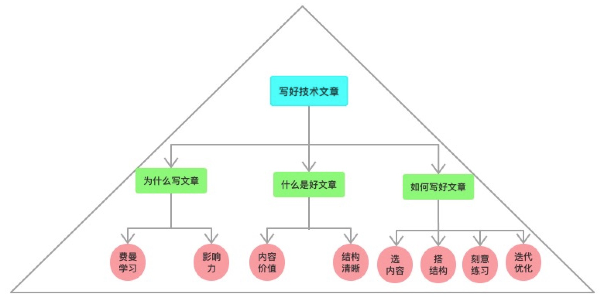

2W1H实际上是对5W1H（Why、Who、When、Where、What、How和How much）的简化和提炼，
如果需要更加全面的思考，我们需要尽量满足MECE法则，此时，5W2H可能是更好的选择。

### 5.1.2.5Why分析法
另外，我们还可以用“疑问解答”的方式来自上而下的构建我们的结构，
这样做的好处是，一方面可以通过设置悬念抓住听者的注意力，另一方面这种不断问“为什么？”的方式，
也是在帮助我们更加深入的理解问题，让我们的论证更加有说服力。

比如你要给大家分享“猪应当被当作宠物来养”，听众肯定会很疑惑“为什么猪可以当宠物呢？”，
你接着说“猪很漂亮，所以可以当宠物”，这回答了前面的疑问，当又引发了大家新的疑问：“猪怎么能漂亮呢？”，
然后你说“猪很肥”，大家的疑问更大了：“肥为什么还漂亮呢？” 这样一步一步往下走，
紧扣着听众的好奇心，这种先抛结论的倒序方式，通过提出疑问——回答疑问的悬念方式自然是非常有吸引力的，
于此同时，因为你对对方关心的问题进行了一个一个的解答，其说服力也会比较高。

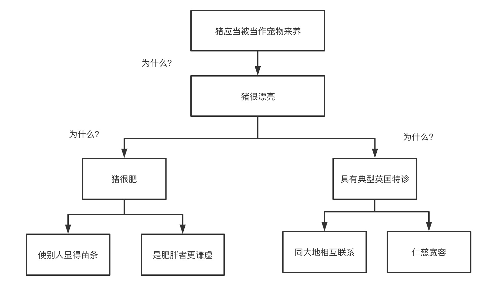

实际上，对于大部分的问题，如果你能连续追问5个why（为什么），一般都能触及问题的本质，
所以这种通过疑问——解答的方式自上而下的构建结构，不仅是一种构建结构的方法，也是一种发现问题根源的强大武器——5why分析法。

例如，丰田汽车公司前副社长大野耐一曾举了一个通过5why分析法来找出停机的真正原因。
1. 问题一：为什么机器停了？ 答案一：因为机器超载，保险丝烧断了。 
2. 问题二：为什么机器会超载？ 答案二：因为轴承的润滑不足。
3. 问题三：为什么轴承会润滑不足？ 答案三：因为润滑帮浦失灵了。 
4. 问题四：为什么润滑帮浦会失灵？ 答案四：因为它的轮轴耗损了。
5. 问题五：为什么润滑帮浦的轮轴会耗损？ 答案五：因为杂质跑到里面去了。 

经过连续五次不停地问“为什么”,才找到问题的真正原因和解决的方法，在润滑帮浦上加装滤网。
如果员工没有以这种追根究底的精神来发掘问题，他们很可能只是换根保险丝草草了事，真正的问题还是没有解决。

## 5.2.自下而上
有些时候，我们要解决的问题并没有那么明确，或者面对的是一堆零散的元素，
比如我们在头脑风暴的时候，产出了很多想法，我们要如何整理这些想法，此时，我们要如何构建清晰的结构呢？

试想这样一个场景，假如客户最近对销售报告和库存报告很不满意，需要你去调查一下原因。

你是一个执行力很强的人，接到任务后，很快开始展开信息收集工作，通过客户访谈，产品调研，很快找到了一堆客户不满意的原因：
1. 提交报告的周期不恰当；
2. 库存数据不可靠；
3. 获得库存数据的时间太迟；
4. 库存数据与销售数据不吻合；
5. 客户希望能改进报告的格式；
6. 客户希望除去无意义的数据；
7. 客户希望突出说明特殊情况；
8. 客户希望减少手工计算。

面对这一堆信息，你千万不要急着打报告交差，因为这些信息是零散的，
老板没有那么多时间去逐条理解，这些信息的罗列，让人摸不着头脑，抓不住重点，也理不清头绪，也不能做决策。

那如何才能让报告更清晰、更容易理解呢？我们可以用结构化思维，对同类信息，进行归纳分组，向上聚合形成一个金字塔的结构。
分组的逻辑是要找到共性，比如“周期不恰当”和“时间太迟”都是报告产生的时机不好，可以归为一类。

通过逐条分析原因，我们可以将8个问题概括为3组：
1. 时机不好：产生报告的时间太晚，无法采取有效措施。
2. 数据质量不好：报告中含有不可靠的数据；
3. 格式不对：报告的格式混乱；

进行分组之后，我们就可以得到如下的金字塔结构：

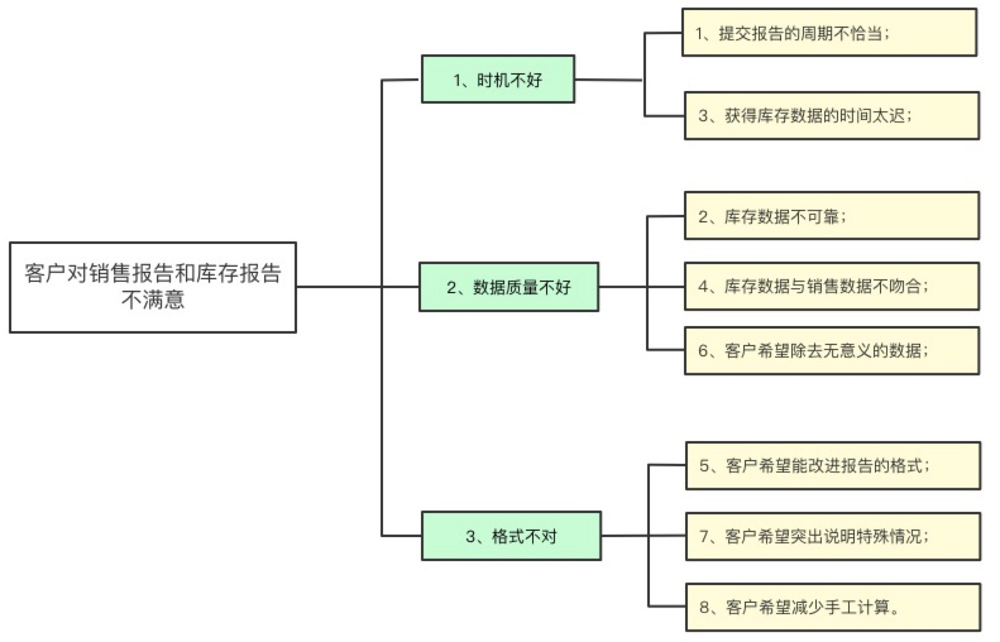

这种结构化的表达，很明显让问题的表述更加清晰。领导也可以很快抓住问题的要点，并作出相应的决策。

代码晦涩难懂，很多时候也是源于“没有结构”的混乱，长方法之所以是典型的代码坏味道，
正是因为它把过多的信息放在了一起，前面说过了，我们人类的大脑不是CPU，一次容不下过多的概念，
我们构建结构的目的就是为了更加清晰的表达，减轻大脑负担。这和我们如此强调代码可读性的要求是一致的。

商品是电商系统中最重要、也是最复杂的业务之一。
在发布商品的时候，我们需要组装offer（商品）的各种参数，因为offer需要的信息特别多，导致组装offer的代码也特别长。
随着时间的推移，还不断有新的信息在往这个方法中添加。
如果把这个代码类比成文章，这是一篇没有章节、没有段落的文章，其可读性和可维护性可想而知。

面对这些零散的“素材”，我们有必要对其进行归纳整理，构建一个更加清晰的结构。
通过简单归纳，我们不难发现商品信息主要包括商品核心信息、商品描述信息、产品属性信息、销售属性信息、系统属性信息、商品扩展信息等。
其中，扩展信息又可以进一步拆分成产品信息扩展（比如，是否进口）、销售信息扩展（比如，销售单位规格）、供应链信息扩展（比如，仓库类型）等等。形成一个如下的结构：

同样的业务逻辑，对比两种不同的实现方式，不难看出结构在里面起到的重要作用。

## 5.3.上下结合
自上而下的分解，自下而上的归纳，二者不是你有我无的关系。更多的时候，是两个方法都会用到，
构建结构的过程，不是一次性的从上到下，也不是一次性的从下往上，而是上上下下，来来回回，反复修改，反复优化的过程。

了解我的人都知道，我一直在致力于控制软件复杂度，写过一篇文章——一文教会你如何写复杂业务代码，
文章的核心思想就是提出了通过**自上而下的结构化分解+自下而上的抽象建模，通过上下结合来治理复杂业务的方法论。**
实际上，这就是典型的结构化思维，是演绎法和归纳法的完美结合。
天下的道理都是相通的，结构化思维本来是教人清晰表达、写作的，然而同样的道理在软件设计和代码实现中，同样适用。

自上而下的分解可以帮助我们更好的理清业务逻辑，更清晰的表达业务过程，这种分解非常有必要，
只是太面向过程了，导致代码的复用、扩展和语义表达能力偏弱；
因此，我们还需要自下而上的抽象建模，帮助我们提升代码的复用性、扩展性和业务语义表达能力。

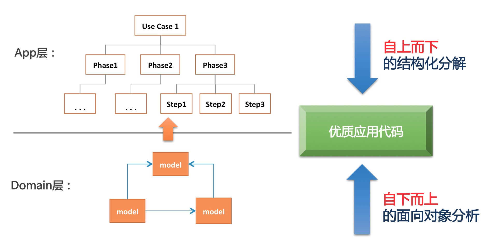

我记得有一次在分享的时候，有一个同学问我：“分解必须是自上而下，建模必须是自下而上的吗？” 
当然不是，在分解之前，我们可能已经初步构建了模型，同样，
在建模的同时，我们也可以同步实施业务过程分解。这两个步骤是相辅相成的，是螺旋式上升的过程。
步骤可以交替进行、也可以同时进行。随着我们对问题域理解的更加深入，我们很有可能在某个时间点，重构我们的结构和模型。
分开介绍自上而下和自下而上的方法，是为了说明演绎思维和归纳思维的区别，至于在使用的时候，通常都是上下结合一起使用的。

# 6.更多有用的结构
通过前面的介绍，我相信你在学习结构化思维的同时，应该也感受到了思维框架在结构化中的作用，
比如2W1H就是非常有用的框架，因为它涉及到大部分问题的本质——“是什么”，“为什么”，“如何做”。

5W2H也是解决一般问题非常有用的思维框架，5W2H分别代表Why、Who、When、Where、What、How和How much，
很多问题都可以拆解成这7个要素，如果你知晓这个结构，在分析问题的时候，就比不知道这个结构的人要更加全面和体系化。
知晓框架的好处是，别人的难题，只是你的“填空题”，别人在感叹你思考为什么如此全面的时候，你会心一笑，这只不过是一个“套路”。

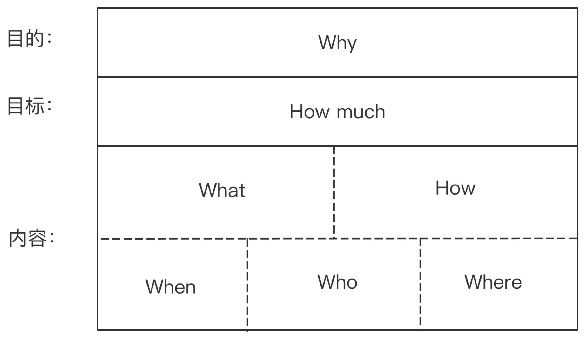
举个例子，最近系统不稳定，连续出现了一些比较严重的P1故障，老板让你组织开一个全员大会，提升大家的质量意识。你准备发出一个会议通知：

为了提升质量意识，召集大家在10月22日下午3点在3号楼205培训室召开全员大会。
会议议程是首先复盘一下最近故障出现的原因，然后制定策略防止类似故障再次出现。
目标是为了在下半年不再出现P1故障，确保线上系统稳定性。

然而，这个内容不够清晰，更好的做法是可以使用5W2H对内容进行结构化的表达：
* 目的：提升全员质量意识。
* 目标：下半年不再出现P1故障。
* 时间：10月22日下午3点。
* 地点：3号楼205。
* 议程：1）故障复盘。2）制定故障防控策略。

对比两个会议通知，不难发现，5W2H的结构让我们的表达更有条理，更加清晰。
幸运的是，针对不同的问题场景，前人们已经总结出很多解决特定问题的结构框架，
我们不用绞尽脑汁的去寻找分析问题的角度，拿来即用即可，比如：
1. 制定市场营销策略的“4P”模型：即产品策略（Product Strategy）、价格策略（Price Strategy）、渠道策略（Place Strategy）、促销策略（Promotion Strategy）。
2. 思考组织战略的“7S”模型：即经营策略（Strategy）、组织结构（Structure）、运营系统（System）、经营风格（Style）、职员（Staff）、组织技能（Skill）和共享价值观（Shared value）。
3. 分析竞争力的SWOT模型：SWOT分析代表分析企业优势（Strengths）、劣势（Weakness）、机会（Opportunity）和威胁（Threats）。
4. 制定目标的SMART模型：即制定目标要满足确定性（Specific) 、可度量性（Measurable）、可实现性（Attainable）、相关性（Relevant）和时效性（Time-based）。

擅用这些框架。可以极大的提升我们解决问题的效率，同时帮助我们做更加全面的、结构化的思考。做到“无遗漏，不重复”。

