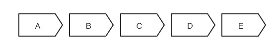

思维能力：逻辑思维
======

“你讲话要有逻辑！”
“你这逻辑不对！”
“你的底层逻辑是什么？”
“说说你的逻辑思维能力体现在哪儿？”

在日常交流中，我们会频繁的使用“逻辑”这个词。
但能够清晰的说出逻辑的定义（什么是逻辑）应该不多，能够正确的掌握逻辑推理的人就应该更少了。
对于大部分人来说，逻辑更像是一个“熟悉的陌生人”。

举个例子。
小王说：“Frank真不是男人，竟然会怕毛毛虫。”
小张说：“Frank怎么不是男人，他不是男人，怎么会有鼓鼓的二头肌呢？”

你觉得小张的反驳有道理吗？如果你觉得有问题，问题出在哪里呢？
这里其实是犯了一个典型的逻辑谬误（先卖个关子，在逻辑谬误小节会给出答案）。
类似于这样的逻辑谬误，每天都会在我们的沟通交流中发生，只是因为我们缺乏相应的逻辑知识，不能被识别罢了。
因此，作为以逻辑思维缜密自居的程序员们，我们有必要好好的探究一下逻辑思维。

然而，逻辑学是一门非常复杂的学科，光《逻辑学导论》就有752页，系统的介绍逻辑学并不是本章的目的，
本章的主要目的是逻辑知识科普，旨在唤起大家的理性意识，能够掌握一些逻辑学的基本知识，具备一些逻辑思维能力。
在面对“杠精”的时候，能发现对方的逻辑谬误；在思考问题的时候，能尽量做到逻辑完整；在表达的时候，能尽量做到逻辑清晰。

下次，当别人对你说“你这逻辑不对！”的时候，你能知道他是在说什么。
同样，当你对他人说“你这逻辑不对！”的时候，也知道自己在说什么。

# 1.什么是逻辑
逻辑（logic），源自古典希腊语逻各斯（logos），最初的意思是“词语”或“言语”，（引申出意思“思维”或“推理”）。
逻各斯，是古希腊哲学家赫拉克利特最早引入的哲学概念，古希腊哲学从探求世界本原问题开始，
从泰勒斯的水本原（具象），认为水是万物之源，到赫拉克利特的逻各斯（抽象），
再到柏拉图的理念论，完成了自然哲学到形而上学的发展。

简而言之，逻各斯是指可理解的一切规律，**逻辑是指思维的规律和规则。**

逻辑除了指思维规律，狭义上，也有逻辑学的含义，按照《逻辑学导论》中的定义，
**逻辑学是研究用于区分正确推理（inference）与不正确推理的方法和原理的学问。**

相比较上面的教科书定义，我觉得芝本秀德在《深度思考法》中对逻辑的定义要更容易理解，他说“**逻辑就是关系。**”

我们说某人逻辑性太差，其实正是因为他们没有在想表达东西之间建立关系。
例如，对方说“今天的天气真不错。”我们认为，诸如“是啊，天气太好了”或者“天气让人心情都变好了”这样的回答是有逻辑性的。
可是如果回答是“我肚子好饿啊”，那么这种答非所问，就完全不符合逻辑。
**所以说无逻辑就是没有建立起事物之间的正确关系，换句话说有逻辑就是能建立事物之间的正确关系。**

这个表述有一定的道理，因为逻辑学就是研究多个语句（sentence）之间推理是否正确的学问，
所以从这个意义上来说，逻辑学就是研究语句之间关系的学问。
不过，这个“关系”并不是都像“天气好”和“心情好”这样的显而易见，有些关系很复杂，有些关系很隐蔽，这就要借助更多逻辑学的知识来分析他们的有效性了。

不管怎样，从理解的角度来说，记住“逻辑就是关系”还是很有用的，关于逻辑关系，我也会在结构化思维一章中进行更加详细的阐述。

# 2.逻辑思维的要素
逻辑思维基本包含三个方面：

概念；
判断（在逻辑学中，也叫命题，英文是proposition）；
推理（在逻辑学中，也叫论证，英文是argument）；

概念是思维的基本单位；通过概念对事物是否具有某种属性进行肯定或否定的回答，这就是判断；
由一个或几个判断推出另一判断的思维形式，就是推理。

实际上一本书的逻辑也是包含这三个要素，如果你看过《如何阅读一本书》，里面提到的分析阅读，
说的就是如何通过提炼一本书的关键字词（概念），关键句子（判断），以及关键论述（推理）来分析一本书的主旨。

所以逻辑思维的要义，就在于正确运用概念、判断、推理的思维形式。想要正确掌握逻辑思维，就必须从这三方面学起。

## 2.1.概念
概念是思维的基本单位，是反映事物本质属性或特有属性的思维形式。

这个世界有很多事物，都是通过我们的思维去赋予它们意思或意义的，然后通过语言符号呈现出来。
所以说，**这些意思或意义，就是概念的思维内显形式。语言是概念的外显形式。**

明晰概念可以说是我们了解事物的第一步。是我们学习、研究和讨论的基础。
可以说认知水平越高的人，越能认识到概念的重要性。

在《批判性思维工具》一书中，**作者说学习一门课程应该从理解课程的最基本概念开始。**
比如在经济学中，“稀缺”是经济学中的基本概念，其它经济学概念都与这一中心概念有关：
稀缺意味着我们任何一个人都不可能拥有所有想要的资源（稀缺的事实），我们想要得到一些东西必须先放弃另一些东西。

同样，在2016年11月9日下午，在北京举办的“朗润·格政”国家发展研究院论坛上，
两位著名经济学家林毅夫和张维迎在北京大学朗润园进行了一场可以写入历史的辩论。

他们辩论的主题是“产业政策”。在辩论的开始很有意味，林毅夫首先开讲，在说完客套话后接着说：
“在准备这个报告的时候，他们给我一个任务，**你在讲你的看法之前先定义一下什么是产业政策，
我想定义是非常重要的，不然会各说各话，谈论过程当中就没有激情。**”

我个人也是如此，我在分享DDD（Domain Driven Design：领域驱动设计）的时候，
总是会花很大的篇幅去介绍通用语言（Ubiquitous Language），说这是DDD的核心，
一个团队只有在统一语言概念基础上，才能更好的沟通协作；
文档和代码里面的核心概念只有保持一致，才会具备更好的可读性和可理解性。
我建议，对于任何领域，都应该有一份核心领域词汇表，方便团队在这些核心概念的表达和命名上达成共识。

所以，提高我们的逻辑思维能力，要从懂清楚每一个概念所表达的具体内容（内涵和外延）开始。

## 2.2.判断
判断（也叫命题）是推理的建筑基块，一个判断就是一个断言（Assert），它断定了一个事情是这样或者不是这样。
因此，每一个判断都是或真或假的。

一个问题没有断言任何东西，就不是判断。“你知道下象棋吗？”这的确是一个句子，但没有做出关于这个世界的断定。
一个命令（“快点！”）或者感叹（“我的天哪！”）也不是判断。因为这些问题、命令和感叹都是非真且非假的。

判断一般都是用陈述句作为表达的，如“世界上的所有人都是善良的”。
这是一句肯定判定。只要该判断符合对象的实际情况，这就是真的，反之就是假的。

判断是概念的展开，没有判断，就不能揭示和说明概念。同时，判断也是推理的前提，是正确运用各种推理的必要条件。

试想一下，“世界上的所有人都是善良的”这个判断，我们都知道是假的，否则这个世界就没有违法犯罪的人了。

由此，我们可以得出判断的两个重要特征：
* 判断有肯定或者否定之分，可以有肯定判断和否定判断；
* 判断有真假之分，一个判断要么真要么假，不能非真非假；

准确的运用判断，我们才能够进行正确的思考。而思考的形式，就是推理了。

# 3.逻辑推理
逻辑推理，可以分为演绎推理（Deductive Inference）、归纳推理（Inductive Inference）和溯因推理（Abductive Inference）。
还记得上文关于逻辑的定义吗，逻辑就是关系。所谓的推理，就是研究语句、判断、命题之间相互关系的学问。

## 3.1.演绎推理
演绎推理旨在阐明前提和结论之间的关系，为评估演绎论证是否有效提供方法。

演绎逻辑是一个从一般到特殊的过程。我们通常说的“大前提、小前提、结论”的三段论形式就是典型的演绎逻辑。
例如“所有人都会死，苏格拉底是一个人，因此，苏格拉底会死。
” 大前提是“所有人都会死”，小前提是“苏格拉底是一个人”，结论是“苏格拉底会死。” 
这是一种必然性推理（保真推理），因为其结论就包含在前提之中，“所有人会死”本身就包含“苏格拉底会死”。

演绎逻辑，在历史上出现了两种杰出理论。第一种被称为“古典逻辑”或“亚里士多德逻辑”，
开创这种理论的是古希腊哲学家亚里士多德，他关于推理的论述被收集成册，称为《工具论》。
另一种称为“现代逻辑”或“现代符号逻辑”，他主要形成与20世纪。

古典逻辑和符号逻辑，都是研究推理的形式（form），所以也被称之为形式逻辑。

也就是说，对于一个推理来说，首先要保证在形式上是有效的，如果推理形式有效且前提为真，那么结论必定为真。
如果形式是无效的，即使前提为真，结论不一定为真。“真”和“假”的概念适用于命题，“有效性”和“无效性”适用于逻辑形式。

例如下面的论证：
如果比尔盖茨拥有福特的所有财富，那么比尔盖茨将是富有的；（p=>q）
比尔盖茨不拥有福特的所有财富；（~p）
所以，比尔盖茨不是富有的。（∴ ~q）

虽然前提（premise）是真的，但是其论证形式是无效的（否定前件谬误，后续会介绍），所以其结论是无效的，同时也是假的。

### 3.1.1.古典逻辑
**古典逻辑（亚里斯多德逻辑）主要处理的是不同对象的类之间关系的论证。**
类是指共有某种特定属性的对象的汇集。
类与类之间的三种关联方式：
* 全包含（wholly included）例如狗的类和哺乳动物的类。
* 部分包含（partially included）例如运动员的类和女人的类。
* 互斥（exclude），例如三角形的类和圆形的类。

基于类和类之间的关系，有四种直言命题：
* 全称肯定命题。所有S是P。例如所有政客都是说谎者。也叫A命题。
* 全称否定命题。没有S是P。例如没有政客是说谎者。叫E命题。
* 特称肯定命题。有S是P。例如有政客是说谎者。叫I命题。
* 特称否定命题。有S不是P。例如有政客不是说谎者。叫O命题。

基于这些命题和谓项，组成了很多形式。古典逻辑学家很细致的研究了这些形式，总结出15个有效的三段论形式。

例如下面的论证：
没有富人是游民，（E命题）
所有律师都是富人，（A命题）
所以，没有律师是游民。（E命题）

因为这个论证形式是EAE-1，而EAE-1是15个有效论证形式之一，所以是一个有效论证。
又因为其前提是真的，所以结论也是真的。

### 3.1.2.符号逻辑
**所谓符号逻辑就是利用符号来表示逻辑中的各种概念。**
1847年，英国数学家布尔发表了《逻辑的数学分析》，建立了“布尔代数”，并创造一套符号系统。
布尔建立了一系列的运算法则，利用代数的方法研究逻辑问题，初步奠定了数理逻辑的基础。

目前，符号逻辑已经超出逻辑学的范畴，成为数学的一个分支，同时也是计算机科学的基础。

逻辑代数也叫做开关代数，它的基本运算是逻辑加、逻辑乘和逻辑非，
也就是命题演算中的“或”、“与”、“非”，运算对象只有两个数 0和 1，相当于命题演算中的“真”和“假”。
逻辑代数的运算特点如同电路分析中的开和关、高电位和低电位、导电和截止等现象完全一样，都只有两种不同的状态。
因此，它在电路分析中得到广泛的应用。

通过符号化和公式化，我们就可以对逻辑命题进行数学演算，比如符号~代表否定，因此 p=q 和 p=~~q 是等价的，即双重否定等于肯定。
同样，我们在计算机中的逻辑运算（与、或、非）也是完全符合符号逻辑的。

再比如，如下的论证形式都是无效的，因为犯了肯定后件和否定前件的谬误。

肯定后件谬误
p=>q
q
∴ p

否定前件谬误
p=>q
~p
∴ ~q

关于这两个谬误很容通过例子看出来，前面“比尔盖茨不是富翁”的例子就是一个典型的否定前件谬误。
而下面“华盛顿之死”的例子是肯定后件谬误。因此，所有的论证形式只要是否定前件或者肯定后件的，都是无效的。

如果华盛顿是被暗杀的，那么华盛顿死了。（p=>q）
华盛顿死了。（q）
因此，华盛顿是被暗杀的。（∴ p）

## 3.2.归纳推理
归纳推理是以一类事物中若干个别对象的具体知识为前提，推出有关该类事物的普遍性知识的结论的过程。

例如：
猫A喜欢吃鱼。
猫B喜欢吃鱼。
猫C喜欢吃鱼。
猫D喜欢吃鱼。

因此：猫喜欢吃鱼。

就是一个典型的归纳推理。然而，同样的推理用在下面的案例中，就出现了问题，因为我们知道还有黑天鹅的存在。
天鹅A是白的。
天鹅B是白的。
天鹅C是白的。
天鹅D是白的。

因此：天鹅是白的。

这也是为什么有很多哲学家吐槽归纳法，认为归纳法虽然可以得到新知识，但是因为不能穷举，所以永远也得不到真理。
然而，演绎法虽然可以保真，但因为结论是蕴含在大前提里面，又不能产出新知识。
最后推导出如果有真理存在的话，真理只能是先验的（先于我们感觉经验，先天存在于我们的意识之中）。

然而科学知识都是来自于科学归纳法，所以真正的科学都是可以被证伪的，
即当一个科学理论与最新的发现发生矛盾的时候，就需要一个新的理论来代替它。
爱因斯坦的相对论虽然在牛顿力学的基础上迈出了一大步，但还是受到了量子力学的挑战。
因此，我们还需要一个能够解释所有力学现象的统一场论。
这也是爱因斯坦终其一生没有完成的工作，只能期待另一个爱因斯坦来完成这个伟大的工作了。

实际上归纳和演绎并不是割裂的，而是彼此联系的，主要有两个原因：
其一，为了提高归纳推理的可靠程度，需要运用已有的理论知识，对归纳推理的个别性前提进行分析，把握其中的因果性，必然性，这就要用到演绎推理。
其二，归纳推理依靠演绎推理来验证自己的结论。同样，演绎推理要以一般性知识为前提，这通常要依赖归纳推理来提供一般性知识。

这一点在我们软件工程中的建模工作中得到了充分的体现，
**建模是一个归纳工作，我们通过抽象问题域里具有共同特性的类来建立模型。
为了验证模型的有效性，我们会使用演绎的方法，去推演不同的业务场景，看看是否能满足业务的需要。**
这样的工作往往并不是一次成型，而是要交替往复，最终才能得到一个相对合理的模型。

## 3.3.溯因推理
溯因推理就是我先知道了答案，再去追溯原因的推理。
这种推理方法最早也是由亚里斯多德提出的，在他的著作《前分析篇》中，提到过一种“还原推理模式”，说的正是溯因推理。

演绎推理的方法是由A推理出B，而溯因推理则不同，它是在看到了B后，
推理出到底是什么导致了B的最佳解释方法，可以理解成是根据结果B去推测原因A的推理方法。
换句话说，溯因推理是解释已知事物的过程。

如何进行溯因推理呢？

简单来说，就是**八个字：大胆假设，小心求证。**

假如你家卫生间地上出现了一滩积水，需要你去推理一下它的原因，你该怎么办？

按照这个八个字，你首先要做的是：大胆假设。

能够造成卫生间地上有滩积水的原因比较多，比如卫生间的屋顶漏水、抽水马桶漏水，或者有人在地上放了冰块。

接下来，就得从众多可能原因中找到一个最贴近现实的假设。
因为屋顶漏水和地上有冰块都不好解释水是在抽水马桶一侧的现象，而且冰块也不大可能会出现在卫生间。
综合考虑这些因素后，你就能得出一个最贴近现实的假设，那就是抽水马桶本身漏水。

那么，怎样才能知道卫生间的积水是抽水马桶漏水呢？这就需要对这个假设进行验证了，也就是小心求证。
在这里，验证并不困难，你只需要擦干漏水，看是不是有水从马桶里漏出来，就能验证假设是否正确了。
这就是溯因推理的具体方法——大胆假设，小心求证。

做科学研究，也离不开大胆假设、小心求证。

1845年，天王星的运动数据和其它行星比起来，出现了2分钟弧度差值。
勒维耶提出一个假设：天王星的差值是有另一颗（未发现的）行星引起的，一旦做出这样的假设，海王星那颗新行星就很快得以发现。

对于我们程序员来说，这种溯因推理基本每天都在进行，我们通常说的故障排查（Trouble Shooting）就是溯因推理。
用的手段基本上也是假设和求证。

比如我们收到系统异常报警，然后去查看系统日志，发现是一个依赖的服务报了超时（Timeout）错误，
我们的第一反应是：是不是网络出现了问题（假设）。于是开始ping依赖服务的IP，发现网络是没问题的（求证）。
于是提出了新的假设：是不是依赖服务内部出现了什么问题。
于是开始排查依赖服务的日志，发现是因为一个数据库操作太过频繁，导致响应时间超时。
可是这块的代码很长时间没有修改了，为什么正好今天出现问题呢？
通过进一步排查，发现是缓存服务器出现了问题，导致本来调用缓存的操作，全部打到了数据库上。
那为什么缓存服务器会宕机呢？进一步追查，是因为最近使用缓存的人比较多，导致内存空间不足导致了宕机。
至此，才算真正的找到了问题的根因（Root Cause）。

溯因推理不仅可以帮助我们找到造成现象的原因，还可以帮助我们挖掘问题的根因。
因为很多时候，导致问题出现的原因往往是一个因果链：A导致了B的发生，B导致了C的发生，C导致了D的发生，D又导致了E的发生。
所以，在看到E时，如果我们只追问到D这一层，就是没有找到问题的根源所在。
比如上面服务器超时问题的表象原因是数据库操作导致的，实际的根因却是缓存服务器的内存空间不足。

凡事我们要多问几个“为什么”，任何问题，如果你能扛得住5个“为什么”，说明你是真正理解了这个问题。
有个著名的提问法就叫5Why提问法。

丰田汽车公司前副社长大野耐一曾举了一个通过5why提问找到问题根因的实例。

有一次，大野耐一先生见到生产线上的机器总是停转，虽然修过多次但仍不见好转，便上前询问现场的工作人员。
问：为什么机器停了？（1Why）
答：因为机器超载，保险丝烧断了。

问：为什么机器会超载？（2Why）
答：因为轴承的润滑不足。

问：为什么轴承会润滑不足？（3Why）
答：因为润滑泵吸不上来油。

问：为什么润滑泵吸不上来油？（4Why）
答：因为油泵轴磨损、松动了。

问：为什么油泵轴磨损了？（5Why）
答：因为美誉安装过滤器，润滑油里混进了铁屑等杂质。

在我们的实际工作中，也是如此，凡事要多问几个为什么，要知其然知其所以然，
这种本质思考会极大的提升我们的认知水平和解决问题的能力。

# 4.逻辑谬误
所谓谬误（fallacy），就是推理中的欺骗手段，常见的花招有错误假设，理由和结论不相关（偷换概念）等。

虽然上文只是对形式逻辑（古典逻辑、符号逻辑）进行了简单的介绍，想必你也感受到了它的抽象和复杂。
是的，形式逻辑虽然强大，但远离生活。试想下，在与人沟通和辩论的同时，是很难用形式逻辑做算式推导的。

出于实用性的考虑，逻辑学家们发展出了非形式逻辑（informal logic），
主要是因为它不依赖于形式逻辑概念，也不依赖形式逻辑的主要评价功能——有效性。
非形式逻辑可以在日常生活中，辅助我们进行逻辑分析和批判性思考。

为了方便运用，逻辑学家给这些逻辑谬误进行了分类，并给与容易记忆的命名，
这样在碰到类似的场景的时候，我们便可以那这些谬误分类作为武器，为我们的批判、分析、讨论进行“防卫”。

那么，都有哪些谬误呢？

这些谬误包括偷换概念、错误假设、以偏概全、转移话题、人身攻击、以势压人、以众压人、
循环论证、不适当地诉诸权威、不适当地诉诸情感、窃取论题、得寸进尺等等。
关于更多逻辑谬误的知识，推荐去看看《学会提问》这本书，接下来我会挑选几个常见的逻辑谬误简单介绍一下。

## 4.1.偷换概念
回到开篇关于“Frank不是男人”的例子，这里小张就是使用了偷换概念的花招，
小王说的“男人”是指男子汉气概，而小张说的“男人”是指生理男人，两个“男人”指向的不是同一个概念。

当你看到一个关键词在论证中不止一次出现，要注意其意义有没有发生改变，如果意思发生改变，就要警惕偷换概念谬误。
那些高度含混的术语和词组尤其是偷换概念的绝佳材料。

偷换概念也是一种常见的诡辩手法。主要有以下几种表现：
* 任意改变一个概念的内涵和外延．使之变成另一个概念。
* 利用多义词可以表达几个不同概念的特点，故意把不同的概念混淆起来。
* 抓住概念之间的某些相似之处，抹杀不同概念的本质区别。

再比如，当有人说欧谛德谟克说谎时，他狡辩说：“谁说谎就是在说不存在的东西，而不存在的东西是无法说的，所以没有人能说谎。”

在欧谛德谟克的狡辩中，两次使用了“不存在的东西”这一语词，但其所表达的概念却是不同的。
前者表达的是“不符合事实”的概念，后者表达的是“根本不存在的事物”的概念。他就是故意用后一概念去偷换了前一概念。

## 4.2.错误假设
在所有的论证中，都有一些作者认为是理所当然的特定假设，通常情况下他们却不会明说出来。
因此，乍一看，几乎每个论证都显得“有道理”，其外表结构看起来都显得完美无缺。
但有些内在的没有说出来的看法——隐含假设，所起到的作用同样重要。

让我们思考下这个说法：“一个小学没有毕业的人早早地混社会挣了很多钱，一个博士毕业但是没有挣到太多钱。
所以读书无用，小学没有毕业可以比博士更成功。”

这种说法，就暗含了一个隐含的价值观假设：即金钱是唯一的衡量标准，金钱是最重要的。
但金钱至上的价值观并不是普适的，如果你不认同这样的价值观（认为精神富足更重要），那么这个论证也就不成立了。

再比如，在阿里面对烂系统，经常有一个说辞叫“野蛮生长”，言下之意是业务发展很快，技术来不及优化只能草率支撑。
这里其实隐含着一个前提假设——即时间有限系统就会烂。然而这个前提假设在逻辑上也是不严密的，有没有可能在同等的时间下做到既快又好呢？
我想，随着技术能力水平的提升，是有可能做到“既快又好”的。

每个人的背景和身份不一样，代表的利益不一样，所以他们的话语中经常是带有自己的价值倾向，
只有把这些隐含的假设暴露出来，我们才能进行正确的判断。
比如马老师说996是福报，也是带有自己利益团体价值观倾向的。

## 4.3.循环论证
一个结论会自己证明自己，只不过措辞有所改变。例如：
一个瘦子问胖子：“你为什么长得胖？”
胖子回答：“因为我吃得多。”
瘦子又问胖子：“你为什么吃得多？”
胖子回答：“因为我长得胖。”

电视剧《士兵突击》里的金典对白也是如此：
老马：“可是什么有意义呢，许三多？人这辈子绝大多数时候都在做没意义的事情。”
许三多：“有意义就是好好活。”
老马：“那什么是好好活呢？”
许三多：“好好活就是做有意义的事情。（看一眼老马后再强调）做很多很多有意义的事情。”

再比如，论证“逃课不好”，因为“逃课是不对的”，不好和不对是一个意思，等于没有论证，是在同义反复。

## 4.4.以偏概全
以偏概全是指依据不充分的例证得出普遍的结论。你不能说看到3个意大利人很有情调，就说所有的意大利人都是浪漫的。

以偏概全是使用归纳法中常见的谬误，即使用过小的样本量，或者不具代表性的样本，归纳得到一个错误的结论。
比如说，用一张什么偏方，治好了某个人的某种疾病，如果就据此得出“这张偏方具有治疗该疾病的作用”，那就错了。
现代临床医学研究，总是强调大样本、多中心、随机、双盲和对照试验，目的就是避免在运用归纳法时陷入以偏概全的谬误。

实际上，上文中关于“读书无用论”的论证，除了有价值观假设的问题，也有以偏概全的问题。
毕竟即使在经济上，不读书能成功的也是极少数，从概率上来讲，更多高学历的人比低学历的人在经济上要优越。

## 4.5.滑坡谬误
滑坡谬误是指不合理使用连串因果关系。通过一个起因A，引发多米诺效应，带来一些列负面事情。
A并不是很糟糕，但是A导致B，B导致C，C导致D，D简直糟糕透顶。

想象一位母亲告诫她年轻女儿说：“亲吻自然没有什么，但是想想亲吻能带来什么，接下来又会发生什么。
只有你弄清楚这些，你才会避免成为一个可怜孩子的妈妈，否则你年轻的生命就永远地毁了！”
焦虑的滑坡谬误操纵者忘了一点，那就是许多行走在滑坡上的人都很小心，并不会跌倒。

现在的教育内卷，实际上也是一种滑坡谬误，很多家长不想让小孩输在起跑线上，
认为没有好的幼儿园就上不了好小学，没有好小学就上不了好中学，没有好中学就上不了好大学，上不了好大学这辈子就没有希望了。

“滑坡”在逻辑上虽然可能存在漏洞，但是作为一种修辞手法，往往会起到比较好的喜剧效果，
比如在《江湖》中，刘德华对张学友经典对白：“说了你又不听，听又不懂，懂又不做，做又做错，错又不认，认又不改，改又不服，不服也不说，那叫我怎么办？”

最后，我想说，逻辑思维需要理性的思考。但是，我们人类并不是纯粹理性的动物。
正如丹尼尔.卡尼曼在《快思慢想》所说：“人类都是主观性的动物，别说客观公正了，很多时候，连理性都没有，都是感觉直观。”

不可否认，逻辑思维是我们最重要、也是最底层的思维能力。
特别是对程序员，因为软件是一个纯思维的创造活动，没有清晰的逻辑思维，不可能创造出漂亮的作品。

然而在生活上，有时候我们还是可以“傻”一点，没必要凡事都上纲上线、理性分析。
特别是在家庭生活中，你要相信老婆很多时候都是“有道理的”，就拿我自己来说，周日早上还是会乖乖的陪女儿去上英语学习班。

