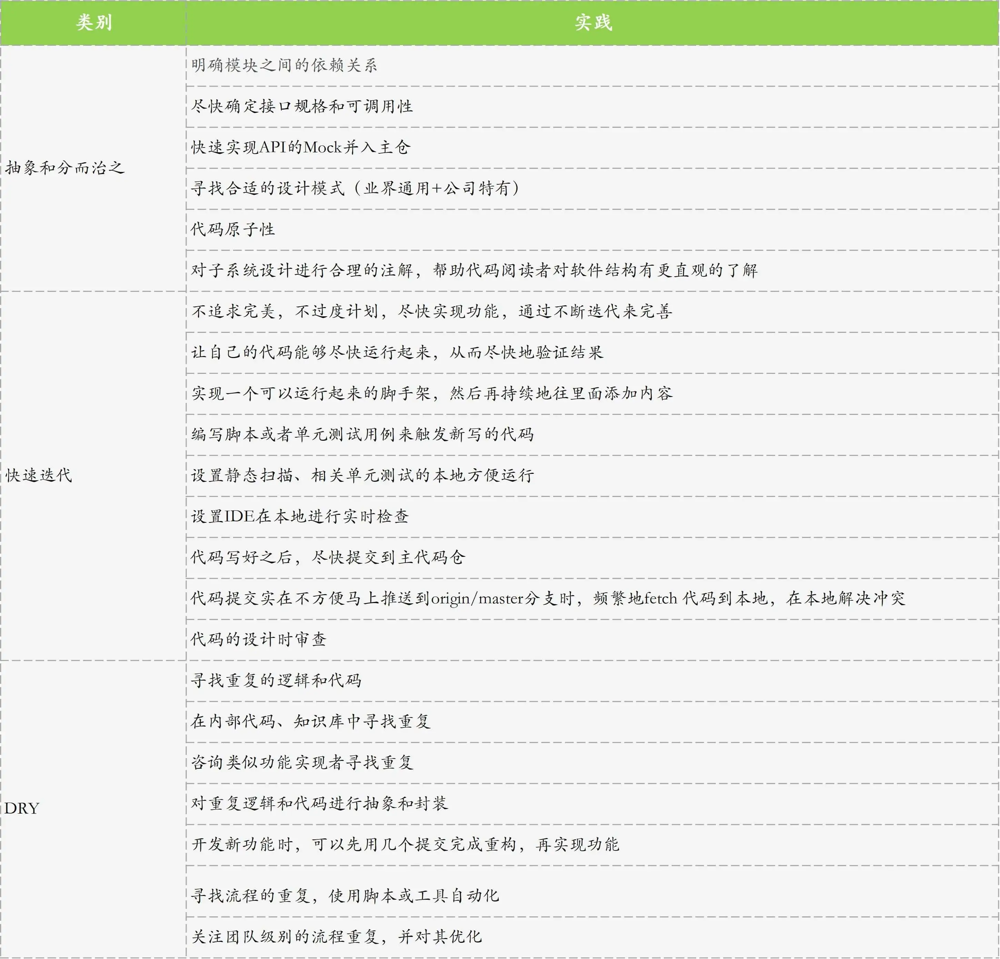

21 | 高效工作：Facebook的10x程序员效率心法
======
> [原文](https://time.geekbang.org/column/article/148170)

从今天这篇文章开始，我们就正式进入**个人效能**模块了。今天，我要和你分享的**主题是，程序员如何高效地进行开发工作。**

最近比较流行的一个说法是 10x 程序员，也就是 10 倍程序员，意思是一个好的程序员，工作效率可以达到普通程序员的 10 倍。
要做到这一点并不容易，我们需要在**编程技术、工作方式、工具使用**等方面全面提高。

今天这篇文章，我将聚焦于**如何提高自己的编程技术，给出在实践中被证明有效的 3 条原则，
包括抽象和分而治之、快速迭代，以及 DRY（Don’t Repeat Yourself），并针对每条原则给出几个高效实践。**
而关于工作方式、工具使用等方面的内容，我会在后面几篇文章中与你详细讨论。

# 第一条原则：抽象和分而治之
虽然我们面对的世界非常复杂，但大脑只能同时处理有限的信息，那**怎么平衡这个有限和复杂之间的矛盾呢？**

**最好的办法是，把一个系统拆分为几个有限的子系统，每个子系统涵盖某一方面的内容，并将其复杂性隐藏起来，只对外暴露关键信息。**

这样，我们在研究这个系统的时候，就无需考虑其子系统的细节，从而对整个系统进行有效的思考。如果我们需要深入了解某一个子系统，再打开这个子系统来看即可。

以此类推，如果这个子系统还是很复杂，我们可以再对其进行拆分。
这样一来，在任何时候，我们思考时面对的元素都是有限的，复杂度也下降到了大脑的能力范围之内，从而完成对一个复杂系统的理解和处理。

**这个拆分处理的过程，就是我们常说的分而治之；而用子系统来隐藏一个领域的内部细节，就是抽象。**
抽象和分而治之，是我们理解世界的基础。

比如，我们在了解一张简单的**桌子**时，首先想到的是它由 1 个桌面和 4 条桌腿组成。
那么，桌面和桌腿就是子系统：桌面就是一个抽象，代表实现摆放物品功能的一个平面；桌腿也是一个抽象，代表支撑桌面的结构。

如果我们需要进一步了解桌面或者桌腿这两个子系统，可以再进一步去看它们的细节，比如两者都有形状、重量、材料、颜色等。
但如果一上来就考虑这些细节的话，我们对桌子的理解就会陷入无尽的细节当中，无法快速形成对整个桌子的认知。

软件开发也是这个道理，我们必须做好抽象和分而治之，才能做出好的程序。

所以，拿到一个任务之后，我们要做的**首先就是进行模块的定义，也就是抽象，然后对其分而治之。**

为方便理解，我再和你分享一个在 Facebook 时，几个前后端开发者同时开发一个功能的案例吧。

这个功能由一个前端开发者和两个后端开发者完成，整个研发过程至少涉及 3 个抽象和分而治之的操作：
* 第一步，前后端模块进行自然的拆分。这时，**前后端开发者**一定会一块儿认真讨论，**明确前后端代码运行时的流程，后端需要提供的 API，以及交付这些 API 的时间。**
* 第二步，**两个后端开发者****对后端工作进行拆分，确定各自的工作任务和边界。**
* 第三步，**每个开发者****对自己负责的部分再进行抽象和拆分。**

在这个过程中，一定要**明确模块之间的依赖关系，尽快确定接口规格和可调用性。**
比如，在前后端的拆分中，常常会采用这几个步骤**处理 API**：
* **前后端开发者**一起讨论，**明确需要的 API**。
* **后端人员**会**先实现 API 的 Mock，返回符合格式规范的数据**。在这个过程中，后端开发者会尽快发出代码审查的要求给另一个后端和前端开发者，以确保格式正确。
* Mock 实现之后尽快推到主仓的 master 上 (也就是 origin/master)，并尽快将其部署到内部测试环境，让前端开发者可以使用内部测试环境进行开发和调试。
* 这些 API 还不能面对用户，通常会先使用功能开关让它只对公司开发人员可见。这样的话，即使 API 的代码在 origin/master 上部署到了生产环境，也不会对用户产生影响。

通过这样的操作，前后端的任务拆分就顺利完成了。

提高抽象和分而治之效率的一个技巧是，在设计代码架构时注意**寻找合适的设计模式**。

设计模式指的是，设计过程中可以反复使用的、可以解决特定问题的设计方法，
最经典的莫过于《设计模式：可复用面向对象软件的基础》中列举的 23 个设计模式，以及针对企业软件架构的《企业应用架构模式》。
同时，我们还要注意公司内部具体的常用模式。这些模式都是经实践检验有效的，且传播较广容易理解，都可以作为你进行模块拆分的参照。

具体实现功能的过程中，也会处处体现分而治之的思想。最主要的一个表现是，每个开发者都会把自己的**代码尽量做到原子性**。
代码的原子性指的是，一个提交包含一个不可分割的特性、修复或者优化。

在实际工作中，功能往往比较大。如果只用一个提交完成一个功能，那这个提交往往会比较大，所以我们需要把这个功能再拆分为子功能。

比如，某个后端 API 的实现，我们很可能会把它拆分成数据模型和 API 业务两部分，但如果这样的提交还是太大的话，可以进一步将其拆小，把 API 业务再分为重构和添加新业务两部分。

总之，我们的目的是让每个提交都做成能够独立完成一些任务，但是又不太大。一般来说，一个提交通常不超过 800 行代码。

# 第二条原则：快速迭代
通过前面的文章，我们已经明确了**快速迭代对提高研发效能的重要意义**。接下来，我们就看看在具体的编程中，快速迭代的一些实践吧。

**第一，不要追求完美，不要过度计划，而是要尽快实现功能，通过不断迭代来完善。**
优秀的架构往往不是设计出来的，而是在实现过程中逐步发展、完善起来的。

Facebook 有一条常见的海报标语，叫作“Done is better than perfect”，意思就是**完成比完美要重要**。要实现快速迭代，我们在设计和实现功能时都要注意**简单化**。

有些开发者过于追求技术，投入了大量时间去设计精美、复杂的系统。这样做没有问题，但一定要有一个度，切忌杀鸡用牛刀。
因为复杂的系统虽然精美，但往往不容易理解，维护成本也比较高，修改起来更是不容易。

所以，我们在 Facebook 进行**开发的时候，尽量使用简单实用的设计，然后快速进行版本迭代。**

**第二，在设计的实现中，尽量让自己的代码能够尽快运行起来，从而尽快地验证结果。**
我们常常会先实现一个可以运行起来的脚手架，然后再持续地往里面添加内容。

在工作中，因为往往是在一个比较大的系统里工作，不能很容易地运行新代码。这时，我们可以编写脚本或者单元测试用例来触发新写的代码。
通常情况下，我们更倾向于使用后者，因为这些测试用例，在功能开发完成上线之后，还可以继续用于保证代码质量。

在我看来，在开发过程中，能触发新写的代码帮助我开发，是单元测试的一个重要功能。

**第三，为了能够快速进行验证，一个重要实践是设置好本地的代码检验**，包括静态扫描、相关单元测试的方便运行，以及 IDE 能够进行的实时检查等。

**第四，代码写好之后，尽快提交到主代码仓并保证不会阻塞其他开发人员。**

实际上，这是代码提交原子性的另外一个重要特点，即**代码提交的原子性**，可以保证主代码仓在理论上能够随时基于 master 分支上的任何提交，构建出可以运行的、直接面对用户的产品。
在这种方式下，每个开发者在任何时候都可以基于 origin/master 进行开发，从而确保 Facebook 几千人共主干开发时分而治之能够顺利进行。

关于实现代码提交的原子性，我还有一个小技巧，就是如果当前编写的代码提交实在不方便马上推送到 origin/master 分支上，
我们也可以频繁地 fetch origin/master 的代码到本地，并在本地对 origin/master 进行 rebase 来解决冲突。
这样就可以确保，我们开发的代码是基于最新的主仓代码，从而降低代码完成之后 push 时冲突的可能性。

# 第三条原则：DRY
DRY，也就是不要重复你自己，是很多开发模式的基础，也是我们非常熟悉的一条开发原则了。
比如，我们把一段经常使用的代码封装到一个函数里，在使用它的地方直接调用这个函数，就是一个最基本的 DRY。

**代码逻辑的重复**，不仅仅是工作量的浪费，还会大大降低代码的质量和可维护性。所以，我们在开发时，需要留意重复的代码逻辑，并进行适当的处理。

具体来说，首先是寻找重复的逻辑和代码。在动手实现功能之前，我们会花一些时间在内部代码仓和知识库中进行查找，
寻找是否有类似的功能实现，以及一些底层可以复用的库，过程中也可以直接联系类似功能的实现者进行讨论和寻求帮助。
另外，有一些 IDE，比如 Intellij IDEA，可以在编码的过程中自动探测项目中可能的代码重复。

找到重复的逻辑和代码之后，主要的处理方式是，把共同的部分抽象出来，封装到一个模块、类或者函数等结构中去。

如果在开发新功能时发现有需要重构的地方，一个常见的有效办法是，先用几个提交完成重构，然后再基于重构用几个提交实现新功能。

在编程工作中，除了代码的重复外，比较常见的还有**流程的重复**。比如测试中，我们常常需要重复地产生一些测试数据，运行完测试之后再把这些数据删除。

这些重复的流程也需要 DRY，最主要的办法是**自动化**。以重复的测试数据产生、删除流程为例，一般的做法是，编写脚本进行自动化，当然有些时候也需要写一些复杂的可执行程序来生成数据。

流程重复还有一个特点是，它常常和团队相关，也就是说很多成员可能都会重复某些操作，这样的操作更值得自动化。
比如，团队的很多成员常常都需要产生测试数据，这时我推荐你主动对其进行自动化、通用化，并提交到代码仓的工具文件夹中供团队使用。

# 小结
今天，我针对如何使自己成长为 10x 程序员，首先给出了在编程技术方面的 3 个原则，分别是抽象和分而治之、快速迭代，以及 DRY。
然后，针对每一条原则，我给出了 Facebook 高效开发者的一些常用实践。

其实，我们还可以从这 3 条原则中延伸出其他很多有效的实践。

比如，好的代码注释。**对子系统设计进行合理的注解**，可以**方便其他开发者在不同的抽象层面对软件结构有更直观的了解。**
而且如果系统拆分得当的话，需要注释的地方就会比较少。又比如，代码的**设计时审查**，就是帮助我们及早进行**架构讨论**，从而实现快速迭代。

为方便你理解并运用到自己的开发工作中，我将这些实践总结到了一张表格中，如下所示。

另外，关于**编程技术的高效实践**也是不断演化和发展的。以设计模式为例，最近几年又出现了针对 Kubernetes 开发场景的模式，你可以参考《Kubernetes Patterns》这本书；
针对云原生（Cloud Native）开发，也有了业界比较认可的 [12-factor 原则](https://12factor.net/zh_cn/) 等。
将来必定还会有其他新的设计模式产生。比如，伴随着 AI 的逐渐成熟，针对 AI 的设计模式必定会出现。

所以，作为一名软件开发者，我们必须要**持续学习**。
我之前在一家创业公司时，有一个刚大学毕业两年的同事，他有一个非常好的习惯，就是每天早上比其他同事早半个小时到办公室，专门来学习和提高自己。
正是因为他的持续学习，使得他虽然工作时间不长，但在整个团队里一直处于技术领先的位置。你也可以借鉴这个方法，或者采用其他适合自己的方法来持续地提升自己。

# 思考题
1. 我今天提到的关于**分而治之的实践**，哪一条对你触动最大呢？同时，也和我分享一下你在工作实践中的感受吧。
2. 你还知道哪些编程技术方面的高效原则和实践吗？

