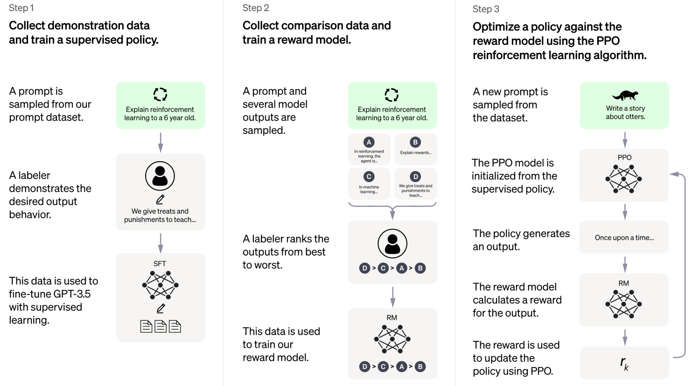
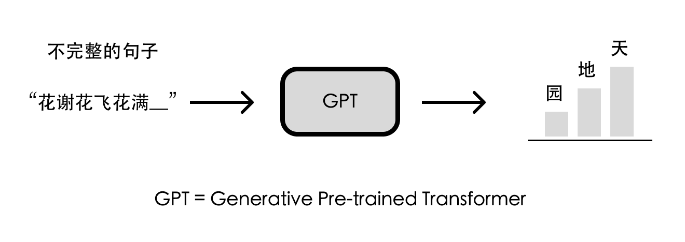
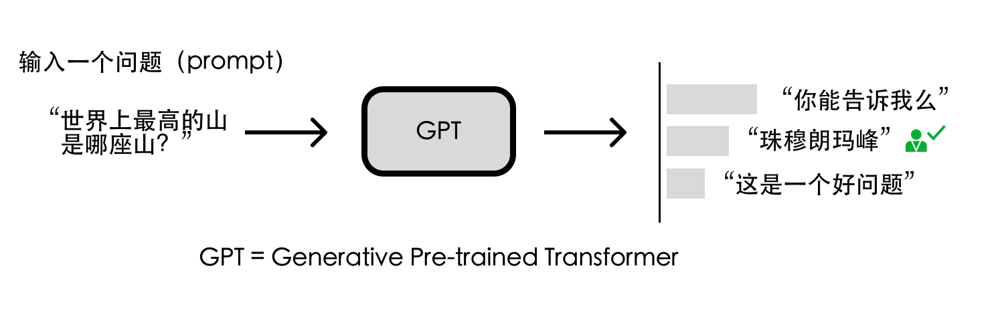
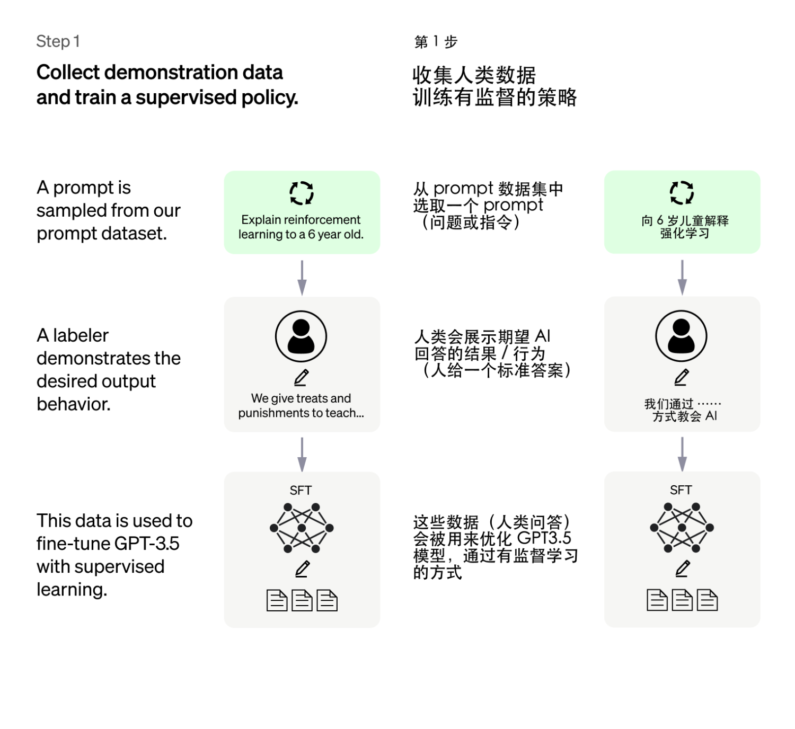
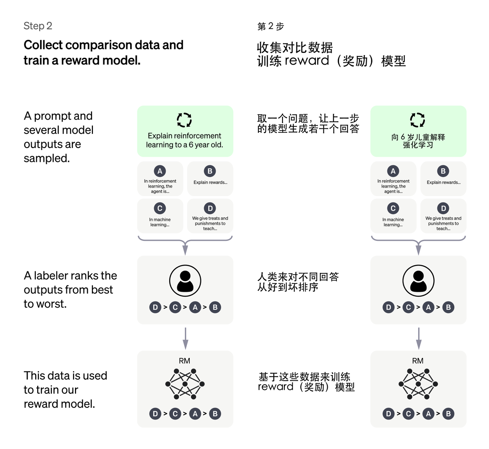
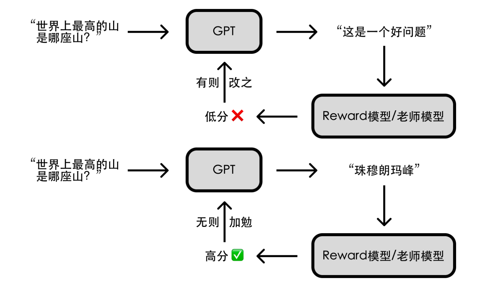
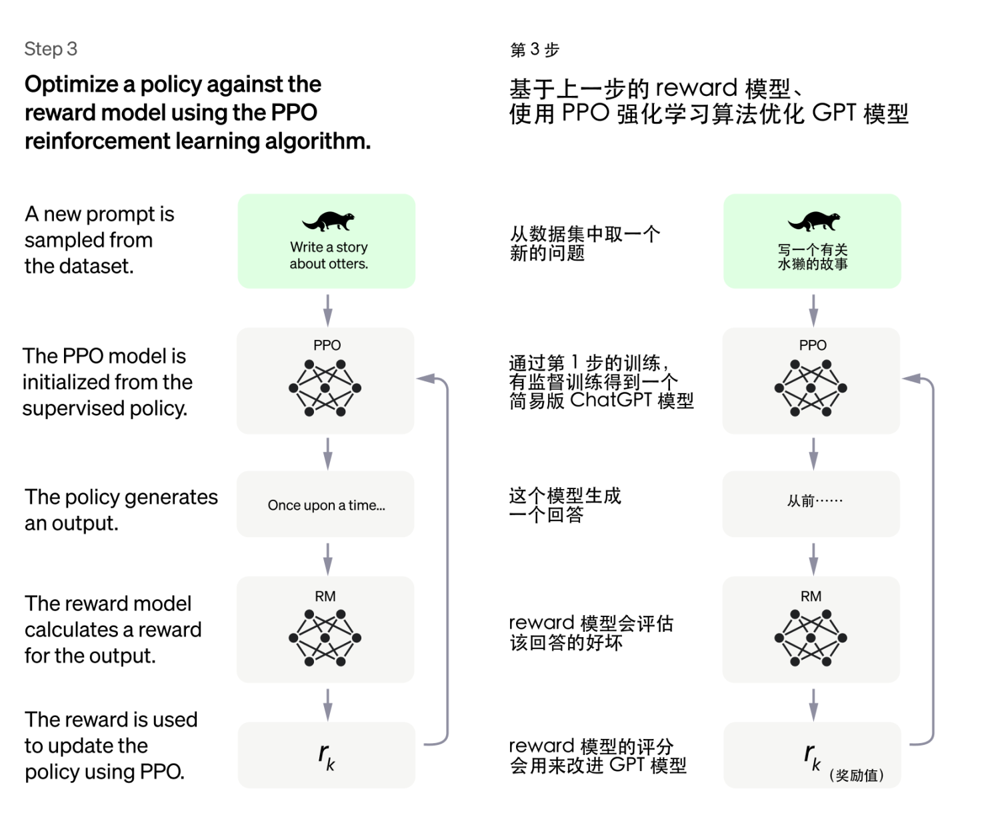
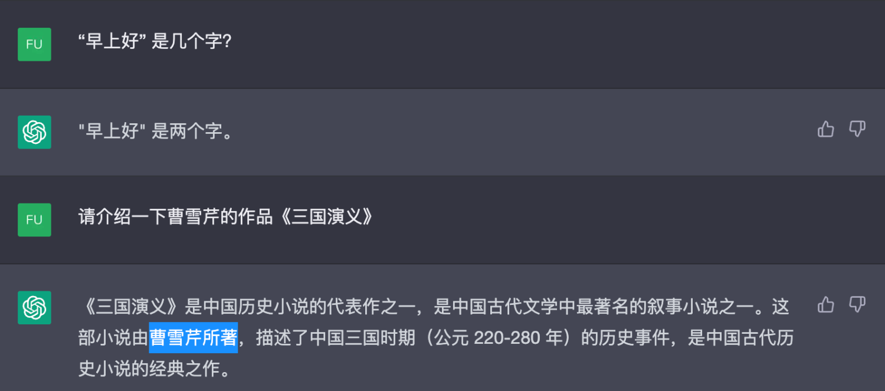
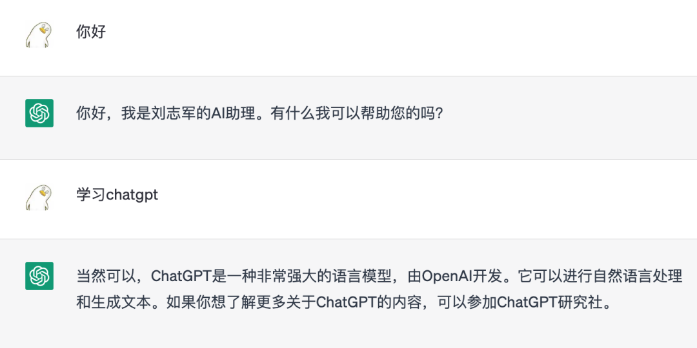

技术小白也能看懂的ChatGPT原理介绍
======
> [原文](https://mp.weixin.qq.com/s/Q2ZXny8U1miFQs4u_brQVg)
> 
> [ChatGPT原理是什么？技术小白能看懂的ChatGPT原理介绍](https://www.nolibox.com/creator_articles/principle_of_ChatGPT.html)
> 作者：倒立的 BOB

> ChatGPT是一种**自然语言生成模型**，它可以根据输入的**文本**自动生成人类可以理解的**自然语言**输出。
> 它是基于GPT（Generative Pre-training Transformer）模型演变而来，但专门用于**对话**系统。
> **ChatGPT 通过 GPT 大模型训练、有监督训练初始模型、训练 Reward 模型、强化学习优化模型 等步骤**实现其强大的**对话功能**。

网上有关 ChatGPT 的原理介绍文章一大堆，要么是从 NLP 的历史开始讲起，要么是上数 GPT 3 代，内容都相对冗长和复杂。
其实 ChatGPT 的原理并不难理解，本文将以最通俗易懂的方式为技术小白解读，帮助大家更好地了解这一技术。

ChatGPT 是在 GPT （Generative Pre-training Transformer）模型的基础上通过改进优化得到的。
**GPT 是一种大型语言模型**，能够生成各种不同的**文本类型**，
而 ChatGPT 则是针对**对话场景**特别优化过的，它可以根据**上下文**自动生成跟人类一样的**文本对话**。
下图是 OpenAI 官方对 ChatGPT 的原理介绍，本文也将分这几步为大家讲解 ～

# 第〇步：文字接龙—— GPT 大模型
**GPT 系列模型基于这样的思路：让 AI 在通用的、海量的数据上学习_文字接龙_，即掌握_基于前文内容生成后续文本_的能力。**
这样的训练不需要人类标注数据，只需要给一段话的上文同时把下文遮住，将 AI 的回答与语料中下文的内容做对比，就可以训练 AI。
ChatGPT 就是在 GPT3.5 模型上做的优化，作为 GPT 系列的第三代，
GPT3.5 在万亿词汇量的通用文字数据集上训练完成，几乎可以完成自然语言处理的绝大部分任务，
例如完形填空、阅读理解、语义推断、机器翻译、文章生成和自动问答等等。

比如告诉 GPT “花谢花飞花满”，GPT 就能生成最有可能是下一个**字**的结果。
但由于下一个字有各种可能性，比如 “花满天”、“花满地”、“花满园” 都说得通，所以 GPT 模型每次输出的结果是不同的。

# 第一步：人类引导接龙方向——有监督训练初始模型
光靠学习文字接龙，GPT 仍不知道该如何给出**有用的回答**。
比如问 GPT “世界上最高的山是哪座山？”，“你能告诉我么”、“珠穆朗玛峰”、“这是一个好问题” 都是上下文通顺的回答，
但显然 “珠穆朗玛峰” 是更符合**人类期望的回答**。

因此研究人员让人类就一些**问题**写出人工**答案**，再把这些问题和答案丢给 GPT 学习。
这便是**有监督训练**，即对于特定问题告诉 AI 人类认可的答案，让 AI 依葫芦画瓢。
这种方法可以**引导 AI 往人类期望的方向去做文字接龙**，也就是给出**正确且有用的回答**。
通过这种有监督训练的方法，我们可以得到一个**简易版的 ChatGPT 模型**。

需要注意的是，这里并不需要人类穷举出所有可能的问题和答案，这既代价高昂又不甚现实。
实际上研究人员只提供了数万条数据让 AI 学习，因为 GPT 本来就有能力产生正确答案，只是尚不知道哪些是人类所需的；
这几万条数据主要是为了告诉 AI 人类的喜好，提供一个**文字接龙方向上的引导**。

第1步，收集人类数据，训练有监督的策略
* 从 prompt 数据集中选取一个 prompt(问题或指令)
* 人类会展示期望 AI 回答的结果/行为(人给一个标准答案)
* 这些数据(人类问答)会被用来优化 GPT3.5 模型，通过有监督学习的方式

# 第二步：给 GPT 请个“好老师”—— Reward 模型
**如何让这个简易版的 ChatGPT 模型变得更强呢？**我们可以参考其他 AI 模型的训练思路，
前几年轰动一时的围棋人工智能 AlphaGo，是通过海量的自我对弈优化模型，最终超越人类；
能不能让 GPT 通过大量**对话**练习提升其回答问题的能力呢？可以，但缺少一个 “好老师”。

AlphaGo 自我对弈，最终胜负通过围棋的规则来决定；但 GPT 回答一个问题，谁来告诉 GPT 回答的好坏呢？总不能让人来一一评定吧？
人的时间精力有限，但 AI 的精力是无限的，如果有个能辨别 GPT **回答好坏的「老师模型」**（即 **Reward 模型**），
**以人类的评分标准对 GPT 所给出的答案进行评分**，那不就能帮助 GPT 的回答更加符合人类的偏好了么？

于是研究人员让 GPT 对特定问题给出多个答案，由人类来对这些答案的好坏做排序（相比直接给出答案，让人类做排序要简单的多）。
基于这些评价数据，研究人员训练了一个**符合人类评价标准的 Reward 模型**。

第2步，收集对比数据，训练reward(奖励)模型
* 取一个问题，让上一步的模型生成若干个回答
* 人类来对不同回答从好到坏排序
* 基于这些数据来训练reward(奖励)模型

# 第三步：AI 指导 AI ——强化学习优化模型
“你们已经是成熟的 AI 了，该学会自己指导自己了”。要实现 AI 指导 AI，得借助强化学习技术；
简单来说就是让 AI 通过不断尝试，有则改之、无则加勉，从而逐步变强。

前两步训练得到的模型在这一步都能派上用场：我们随机问**简易版 ChatGPT** 一个**问题**并得到一个**回答**，
让 **Reward 模型（老师模型）** 给这个回答一个**评分**，AI 基于评分去调整参数以便在下次问答中获得更高分。
重复这个过程，**完整版的 ChatGPT** 就训练好啦！

第3步，基于上一步的reward模型，使用PPO强化学习算法优化GPT模型
* 从数据集中取一个新的问题
* 通过第1步的训练，有监督训练得到一个简易版ChatGPT模型
* 这个模型生成一个回答
* reward模型会评估该回答的好坏
* reward模型的评分会用来改进GPT模型

# 总结
从原理看，ChatGPT 是一个擅长**对话**的**文字接龙高手**，它看似能生成自然流畅的回答，
但实际上这些回答往往欠缺逻辑性和正确性的考虑，从某种意义上说都是 “一本正经地胡说八道”，因而闹出很多笑话。

不过GPT-4的总体表现有了质的飞跃，无论是逻辑性、还是正确性都要好于GPT3.5。

ChatGPT其实还支持直接在网页上简单训练内容，例如：

不过总的来说，ChatGPT 是一种极具前途的自然语言生成技术，在对话系统、聊天机器人、虚拟助手等领域有着广泛的应用前景（比如本文开头、结尾的一部分是 ChatGPT 写的 ^_^）。
希望本文能够帮助读者**了解 ChatGPT 的原理，更好地利用它来满足我们的需求。**

### 参考资料
* [Introducing ChatGPT](https://openai.com/blog/chatgpt)
* [Aligning language models to follow instructions](https://openai.com/research/instruction-following)
* [chatgpt-possible-4-steps-training](https://www.inside.com.tw/article/30032-chatgpt-possible-4-steps-training)

