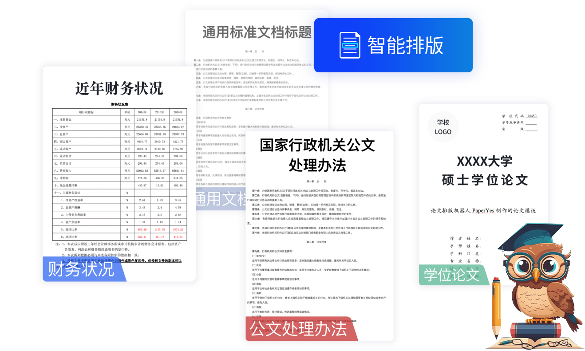

达观助手-智能写作专家
======
> [原文](http://www.datagrand.com/products/datagrand-copilot/)

达观助手是一款全面且免费的**AI智能写作**插件工具。目前支持Windows系统的WPS软件使用（MacOS系统、Office软件等版本敬请期待）。
下载安装达观助手即刻拥有**智能排版、AI润色、AI续写、标题助手、智能纠错、素材搜索**等强大助力。

**AI带来的文字革命：让写作更快、更好、更有趣**

## 智能排版
**近百种模板任你挑选**
涵盖述职报告、工作计划、学术论文、公文通知等上百种场景，一键排版，灵活自定义

## AI润色
**文章焕然一新**
多维度改写润色，让表述更精简地道

## AI续写
**激发创作灵感**
基于对上文的语义理解，自动创作下文，推荐多种关联素材

## 标题AI助手
**一键生成高级标题**
帮助新媒体工作者、学生、行政人员等一键轻松搞定多种风格类型的高质量标题

## 智能纠错
**文章无误**
快速发现错别字、语病、标点误用等问题，全面覆盖100余种常见错误

## 海量素材搜索
供你选择
数10万+文学经典、办公常用、中文佳句素材库，满足您的写作需求

