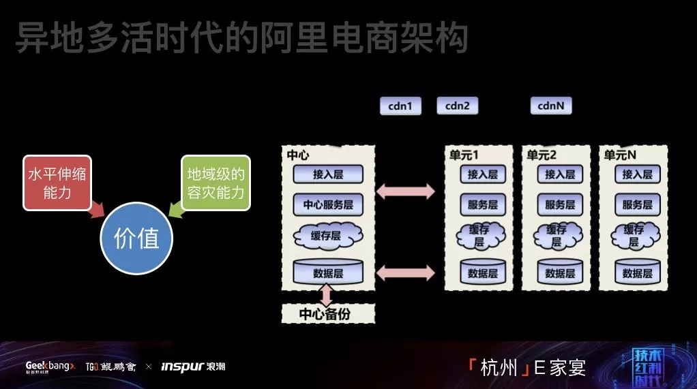
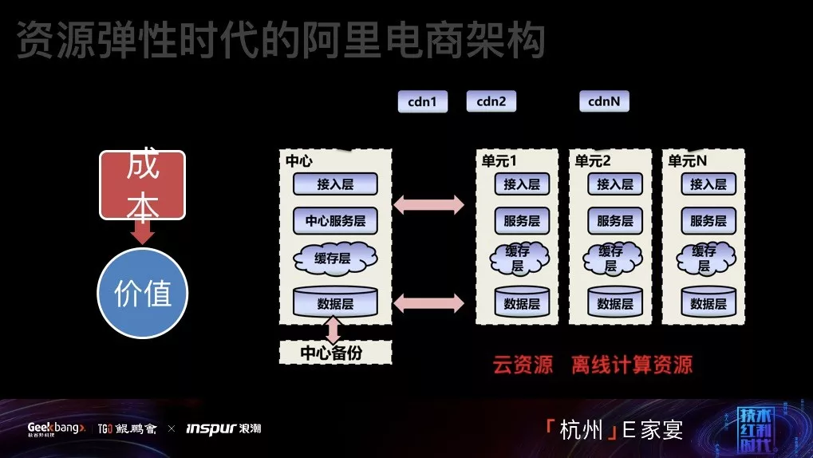

阿里十年，从分布式到云时代的架构演进之路
====================
> 毕玄(林昊)，2018.12.21

本篇文章根据毕玄在活动现场分享的《云时代的软件架构》整理，有部分不改变原意的删减。

毕玄，阿里巴巴系统软件、中间件、研发效能负责人。
2007 年加入阿里，经历阿里电商 10 多年来的技术架构演进，
打造了阿里重要的中间件 HSF 服务框架，设计并带领多团队实现了**阿里电商异地多活架构**。
2011 年开始打造了阿里自研的容器及对资源利用率提升巨大的统一调度系统。
先后任职淘宝网平台架构部架构师、集团核心系统研发部资深技术专家、阿里中间件负责人。

> 阿里软件架构迭代：分布式时代(服务化架构，伸缩性问题+效率问题) -> 异地多活时代(单元化架构，伸缩性问题) -> 资源弹性时代(云资源/离线计算资源，成本问题) -> 云时代(跟云深度整合，效率问题)

## 1. 奠定阿里五年业务快速发展基础的架构改造
阿里经历了几次较大的**软件架构迭代**，首先是**分布式时代的阿里电商架构**。
淘宝从 `2007 年`开始做新一轮架构改造，淘宝从 2007 年开始碰到的`最大的问题，
即访问量增长太快，导致出现了一个问题：不能加机器了`，即`伸缩性的问题`。
淘宝在业务发展过程中，2008 年以前所有的解决方案就是简单加机器就能解决，
但是到 2007 年突然出现加不了，那时候淘宝数据库用的是中国最好的 IBM 的小型机。
以前数据库连接我们用 Oracle，Oracle 数据库最大的问题是每个链接消耗的内存特别大。
因为内存始终有瓶颈，所以当我们内存、数据库连接不够的时候，我们的解决办法是多插内存条，后来内存条插满了，就没有办法了。
所以 2007 年淘宝判断必须做新一轮的架构改造，让我们具备**水平伸缩能力**。

大家现在都知道一个思路，既然一个系统加不了机器，数据库抗不住，那就把一个数据库拆成两个数据库，把访问数据库的业务尽可能集中。
以交易为例，以前是所有的 web 应用都要访问的，如果你把交易逻辑抽象出来，把访问数据库操作的地方抽象成一个系统，
而这个系统其实不需要很多机器，连接数就可以大幅度下降，这是当时的思路。

那时候`淘宝面临主要问题是能否再次水平伸缩`，但是还有第二个问题，那就是被技术团队投诉`研发进度太慢`。
我加入淘宝时有 100 多个工程师，开发用同一个系统，每个人都可以改里面所有的代码。
这个时候问题就来了，比如我接了一个业务，我要改这个类这一行代码，然后另外一个业务也要改同一类同一行的代码。
等这两个人一提交，同一天发布，合并代码就合不了，因为逻辑太复杂了。所以淘宝当时创新性提倡了一种方法：排期。
我们在每个月第一天会开淘宝历史上研发团队最激烈以及大家斗志最昂扬的会议，就是用来排这个月的发布。
如果两个研发团队发生了冲突，那就 PK 一下谁的需求牛逼。当演进成新的架构的时候，这个问题就被解掉了。

当阿里巴巴整个架构演进成一套**服务化架构**的时候，一是**水平伸缩上的能力和价值被认可**；
第二，2008 年研发团队从 100 人增加到 200 人，2009 年增加到近 600 人以上，一年是几倍地增长。
如果当时没有做服务化，整个淘宝业务发展会受到非常大的影响。
所以我们凑巧在最应该做架构改造的时候做完了，这一轮是淘宝历史上比较重要的一轮，
在这一轮架构中打造出**三个最重要的中间件：服务框架、消息中间件、TDDL 云上服务**。
这一轮架构`为阿里巴巴 2008-2013 年五年业务的快速发展奠定了坚实的基础`。
那五年，大部分的团队不用关注技术问题，而是可以非常快地做业务，这对淘宝而言非常重要。

到后来架构图就画得相对标准一点，现在大部分的公司都是这个架构，没有什么区别，基本上都分成三层。
这个架构从 `2008-2009 年初`，花一年的时间完成架构改造，代号五彩石，
`五彩石项目把淘宝和淘宝商城技术架构合并`，合并成新的架构，这个项目`对整个阿里的意义绝对重大`。
这个项目做完以后，架构差不多完成了。

> 微服务架构的价值：水平伸缩能力+百人以上研发协作能力

架构完成以后，我们一致认为我们做了非常完美的架构，但上线以后，我们发现`这个架构碰到的最大问题`是`稳定性问题`。
`2009 年淘宝稳定性`是整个淘宝历史上最差的一年，我们在那一年稳定性小于 3 个 9。
后来这个架构在发展过程中不断演进，我们重点做稳定性。除了稳定性，也存在其他小的挑战，比如秒杀，
那个架构对秒杀没有什么特殊支持的，所以我们后来对秒杀做了针对性地改造，当然整个结构没有变过，
这个架构支撑了淘宝非常多年，直到 2013 年。

到了 `2013 年`，我们碰到了新的挑战。因为`规模增长的问题`，
导致我们在 2013 年双 11 的时候突然间发现了一个问题，我们`在双 11 备战的前一个月也要加机器`。
数据库团队告诉我们不能加太多，因为那时候已经不是买 Oracle，是 MySQL，
MySQL 的连接确实比 Oracle 更小很多，但是我们前面的机器也是很多，所以最后的`链接池又成为了问题`。
当然除了数据库以外，我们发现中间件和其他的东西也存在一些问题，虽然我们整个是分布式系统，
但是一个分布式系统里面一定有`某些点是集中的，某些点一定是全部都要接的，那些点随着规模的上升就会成为很大的瓶颈点。`
所以到了 2013 年，我们就再次面临了这个挑战，那时候已经是双 11 前一个月，我们已经改变不了什么。
那年我们临时用了别的方案顶过了那一年的双 11，但在那年双 11 以后我们明白，阿里迎来了新一轮架构升级的机会。

## 2. 新一轮的架构改造：异地多活
2013 年，我们决定开始做阿里巴巴新一轮的架构改造，我们把这一轮架构改造在内部称为**单元化**，版本的代号是 3.0 到 4.0。
这一轮解决的`第一个问题`是`水平伸缩，怎么样在不加机器下扛大的规模`；
二是我们决定必须做另外一件事情，`让整个阿里可以随便在哪里部署，并且是多个地点`。

> 单元化架构的价值：水平伸缩能力+地域级容灾能力

很多人记得 2013 年杭州特别热，40 度高温持续了十几天，结果是阿里巴巴接到了通知，我们的某个机房必须限电。
那一年吓坏我们了，因为那个机房是数据库机房，如果断了，整个淘宝全挂了，那一次事件给了我们无比大的教训。

这个项目跟我们做分布式有一个很大的不同，2008 年做的时候我们其实有参考对象。
`2013 年`我们做**异地多活**的时候没有参考对象，而且大家都认为这件事情风险非常高，如果能不做尽可能不要做。
从全球来看，谷歌很早做了，Facebook 做了一点点但没有做得太彻底，亚马逊和 eBay 都是不做的。
后来我们参考各家方案，发现谷歌的方案在电商行业根本不可用，谷歌不在乎`响应时间`，但是`交易`非常在乎。
比如你`下单慢一点，在双 11 这样的场景下肯定会导致我们崩盘，因为响应时间往上拉高，我们没有办法支撑。`
Facebook 和腾讯都做了，腾讯主要是微信做，但微信其实是一个消息 IM 系统，IM 其实是比较容易做的，因为大家本来就是异步交互，
但是`交易是特别强调同步并且对数据一致性要求特别高的场景`，所以我们在做整个方案的时候完全只能自己想到底该怎么办。
我们最后做的方案是这边的方案——**异地多活**。

我自己带着团队做这个方案的时候，`最关心的只有一个问题：异地多活最大的风险是什么？`
`因为它是活的，异地这个点不是冷备的点，意味着异地的点也在写数据`，
它`最大的风险就在于每个点都在写数据`，如果数据一旦写错了就废了。
阿里是一家做信任的公司，只要数据一错，我们这个公司的声誉就毁了。
所以当时做这个方案，我们跟架构师团队讲**最重要的是：不要出现数据错乱**，其他我们都可以接受。
其实这个项目在整个架构设计上是非常充分体现了当时最火的讲 `CAP 只能选两个地方`，
因为我们**选择了数据一致性**，所以`一定程度上牺牲了可用性`，对可用性会有一些影响。

这个项目在 `2016 年`基本上全部做完，从 2016 年以后整个阿里部署架构一直都是这样的，我们现在一直都是`三地部署`，
我们有三个点，任何一个点挂了对我们都没有任何影响，我们`切换流量`大概只需要在 30 秒内就可以全部完成。
因为我们上了以后才发现单地风险很容易出现风险，尤其是`单个机房`，比如说`路由器、交换机出现问题`，你就不知道怎么办，但是多地就没有问题。

这个架构对阿里来讲**最大的价值：第一，再次具备水平伸缩的能力**，
我们现在支持双 11，只需要`不断扩容单元`或者说`重新新建不同的单元`，就可以完成整个过程；
**第二，可以让地域级的容灾能力提升**，因为我们`都是活的`，所以就可以随便切来切去。
淘宝在双 11 前面一个月密集备战的过程，我们就会不断切流量，每天白天都在切流量，但我相信很多用户是从来没有感受过我们在切流量。
所以我认为这次架构改造之后，应该还能撑个很多年。

## 3. 资源弹性时代的阿里电商架构
近几年主要围绕另外一件事情做。你们都会发现我们在做前面两个版本改造`最大的区别是：前两个版本都在解决水平伸缩的问题`，
其实**水平伸缩是业务对技术团队的基本要求**，你肯定要做到可以加机器解掉业务高峰的问题，所以这时候技术团队对业务团队的价值是有限的。
但随着我们在水平伸缩上解决得更好，包括双 11 稳定性确保上做得越来越好，技术团队可以做更多。
其实双 11 后来`面临的问题和挑战`是`成本`，**稳定性**方面随着**全链路压测**之后，我们就发现很多东西越来越稳了，
但是`双 11 的成本是我们很大的压力`，因为双 11 的峰值跟日常的峰值差距越来越拉大，
意味着为了双 11 前面那一段时间，我们要付出的代价是非常巨大的。所以现在这个问题就成为了我们`最头痛的问题`。

> 资源弹性调度的价值：成本

我讲阿里的技术架构演进时，很多人会问我`一个问题：双 11 后，你们的机器都拿去干嘛了？`
这句话，每次都问得我非常尴尬，我也不知道怎么回答，我也只能随便扯，
通常的扯法告诉你下一年日常峰值会接近双 11 的峰值，那就没怎么浪费，但很多人都懂其实是不大可能的，所以很难回答。
但是阿里还好，出现了两个变数。我们后来出现了两个东西，来让我们更好**解决这个问题：第一，阿里云**。
从 `2014 年`开始阿里云发展起来了，阿里云的发展对我们来讲有一个巨大的好处，
因为我可以借阿里云的资源临时顶一下双 11，借完了再还给阿里云，阿里云再售卖，这只是一个周期的问题。
所以阿里云的起来，至少对双 11 的帮助是非常巨大的。我们也用了很多年的时间做这件事情，因为阿里的技术和阿里云的技术确实有差别，
所以`为了让我们的东西能跑在阿里云上，并且对业务研发团队没有感觉`，其实也要做很多的东西，
比如说运维系统怎么对接两套不一样的东西，又让业务没有安全，资源的使用方式不一样，
阿里云上是 ECS，我们内部都是容器，所以这两者也要做`对接`。所以我们当时做了很多这方面的工作。

可以给大家一个数据。我们在 2014 年用阿里云资源扛双 11 10% 的流量，2015 年用阿里云的资源扛 60% 的流量，
`2015 年`扛 60％ 流量的那一年做双 11 的成本，每万笔下降了 50%，后来几年我们一直延用这个方案，不断增加`云的资源`。

但是去年开始发现其实我们还有别的路可以走，除了云以外，因为用云其实还是要钱的。
比如，我们要用很长一段时间，因为我们买的机器实在太多了，阿里云卖掉也需要一些时间。
后来我们在想`有没有不用钱的方案？`其实现在大部分内部有两个最大的集群，一个用来部署在线业务，一个用来部署离线业务。
通常来讲，你有两个集群，但是这两个集群没有太大的关系。

所以我们认为在双 11 的时候可以**用大数据计算的集群扛短时的高峰**。
我们开始做这个方案，但是这个方案`有个非常复杂的问题`，虽然我们的`离线没有那么重要，但也不能全部停掉`，
因为如果全部停掉对双 11 也会产生影响，大家知道我们有`实时推荐`，我们需要大数据进行计算。
如果不能全停，就有`一个问题：怎么保证在线业务放上去跑的时候，离线不会把你的资源全部抢光？`所以有一个`互相干扰的问题`。
我们在过去几年，在操作系统的部分、调度系统部分做了很多的工作，来避免这个问题。
`今年`，我们大概用离线机器扛了 16 万笔的交易，相当于 16 万笔交易不用花钱，完全免费，
对业务团队来讲，今年双 11 每万笔交易成本相比去年又下降了 17%。我们总共有 49.1 万笔，所以带来的成本节省是非常壮观的。

## 4. 云时代的软件架构走向何方
`云时代的软件架构走向何方？`这是我们一直在思考的部分，我们在想`未来怎么跟云结合`。我前面所讲的**资源弹性跟云就有很大的关系**。
所以我们认为云时代软件架构，在`价值层面`看到的：对很多使用方来说，**第一点是弹性**，我可以有高峰就用、没有高峰就退。
阿里还有另外一家特别典型的公司：饿了么。`饿了么是典型又非常明显高峰效应的公司，但是它过了高峰就没有什么量了`，
这种公司，如果你为高峰准备钱，投入是非常大的，所以它跟云更好结合，在弹性上一定可以享受非常大的价值；
第二点，我们认为**云的整体演进**会带来另外一点改变是**整个业务研发团队会越来越不关注下面是什么，越来越脱离下面这一层**，
这是`我们认为的一个风向`，因为阿里巴巴在今年双 11 里面已经小面积使用了这个技术。
比如说大家看到的`手淘首页`，首页下面有很多推荐，如果按以前的开发方式，门槛是很高的，你要懂阿里巴巴背后非常多的技术。
但今年我们把它改成了很类似的方式，`前端的人可以简单写几个函数，把页面组装起来，
后面有非常复杂的服务调用、扩容体系，把很多工作都隐藏到了背后的一套平台，前端的人在整体业务效率上非常高。`
所以我们认为**如果我们的软件架构真的演进到跟云深度整合，有一个好处是你的研发效率会提高，门槛会降低**，至少在阿里几个场景里我们看到了这个现象。

我们在内部讨论一个问题：我们认为阿里走到`今天面临的一个很大问题是每进到一个阿里做业务研发的员工，
如果你想做好一个业务研发，你都要了解阿里背后非常复杂的技术体系。`而你要了解这个技术体系，门槛不低，你要学习很多的东西。
但是我相信做过业务研发的人知道，`做业务研发的代码逻辑不应该关心这些东西，他应该关心怎么把业务逻辑抽象成一个比较简单的东西，
这是业务最核心的问题`，现在就导致很多业务人需要花更多时间学技术，而不是研究业务，我们认为这个事会被改变。

> 上云的价值：专注业务+研发门槛+研发效率+?

所以在云的时代，我们希望设计一个右边的架构，希望在下面有一个非常厚的平台，
所有的业务团队更加关注写一些很小的代码片段或者相对来讲更为复杂一点的简单服务，通过下面的东西帮你组装，你也不用关心所有的架构。
这是我们**希望云演进的方向**，也是我们现在探索阿里巴巴整个软件架构怎么演进成这个样子。
大家看阿里的架构演进，就可以发现我们前面解了`伸缩性问题`，`成本问题`基本接近解决，当然还需要进一步努力。
我们现在关注的下一个问题是`效率问题`，怎么让我们的效率进一步提升起来，
比如说我们希望阿里巴巴整个业务研发的门槛能够降低到像 2007 年一样，这样的话业务研发的效率就会非常高，但这背后必须有很复杂的方案。
所以我们认为**这一代架构最关键的是怎么降低研发门槛，怎么大幅拉高研发效率**，这就是阿里现在正在探索的。

[原文](https://mp.weixin.qq.com/s/zhbFkpcx3Cexd1ahZpsKPw)

