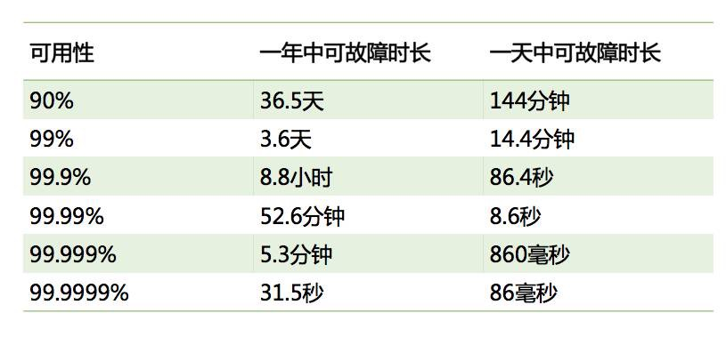
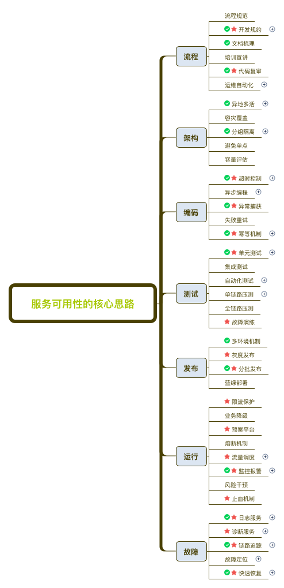

服务可用性的核心思路
==========
> 服务端思维，2018.07.26

服务的可用性，即服务可以正常运行的时间的百分比。

那么，**如何保障稳定性，提高可用性呢？**
其实，可以分为几个方面：**通过技术和流程`防止故障`产生**，
并且**在`发生故障`时，减少故障的定位时间，以及提高`故障恢复时间`。**

[原文](http://blog.720ui.com/2018/picaction_01_improve9999/)

