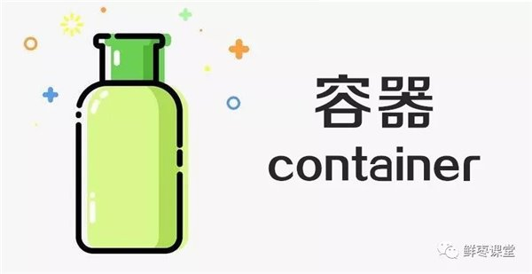
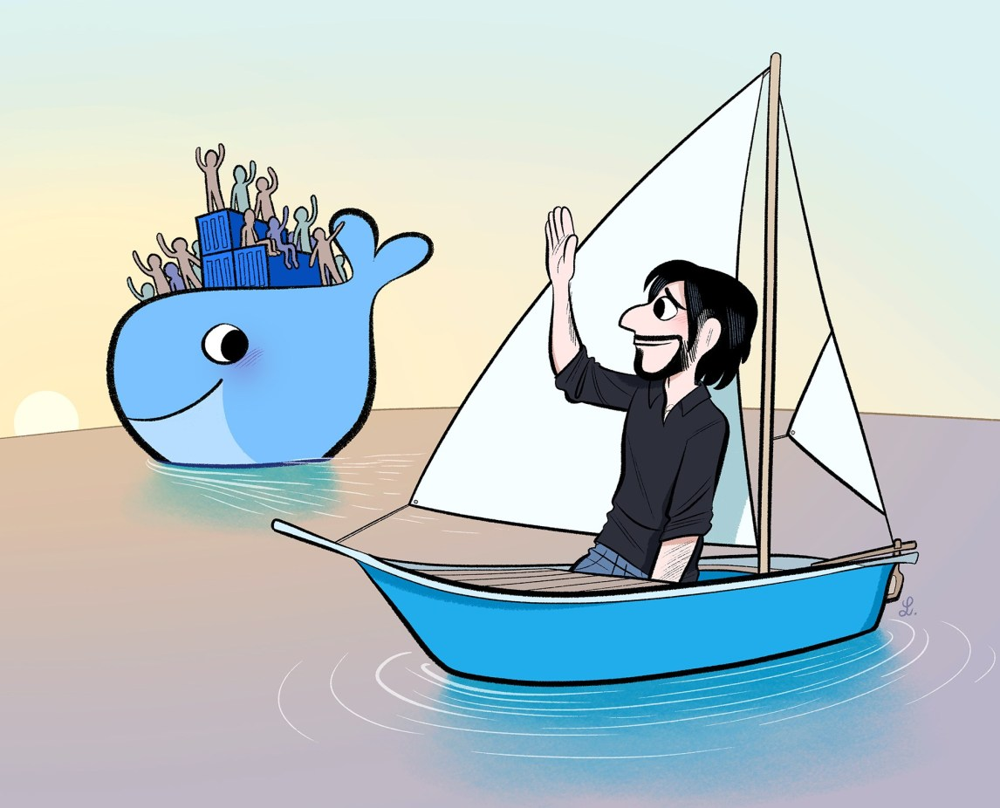
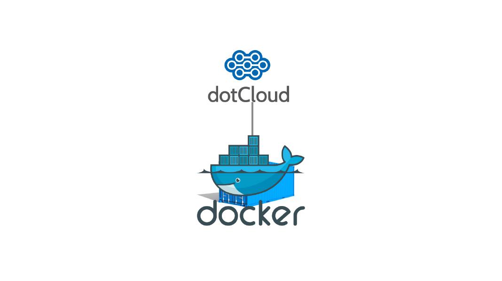
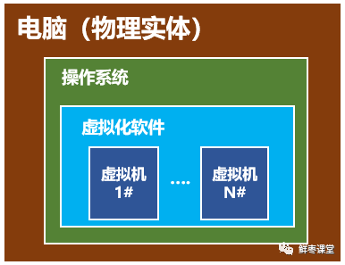
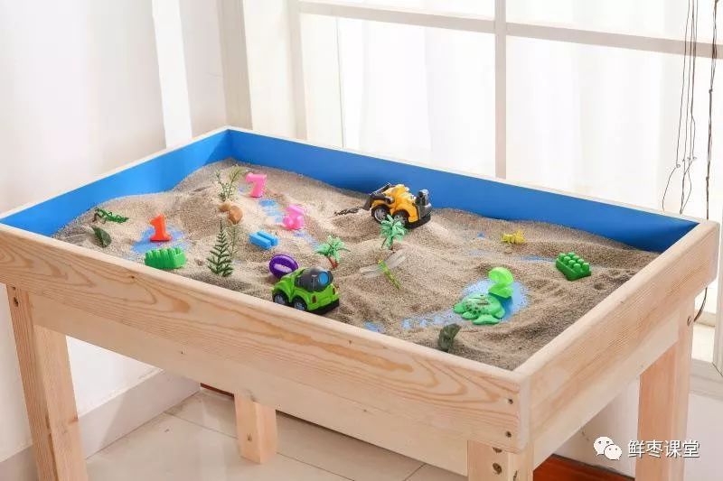
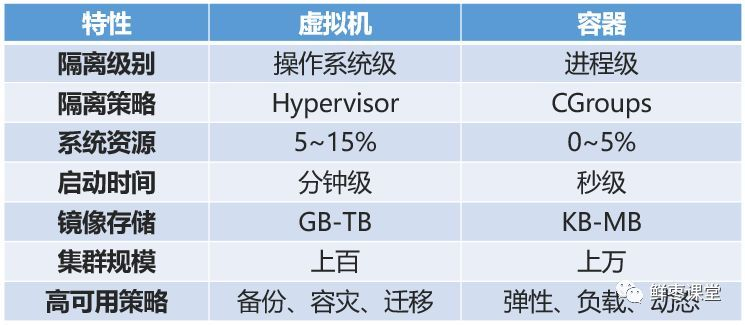
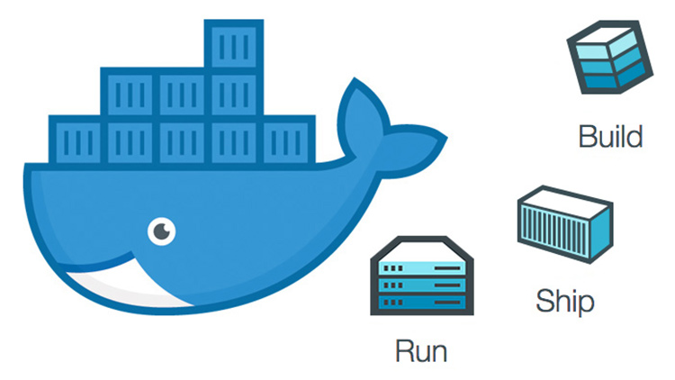
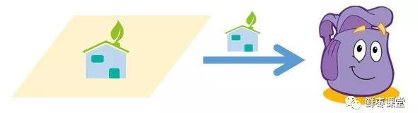

10分钟看懂Docker和K8S
================
> 鲜枣课堂，2018-12-25

2010年，几个搞IT的年轻人，在美国旧金山成立了一家名叫“**dotCloud**”的公司。

这家公司主要提供基于PaaS的云计算技术服务。具体来说，是和LXC有关的**容器技术**。

后来，dotCloud公司将自己的**容器技术**进行了`简化和标准化`，并命名为**Docker**。

Docker技术诞生之后，并没有引起行业的关注。而dotCloud公司，作为一家小型创业企业，在激烈的竞争之下，也步履维艰。

正当他们快要坚持不下去的时候，脑子里蹦出了“开源”的想法。

什么是“开源”？开源，就是开放源代码。也就是将原来内部保密的程序源代码开放给所有人，然后让大家一起参与进来，贡献代码和意见。

有的软件是一开始就开源的。也有的软件，是混不下去，创造者又不想放弃，所以选择开源。自己养不活，就吃“百家饭”嘛。

**2013年3月**，dotCloud公司的创始人之一，`Docker之父`，28岁的**Solomon Hykes**正式决定，将Docker项目开源。

不开则已，一开惊人。

越来越多的IT工程师发现了`Docker的优点`，然后蜂拥而至，加入Docker开源社区。

Docker的人气迅速攀升，速度之快，令人瞠目结舌。

开源当月，Docker 0.1 版本发布。此后的每一个月，Docker都会发布一个版本。到**2014年6月9日，Docker 1.0 版本**正式发布。

此时的Docker，已经成为行业里人气最火爆的开源技术，没有之一。甚至像Google、微软、Amazon、VMware这样的巨头，都对它青睐有加，表示将全力支持。

Docker火了之后，dotCloud公司干脆把公司名字也改成了Docker Inc.。

`Docker和容器技术为什么会这么火爆？`说白了，就是因为它“**轻量/lightweight**”。

在容器技术之前，业界的网红是**虚拟机**。虚拟机技术的代表，是`VMWare`和`OpenStack`。

相信很多人都用过虚拟机。`虚拟机`，就是在你的操作系统里面，装一个软件，然后通过这个软件，再模拟一台甚至多台“子电脑”出来。

在“子电脑”里，你可以和正常电脑一样运行程序，例如开QQ。如果你愿意，你可以变出好几个“子电脑”，里面都开上QQ。“子电脑”和“子电脑”之间，是**相互隔离**的，`互不影响`。

虚拟机属于虚拟化技术。而**Docker**这样的**容器技术**，也是虚拟化技术，属于**轻量级的虚拟化**。

`虚拟机`虽然可以隔离出很多“子电脑”，但`【缺点】占用空间更大，启动更慢`，虚拟机软件可能还要花钱（例如VMWare）。

而容器技术恰好没有这些缺点。它不需要虚拟出整个操作系统，`只需要虚拟一个小规模的环境`（类似“沙箱”）。

【容器优点】它**启动时间很快**，几秒钟就能完成。而且，它**对资源的利用率很高**（一台主机可以同时运行几千个Docker容器）。此外，它**占的空间很小**，虚拟机一般要几GB到几十GB的空间，而容器只需要MB级甚至KB级。

正因为如此，容器技术受到了热烈的欢迎和追捧，发展迅速。

我们具体来看看Docker。

大家需要注意，`Docker本身并不是容器`，它是`创建容器的工具`，是**应用容器引擎**。

想要`搞懂Docker`，其实看它的两句口号就行。

第一句，是“**Build, Ship and Run**”。

也就是，“**构建、运输、运行**”，三板斧。

举个例子【很棒】：
我`来到一片空地，想建个房子`，于是我搬石头、砍木头、画图纸，一顿操作，终于把这个房子盖好了。

结果，我住了一段时间，`想搬到另一片空地去`。这时候，按以往的办法，我只能再次搬石头、砍木头、画图纸、盖房子。

但是，跑来一个`老巫婆`，教会我一种`魔法`。

这种`魔法`，可以`把我盖好的房子复制一份`，做成“**镜像**”，放在我的`背包`里。

等我到了另一片空地，就用这个“镜像”，复制一套房子，摆在那边，拎包入住。

怎么样？是不是很神奇？

所以，Docker的第二句口号就是：“**Build once，Run anywhere（构建一次，到处能用）**”。

**Docker技术的`三大核心概念`**，分别是：
* **镜像（Image）** - Build
* **容器（Container）** - Run
* **仓库（Repository）** - Ship

我刚才例子里面，那个放在包里的“镜像”，就是**Docker镜像**。而我的“背包”，就是**Docker仓库**。我在空地上，用魔法造好的“房子”，就是一个**Docker容器**。

说白了，这个**Docker镜像，是一个特殊的文件系统**。它除了**提供`容器运行时`所需的`程序、库、资源、配置`等文件外，还包含了一些`为运行时准备的一些配置参数`（例如`环境变量`）**。镜像`不包含任何动态数据`，其`内容在构建之后也不会被改变`。

也就是说，每次变出房子，房子是一样的，但生活用品之类的，都是不管的。谁住谁负责添置。

每一个镜像可以变出一种房子。那么，我可以有多个镜像呀！

也就是说，我盖了一个欧式别墅，生成了镜像。另一个哥们可能盖了一个中国四合院，也生成了镜像。还有哥们，盖了一个非洲茅草屋，也生成了镜像。。。

这么一来，我们可以`交换镜像`，你用我的，我用你的，岂不是很爽？

于是乎，就变成了一个大的`公共仓库`。

**负责对`Docker镜像`进行管理**的，是**Docker Registry服务**（类似`仓库管理员`）。

不是任何人建的任何镜像都是合法的。万一有人盖了一个有问题的房子呢？

所以，Docker Registry服务对镜像的管理是非常严格的。

最常使用的Registry公开服务，是官方的**Docker Hub**，这也是默认的Registry，并拥有大量高质量的官方镜像。

好了，说完了Docker，我们再把目光转向K8S。

[原文](https://zhuanlan.zhihu.com/p/53260098)

