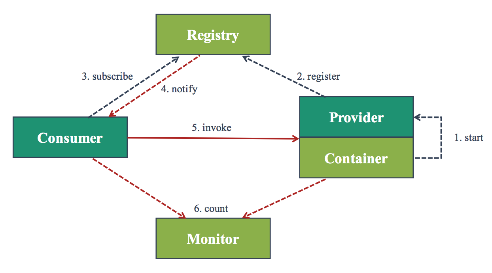
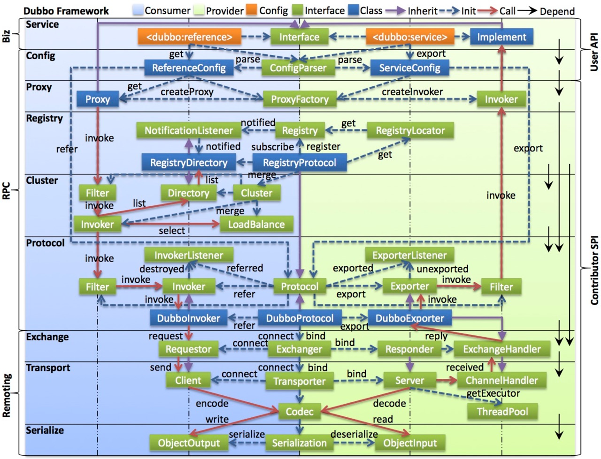

## Dubbo 开源现状与未来规划
罗毅，2018年04月25日

### ⼤纲
1. 基本原理
2. 开源缘由
3. 开源现状
4. 后续规划
5. Apache 孵化
6. 联系我们

### ⼯作原理
Dubbo 是⾼效的服务框架

1. **导出服务**（服务提供⽅**通过指定端⼝对外暴露服务**）
2. **注册服务**（提供⽅**向注册中⼼注册⾃⼰的信息**）
3. **订阅服务**（服务调⽤⽅**通过注册中⼼订阅⾃⼰感兴趣的服务**）
4. **发现服务**（注册中⼼**向调⽤⽅推送地址列表**）
5. **调⽤服务**（调⽤⽅**选择⼀个地址发起 RPC 调⽤**）
6. **监控**（服务提供⽅和调⽤⽅的统计数据由监控模块收集展示）

### 开源缘由
Dubbo 重启开源的原因

* **战略**（云栖⼤会公开宣布**拥抱开源的发展策略**）
* **社区**（社区反馈的问题得不到及时解决，**聆听社区能够激发我们的灵感**）
* **⽣态**（繁荣的⽣态普惠所有的⼈，最⼤的受益⽅是我们⾃⼰）
* **回馈**（同⼀团队，**阿⾥在服务治理、⼤流量、超⼤规模集群⽅⾯的经验**）

### 开源现状
⾃重新维护以来 GitHub 数据显著增⻓

* Star 数增⻓（到⽬前 Star 数增⻓ 7428，Fork 数增⻓ 3072，Watch 数增加 745）
* GitHub 趋势

Dubbo 国内⽤户⼀览

* 请在 [Wanted: who's using dubbo](https://github.com/apache/incubator-dubbo/issues/1012) 上提供您的信息
* Dubbo Meetup

不单单使⽤，⽽要**参与**

* 重建⽂档和主⻚（[dubbo.io](http://dubbo.io) 快速开始、产品⽂档、代码、社区等内容。⽂档以 GitBook 形式发布）
* 三⽅库升级
* 发版节奏（确⽴了特性版本 2.6.x 和维护版本 2.5.x 并⾏的策略，确保每⽉⼀个版本的节奏）
* **倾听⽤户声⾳**（**优先⽀持社区[用户]呼声最⾼的诉求**：REST ⽀持、Spring Boot ⽀持、Hessian、Java 8 ⽀持）
* **进⼊ Apache**（**打消对 Dubbo 开源未来的顾虑**，将项⽬捐献给 Apache 基⾦会。**Apache 强调社区和多样性**）

### 后续规划
##### 技术趋势、⾃身定位

1. **应⽤从单体转向微服务架构**（**轻量化、多语⾔**⽀持、REST ⽀持、Spring Boot 的集成）
2. **软件向云上迁移成为趋势**（**Spring Cloud、Service Mesh**）
3. **服务化治理整体⽅案**（建⽴⽣态）
4. **⾼性能是⽴命之本**（⼤规模集群⼤流量场景带来的挑战、**异步化编程模型**、建⽴ benchmark 机制）

##### Dubbo 核⼼

* **模块化**（解决`通信层与服务治理层耦合严重`的问题。**为 Dubbo Mesh 做准备**）（Spring Framework 2.x -> Spring Framework 3.x）
* **元数据**（**服务治理数据和服务注册数据分离**，解决`元数据冗⻓`的问题。**为对接注册中⼼、配置中⼼做准备**）（全局注册中心和配置中心下沉为平台的基础能⼒）
（见 [配置参考手册](http://dubbo.apache.org/books/dubbo-user-book/references/xml/introduction.html) 的服务发现、服务治理、性能调优配置项）
* **路由策略**（引⼊在阿⾥内部实践⼴泛的**路由策略：多机房、灰度、参数路由等智能化策略**）（HSF 在这方面的实践经验？）
* **⼤流量**（通过**熔断、隔离、限流、降级等⼿段**来提升`集群整体稳定性`，定位故障节点）（HSF 在这方面的实践经验？）
* **⼤规模**（`超⼤规模集群对服务注册发现、内存占⽤、选址 CPU 消耗`带来的挑战）（HSF 在这方面的实践经验？）
* **异步化**（CompletableFuture ⽀持，**跨进程的 Reactive** ⽀持，提升`分布式系统整体的吞吐率和 CPU 利⽤率`）

##### Dubbo ⽣态 – 扩展

* API (**Spring Cloud、Reactive**、Fluent API)
* registry (**Eureka**、etcd、CS、Hazelcast)
* config (Apollo、**Diamond**、Archaius)
* cluster (**Hystrix**)
* LB (Latency、⼀致 Hash)
* router (**灰度、参数、同机房、智能**)
* protocol (JsonRPC、**REST**、Thrift、**gRPC**)
* serialize (FST、kryo、**Protobuf**)
* transporter (**Netty 4**、QUIC、XIO、**HTTP 2**)
* codec (**Dubbo 3、Rx**)

##### Dubbo ⽣态 – 互通

* Java Client、HTTP Client、Node Client、Python Client
* **Gateway/Sidecar**
* **Dubbo Service** (**Service Discovery、Config Service、Metrics/Trace、Auth Service**)
* Mock Server、Test Server、Swagger Server、Dubbo Admin

##### 云原⽣ - Dubbo Mesh

* **服务治理能⼒下沉**
  * **未来的趋势是服务治理能⼒下移成为平台的基础能⼒，应⽤⽆需与特定语⾔的技术栈绑定**。Dubbo Mesh 成为数据⾯板
* **多语⾔⽀持**
  * **编程语⾔的多样性是云上场景的强诉求。通过将服务治理能⼒ sidecar 化，⽀持多种语⾔的 RPC 成为可能**，
  这也是 **Spring Cloud ⽅案最⼤的短板**

核心组件
* Dubbo RPC
* **Dubbo Mesh** (Register、Config、Cluster、Load Balance、Router、Protocol)
* Dubbo RPC 之间的通信基于 Dubbo Mesh
* **全局基础能⼒：Service Discovery、Config Service、Trace Server**

### Apache 孵化
Community Over Code

* 准备阶段（历时 1-3 个⽉，1 个 champion，4 个 mentor，提案历时 1 周，讨论阶段 72 ⼩时，投票阶段 72 ⼩时，3 ⼈同意之后进⼊孵化阶段）
* 孵化阶段（历时 8 个⽉以上。主要分为软件授权转移和转移后**社区建设**两部分，可以同步进⾏。需要强调的是 Apache 的理念是 community over code）
* 毕业阶段（通过**成熟度评估**之后，经过投票可以毕业）

### 联系我们
* Home (http://dubbo.apache.org, http://dubbo.io)
* GitHub (https://github.com/apache/incubator-dubbo, https://github.com/dubbo)
* Mailing List (dev@dubbo.apache.org)
* IM (https://gitter.im/alibaba/dubbo)

[原文](https://static001.geekbang.org/con/28/pdf/3748161464/file/Qcon2018%E5%8C%97%E4%BA%AC--%E3%80%8AApache%20Dubbo(incubating)%E5%BC%80%E6%BA%90%E7%8E%B0%E7%8A%B6%E5%92%8C%E6%9C%AA%E6%9D%A5%E8%A7%84%E5%88%92%E3%80%8B--%E7%BD%97%E6%AF%85.pdf)

