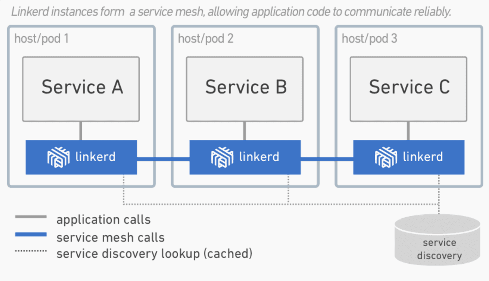

# 什么是服务网格以及为什么我们需要服务网格？
作者 William Morgan，译者 薛命灯，2017年11月10日

**Service Mesh（服务网格）是一个基础设施层，让`服务之间的通信`更安全、快速和可靠。**
如果你在构建云原生应用，那么就需要Service Mesh。

在过去的一年中，Service Mesh已经成为**云原生技术栈**里的一个关键组件。
很多拥有`高负载业务流量`的公司都在他们的生产应用里加入了Service Mesh，如PayPal、Lyft、Ticketmaster和Credit Karma等。
今年一月份，Service Mesh组件Linkerd成为CNCF（Cloud Native Computing Foundation）的官方项目。
不过话说回来，**Service Mesh到底是什么？为什么它突然间变得如此重要？**

在本文中，我将给出**Service Mesh的定义，并追溯过去十年间Service Mesh在应用架构中的演变过程。**
我会解释**Service Mesh与API网关、边缘代理（Edge Proxy）和企业服务总线之间的区别**。
最后，我会描述**Service Mesh将何去何从以及我们可以作何期待**。

### 什么是Service Mesh？(What)
**Service Mesh是一个`基础设施层`，用于处理`服务间通信`。**
云原生应用有着`复杂的服务拓扑`，**Service Mesh保证`请求`可以在这些拓扑中可靠地穿梭。**
在`实际应用`当中，**Service Mesh通常是由一系列`轻量级的网络代理`组成的，它们与应用程序部署在一起，但应用程序不需要知道它们的存在。**

随着`云原生应用的崛起`，Service Mesh逐渐成为一个**独立的基础设施层**。
在云原生模型里，一个应用可以由数百个服务组成，每个服务可能有数千个实例，而每个实例可能会持续地发生变化。
服务间通信不仅异常复杂，而且也是运行时行为的基础。
**管理好`服务间通信`对于保证端到端的性能和可靠性来说是非常重要的。**

### Service Mesh是一种网络模型吗？
Service Mesh实际上就是**处于`TCP/IP`之上的一个抽象层**，它假设底层的`L3/L4网络`能够点对点地传输字节
（当然，它也假设网络环境是不可靠的，所以Service Mesh必须具备处理网络故障的能力）。

从某种程度上说，Service Mesh有点类似TCP/IP。
**TCP对`网络端点间传输字节的机制`进行了抽象，而Service Mesh则是对`服务节点间请求的路由机制`进行了抽象。**
Service Mesh不关心消息体是什么，也不关心它们是如何编码的。
**应用程序的目标是“将某些东西从A传送到B”，而Service Mesh所要做的就是实现这个目标，并处理传送过程中`可能出现的任何故障`。**

**与TCP不同的是，Service Mesh有着`更高的目标`：为`应用运行时`提供统一的、应用层面的可见性和可控性。**
**Service Mesh将`服务间通信`从底层的基础设施中分离出来，让它成为整个生态系统的一等公民**——它因此**可以被监控、托管和控制**。

### Service Mesh可以做什么？(How)
**在云原生应用中，`传输服务请求`是一项非常复杂的任务。**
以[Linkerd](https://linkerd.io/)为例，它使用了一系列强大的技术来管理这种复杂性：
**回路断路器、负载均衡、延迟感知、最终一致性服务发现、重试和超时**。
这些技术需要组合在一起，并互相协调，它们与环境之间的交互也非常微妙。

举个例子，当一个请求流经Linkerd时，会发生如下的一系列事件。

1. Linkerd**根据`动态路由规则`确定请求是发给哪个服务的**。比如是发给生产环境里的服务还是发给预发环境里的服务？
   是发给本地数据中心的服务还是发给云端的服务？是发给最新版本的服务还是发给旧版本的服务？
   这些**路由规则可以动态配置**，可以应用在全局的流量上，也可以应用在部分流量上。
2. **在确定了请求的目标服务后，**Linkerd**从`服务发现端点`获取相应的服务实例**。
   如果`服务实例的信息出现了偏差`，Linkerd需要决定哪个信息来源更值得信任。
3. Linkerd**基于某些因素**（比如最近处理请求的延迟情况）**选择更有可能快速返回响应的实例**。
4. Linkerd**向选中的实例发送请求，并把延迟情况和响应类型记录下来**。
5. 如果`选中的实例发生宕机、没有响应或无法处理请求`，Linkerd就**把请求发给另一个实例（前提是请求必须是幂等的）**。
6. 如果`一个实例持续返回错误`，Linkerd就会**将其从`负载均衡池`中移除，并在稍后定时重试**（`这个实例有可能只是临时发生故障`）。
7. 如果`请求超时`，Linkerd会**主动放弃请求，不会进行额外的重试**。
8. Linkerd**以`度量指标和分布式日志`的方式记录上述各种行为，然后将度量指标发送给中心度量指标系统**。

除此之外，Linkerd还能**发起和终止TLS、执行协议升级、动态调整流量、在数据中心之间进行失效备援**。

Linkerd的这些特性可以**保证局部的弹性和应用层面的弹性**。
**大规模分布式系统**有一个**共性**：**`局部故障`累积到一定程度就会造成`系统层面的灾难`。**
**Service Mesh的作用**就是**在底层系统的负载达到上限之前通过`分散流量和快速失效`来防止这些故障破坏到整个系统。**

### 为什么我们需要Service Mesh？(Why)
**Service Mesh并非新出现的功能。**
一直以来，Web应用程序需要自己管理`复杂的服务间通信`，**从过去十多年间应用程序的演化就可以看到Service Mesh的影子**。

`2000年左右`的中型Web应用一般使用了**三层模型：应用逻辑层、Web服务逻辑层和存储逻辑层**。
层与层之间的交互虽然也不算简单，但复杂性是很有限的，毕竟**一个请求最多只需要两个跳转**。
虽然这里不存在“网格”，但仍然存在`跳转通信逻辑`。

随着`规模的增长`，这种架构就显得力不从心了。
像Google、Netflix、Twitter这样的公司面临着`大规模流量的挑战`，他们实现了一种高效的解决方案，
也就是**云原生应用的前身**：**应用层被拆分为多个服务**（也叫作**微服务**），这个时候**层就变成了一种拓扑结构(服务拓扑)**。
这样的系统需要一个**通用的通信层，以一个“富客户端”包的形式存在**，
如Twitter的[Finagle](https://twitter.github.io/finagle/)、Netflix的[Hystrix](https://github.com/Netflix/Hystrix)
和Google的Stubby。

一般来说，**像Finagle、Stubby和Hystrix这样的包**就是**最初的Service Mesh**。
**云原生模型**在原先的**微服务模型**中加入了**两个额外的元素：容器和编排层**。
**容器([Docker](https://www.docker.com/))提供了`资源隔离和依赖管理`，
编排层([Kubernetes](https://kubernetes.io/))对`底层的硬件`进行抽象池化。**

**这三个组件让`应用程序`在`云环境`中具备了`伸缩能力和处理局部故障的能力`。**
但随着`服务和实例的数量增长`，`编排层需要无时不刻地调度实例，请求在服务拓扑间穿梭的路线也变得异常复杂`，
再加上`可以使用任意语言来开发不同的服务`，所以`之前那种“富客户端”包的方式就行不通了`。

`这种复杂性和迫切性`催生了**服务间通信层**的出现，
**这个层既不会与应用程序的代码耦合，又能捕捉到`底层环境高度动态`的特点**，它就是**Service Mesh**。

### Service Mesh的未来
尽管**Service Mesh在`云原生系统方面的应用`已经有了快速的增长**，但仍然存在巨大的提升空间。
无服务器(Serverless)计算（如Amazon的[Lambda](https://aws.amazon.com/lambda/)）正好需要**Service Mesh的命名和链接模型**，
这**让Service Mesh在云原生生态系统中的角色得到了彰显**。
**服务识别和访问策略**在云原生环境中仍显初级，而Service Mesh毫无疑问将成为这方面不可或缺的基础。
**就像TCP/IP一样，Service Mesh将在`底层基础设施`这条道上更进一步。**

### 结论
**Service Mesh是`云原生技术栈`中一个非常关键的组件。**
Linkerd项目在启动一年多之后正式成为CNCF的官方项目，并拥有了众多的贡献者和用户。
Linkerd的用户横跨初创公司（如Monzo）到大规模的互联网公司（如PayPal、Ticketmaster、Credit Karma），
再到拥有数百年历史的老牌公司（如Houghton Mifflin Harcourt）。

查看英文原文：[What’s a service mesh? And why do I need one?](https://blog.buoyant.io/2017/04/25/whats-a-service-mesh-and-why-do-i-need-one/) - William Morgan

[原文](http://www.infoq.com/cn/news/2017/11/WHAT-SERVICE-MESH-WHY-NEED)

