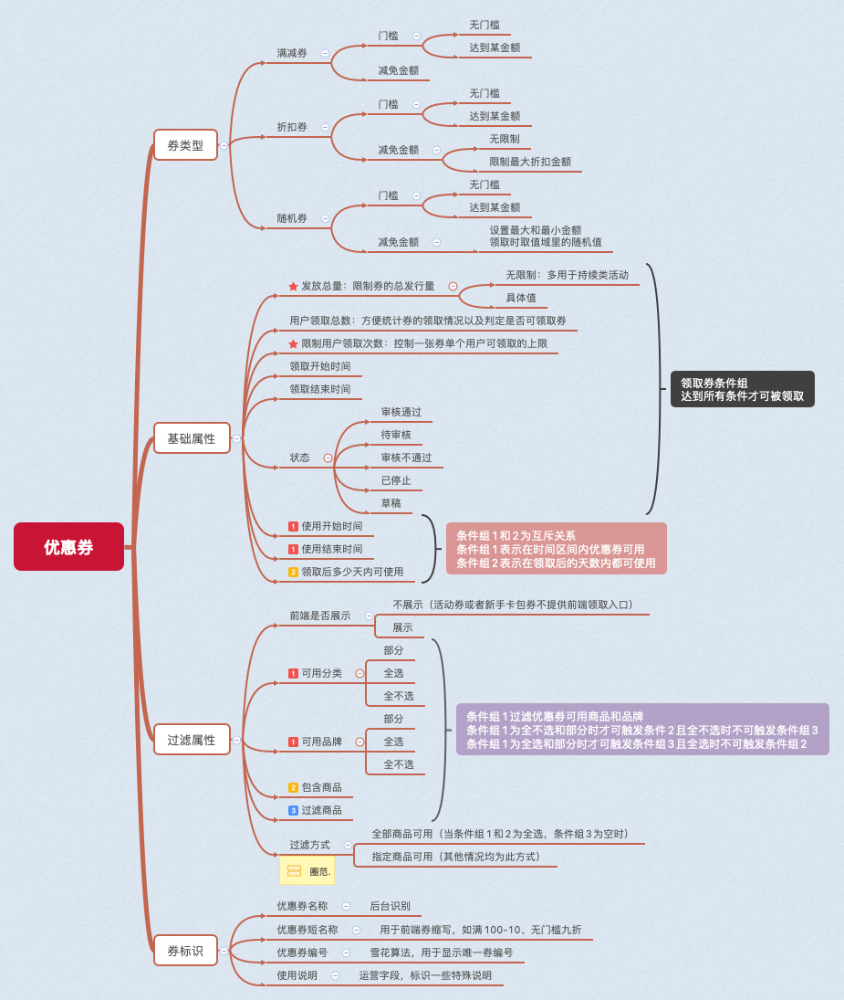
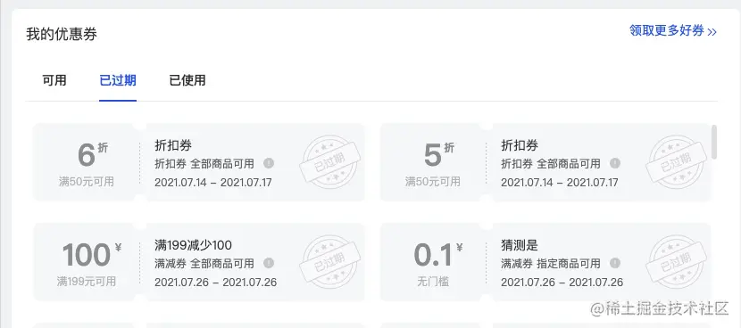

优惠券完全指南一
======
> https://juejin.cn/post/7016623099936243719


# 引言
电商平台都会有优惠券，**优惠券的本质是平台或者商家赋予用户的一种特殊权利的凭证**，
可以在用户支付的时候用于减免一定费用。
本系列文章分享了关于电商后台优惠券设计的实现方式。


# 分析
实现优惠券功能，首先我们要分析出**整个优惠券的组成结构**。

## 结构图


## 优惠券类型
纵观大多数的电商平台，优惠券的类型大致分为三种

1. 满减券: 持本券消费达到一定金额时可抵用部分现金
2. 折扣券: 持本券消费可享受特别折扣，通常搭配使用门槛和限制最大抵扣金额进行限制
3. 随机券: 在用户领取券时才会写入最终减免金额，通常设置最小和最大值，在值域内随机生成

## 基础属性
* 发放总量: 决定该券总发放数量。默认是有限制的，后文会涉及到活动优惠券卡包功能预留无限制的情况
* 用户领取总数: 方便判断是否还有余券以及统计用户领取情况，冗余属性
* 限制用户领取次数: 部分券发放时用户可多次领取，也是为活动卡券包功能做铺垫
* 领取开始结束时间: 用于领券中心判断正在进行并可领取的券
* 状态: 只有审核通过的券才可以被领取和发放，审核功能一般开放给权限较高的运营和财务人员
* 使用开始结束时间: 与领取多少天使用条件是互斥操作，取其一

## 过滤属性
* 前端是否显示: 部分券是卡券包直接发放，前端不提供入口领取，所以需要此属性
* 可用分类: 筛选部分分类商品，可全选也可全不选
* 可用品牌: 筛选部分品牌商品，可全选也可全不选
* 包含商品: 在分类和品牌条件为全不选或部分选择时，可再追加一些单品参与优惠券
* 过滤商品: 在分类和品牌条件为全选或部分选择时，可再追加排除一些单品参与优惠券

## 标识属性
* 优惠券名称: 前端显示的优惠券长文，如双十一满减==
* 优惠券短名称: 前端显示区域需突出券使用规则的地方，如满100-10，无门槛九折==
* 优惠券编号: 用算法生成的券的唯一标识号
* 使用说明: 运营字段，多用于标识一些运营活动特殊说明，仅后台管理平台可见


# 表结构梳理
## 优惠券主体结构表
根据上图的一些分析构想，可得出一套优惠券的主表。

```roomsql
CREATE TABLE `t_coupon_info` (
	`id` INT ( 11 ) UNSIGNED NOT NULL AUTO_INCREMENT,
	`no` VARCHAR ( 64 ) NOT NULL COMMENT '优惠券编号',
	`name` VARCHAR ( 50 ) NOT NULL COMMENT '优惠券名称',
	`short_name` VARCHAR ( 50 ) NOT NULL COMMENT '优惠券短名称',
	`type` TINYINT ( 4 ) NOT NULL COMMENT '优惠券类型：1、满减卷 2、折扣卷 3、随机卷',
	`total` INT ( 11 ) NOT NULL COMMENT '发放总量',
	`order_limit_money` DECIMAL ( 10, 2 ) NOT NULL COMMENT '订单满多少可用，0表示无门槛',
	`limit_small` DECIMAL ( 10, 1 ) NOT NULL COMMENT '最小优惠金额，折扣劵的话就是折扣值',
	`user_get_count` BIGINT ( 20 ) DEFAULT '0' COMMENT '该券用户领取总数',
	`limit_big` DECIMAL ( 10, 2 ) NOT NULL COMMENT '最大优惠金额，0为无限制',
	`is_show_web` TINYINT ( 1 ) NOT NULL COMMENT '前端是否展示：0不展示，1展示',
	`get_begin_time` datetime NOT NULL COMMENT '可领取开始时间',
	`get_end_time` datetime NOT NULL COMMENT '可领取结束时间',
	`user_type` TINYINT ( 4 ) NOT NULL COMMENT '适用用户(0-通用、1-C端、2-B端)',
	`user_limit_num` TINYINT ( 4 ) NOT NULL DEFAULT '0' COMMENT '限制用户领取次数: 0 无限制',
	`use_begin_time` datetime DEFAULT NULL COMMENT '使用开始时间',
	`use_end_time` datetime DEFAULT NULL COMMENT '使用结束时间',
	`use_desc` VARCHAR ( 255 ) NOT NULL COMMENT '使用说明',
	`limit_time_num` INT ( 11 ) NOT NULL DEFAULT '-1' COMMENT '限制使用时间： 0，无限制 其他代表领卷当日起多少日可用',
	`status` TINYINT ( 4 ) NOT NULL DEFAULT '1' COMMENT '状态：1、审核通过 2、进行中 3、已结束 4、已停止 5、草稿 6、待审核 7、审核不通过',
	`create_user` VARCHAR ( 20 ) CHARACTER SET utf8 NOT NULL DEFAULT '' COMMENT '新增 - 创建人',
	`update_user` VARCHAR ( 20 ) CHARACTER SET utf8 NOT NULL DEFAULT '' COMMENT '新增 - 最后修改人',
	`create_time` datetime NOT NULL COMMENT '创建时间',
	`update_time` datetime NOT NULL ON UPDATE CURRENT_TIMESTAMP COMMENT '更新时间',
	`contains_types` text COMMENT '可用分类逗号隔开,0为全部,-1为全不选',
	`contains_brand` text COMMENT '可用品牌逗号隔开,0为全部,-1为全不选',
	`contains_goods` text COMMENT '包含商品,0为全部可用,需追加时商品id逗号隔开',
	`filter_goods` text COMMENT '过滤商品 0为没有过滤,需过滤时商品id逗号隔开',
	`filter_way` TINYINT ( 2 ) DEFAULT '0' COMMENT '优惠劵过滤方式 0.指定商品可用 1.全部商品可用',
	`review_remark` VARCHAR ( 255 ) DEFAULT NULL COMMENT '审核意见',
	PRIMARY KEY ( `id` ) USING BTREE,
	KEY `idx_no` ( `no` ) USING BTREE 
) ENGINE = INNODB AUTO_INCREMENT = 916 DEFAULT CHARSET = utf8mb4 ROW_FORMAT = DYNAMIC COMMENT = '优惠券信息表'
```

ps:新增时需注意分析出的互斥条件

## 用户领券表
有个主体表，还需要一个跟用户关联的用户优惠券表，用于存放领取过的券记录以及券的使用过期情况。



如图所示分析，这张关联表需要一些主体表体现不出的元素。

* 用户目前券的使用情况(可用、过期或已使用)
* 用户领券后券的具体可使用时间(如果主题表为具体的使用时间区间，就可直接使用字段；如果是领取后多少天可用，就需要在领取时推算具体使用时间了)
* 如果用户是使用的随机券还需要记录下本券的具体随机金额
* 还需要防止发券事故的发生，给予一个补充状态，方便停止券的使用，及时止损
* 当然关联的订单号和用户id是必不可少的，方便程序追溯

根据分析得出具体的表结构

```roomsql
CREATE TABLE `t_coupon_user_record` (
	`id` INT ( 11 ) UNSIGNED NOT NULL AUTO_INCREMENT,
	`coupon_no` INT ( 11 ) NOT NULL COMMENT '券主体表id',
	`user_id` INT ( 11 ) NOT NULL COMMENT '用户ID',
	`discounts_amount` DECIMAL ( 10, 2 ) NOT NULL DEFAULT '0.00' COMMENT '实际抵扣金额',
	`order_num` VARCHAR ( 32 ) DEFAULT NULL COMMENT '关联订单号',
	`get_time` datetime NOT NULL COMMENT '领取时间',
	`use_time` datetime NOT NULL COMMENT '使用时间',
	`end_time` datetime DEFAULT NULL COMMENT '过期时间',
	`status` TINYINT ( 4 ) NOT NULL DEFAULT '1' COMMENT '状态：1、待使用 2、售后中 3、已过期 4、已使用 5、强制停止',
	`create_user` VARCHAR ( 20 ) NOT NULL DEFAULT '' COMMENT '新增 - 创建人',
	`update_user` VARCHAR ( 20 ) NOT NULL DEFAULT '' COMMENT '新增 - 最后修改人',
	`create_time` datetime NOT NULL COMMENT '创建时间',
	`update_time` datetime NOT NULL COMMENT '更新时间',
	PRIMARY KEY ( `id` ) USING BTREE,
	KEY `idx_coupon_no` ( `coupon_no` ) USING BTREE,
	KEY `idx_order_num` ( `order_num` ) USING BTREE,
	KEY `idx_user_id` ( `user_id` ),
KEY `idx_end_time` ( `end_time` ) 
) ENGINE = INNODB AUTO_INCREMENT = 3816 DEFAULT CHARSET = utf8mb4 ROW_FORMAT = DYNAMIC COMMENT = '用户领券记录表'
```


# 总结
本文主要梳理了一些常用优惠券类型以及表设计方面的基础架构，后面的文章会系统展开说明如何设计一个完整的优惠券功能。
包含功能

* 优惠券适用商品查询
* 商品详情中优惠券列表的查询
* 商品列表小标签的查询技巧
* 优惠券活动卡包设计

