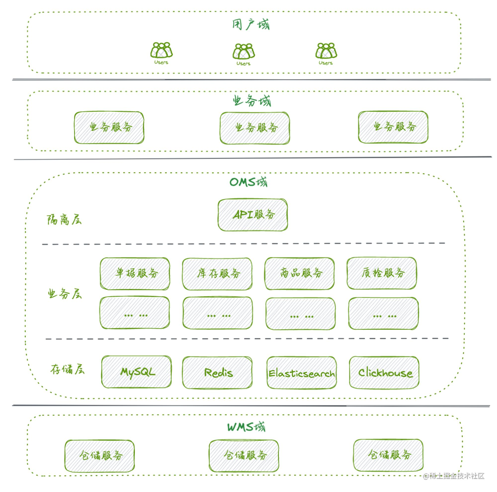

OMS系统实战的三两事
======
> https://mdnice.com/writing/da0775a5a91f44a998985b0bca5fee37

# 1. 前言
这是一篇关于供应链业务相关的OMS系统实战技术文章，整理自近半年的开发实践。
由于业务背景的差异化、具体落地的独特性以及个人业务知识的局限性，
这里不做普适性供应链业务领域的深入讨论，仅论述自身业务场景中技术方案的实现过程，
不可避免会出现部分内容略带一些特殊性和局限性。

首先，从**业务架构**和**系统架构**出发，简单鸟瞰业务构成和系统构建。
其次，在庞大复杂的供应链业务中梳理出较为核心的**单据业务、库存管理**的演进过程。
再次，从技术视角抽取了关联数据映射、状态数据隔离、分布式事务业务化、幂等改造、防重键扩展、动态库存挑战等一般功能实践，进行技术方案设计的讨论。
最后，整理了一些比较典型的问题，给出自己的一些思考。

# 2. 架构设计
## 2.1 业务架构

整体参与供应链业务范畴的领域可以大致划分为**用户域、业务域、OMS域、WMS域、支撑域**。
在整个供应链业务的核心链路可以简单概括为：用户参与业务域提供的售卖、营销、权益活动等与其产生交易关系，
业务域便产生履约职责并将该诉求下沉，OMS域负责将履约诉求进行分发，由WMS域完成出货动作，经由快递服务完成用户履约。

由于供应链业务有着自身的特殊性，并不是所有业务都能够通过纳入到线上系统管理来解决具体现实问题，
领域间需要通过**线上、线下**两部分进行协作完成业务流转。
比如采购商品入库、仓内货品盘点调配、商品派送等都需要有现实人力作为整个信息流的支点来进行串联，
使得线上系统驱动、线下人工作业能够互相配合协作，从而完成业务全链路的闭环。
研发人员除了做好线上系统的良好交付，还有保持好与线下人员的高效沟通，
让每一个点位都能够朝着**降本、提效**这个供应链的核心目标靠近，
实现业务价值的最大产出，最终收获技术价值的最大存在。

## 2.2 系统架构

整体的系统架构按照传统的**隔离层、业务层、存储层**进行分层拆分：

* **隔离层** 主要通过一个Facade API进行服务能力的输出，是外部领域与内部逻辑交互的边界，主要职责是做数据有效性校验、数据聚合等
* **业务层** 核心区域，是复杂的业务逻辑实现层，包括供应关系涉及的方方面面的微服务群组
* **存储层** 数据沉淀、加工、传递的区域，支持诸多数据结构的存储介质和引擎

# 3. 功能演进
供应链业务庞大、功能复杂，这里抽取**单据业务、库存管理**的发展历程来概述下系统功能演进。

## 3.1 单据业务演进

