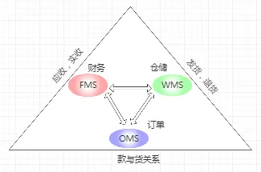
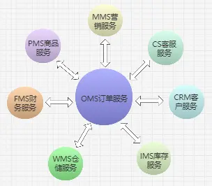

分布式场景下的OMS系统设计
======
> https://www.woshipm.com/pd/4854238.html

编辑导语：
**OMS即订单管理中心**，可以看作是**电商系统的核心**，其所需要具备的功能包括**汇集数据、分发、跟踪汇总**等等。
那么，如何依据实际业务场景、搭建一个可支撑的、稳固强大的OMS系统？
本文作者针对分布式场景下的OMS系统设计做了总结，一起来看一下。

# 一、OMS所处位置
通常我们所谈论的**网上购物为狭义电商**，属于**广义电商**的一种，即**以电子化手段进行商品交易的一种行为。**

**狭义电商**简单可以描述为**货、款、以及货与款的关系**。
同样，转化为**电商系统主要核心模块**可以分为**WMS仓储系统、FMS财务系统、OMS订单系统**。

在电商的三大核心模块中**OMS订单系统**又可以看作**核心中的核心**，所有系统以围绕着订单模块进行构建，
如果整个电商系统比作人体器官，那么OMS当之无愧可以比作人的心脏，
所以OMS系统设计的好坏，直接影响着其他系统的构建。

# 二、OMS作用
OMS系统承上启下处在电商系统业务链的中游。
通过各个平台聚集到OMS的订单，系统通过会员信息、收货信息、优惠信息、商品、积分、支付等条件对订单提供后续处理，
如合单、拆单、第三方推送、分发仓库、通知扣减积分，库存、创建退款，退货申请单等操作。
同时具备从其他系统上报收集追踪订单变化。如出库、物流信息，并对其他系统运营分析提供数据支撑。

可见**OMS系统要具备数据快速聚集、加工、分发、跟踪汇总的能力。**

# 三、OMS设计
了解了OMS所处位置和作用，接下来谈谈如何设计一个稳健的、可持续性的OMS系统。

