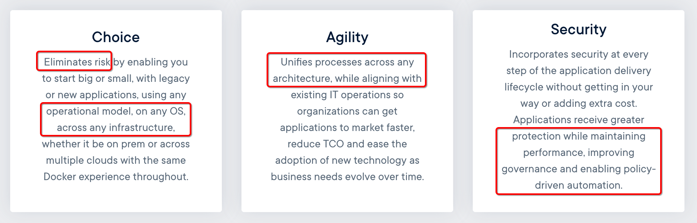

Docker - Build, Ship, and Run Any App, Anywhere/随时随地构建，发布和运行任何应用
================================================================
**Build, Manage and Secure Your Apps Anywhere. Your Way./以你的方式随处构建，管理和保护您的应用**

The `Dev` to `Ops` Choice for **Container Platforms**

[Why Docker?/为何选择Docker](./0.2-why_docker.md)

## The Rise of the Container Platform/容器平台的兴起
Learn **the differences between a container and a container platform** and
the key requirements around `security, operations and orchestration` that
organizations should be looking for in an enterprise-grade platform.

## The Docker Enterprise Difference
Leading companies rely on our container platform to `build, manage and secure all their applications`
from traditional applications to cutting-edge microservices — `and deploy them anywhere`.

## Docker Simplifies the Developer Experience/简化开发人员体验
**Docker provides container software** that is ideal for developers and teams
looking to get started and experimenting with `container-based applications`.
[Docker Desktop](https://www.docker.com/products/docker-desktop) provides an integrated `container-native development experience`;
it launches as an application from your Mac or Windows toolbar and provides access to
the largest library of community and certified Linux Server content from [Docker Hub](https://hub.docker.com/).

Still trying to `learn more about containers and the difference between a container and a VM?`
Find out what's possible with [Docker Containers](https://www.docker.com/resources/what-container).

[Get Started](./0.4-get_started_with_docker.md)

## Discover What Docker Can Do For Your Organization/了解Docker可以为您的组织做些什么
**Applications are the lifeblood of any business.**

Companies that outperform in the digital economy manage their applications as business-critical assets that
simultaneously delight their customers and outmaneuver their competition.
**Containerization/容器化** is `a key component of this strategic investment.`
While developers have long taken advantage of the `agility` and `portability` benefits that
**Docker (Linux) containers provide across the application lifecycle**,
organizations planning to optimize these applications for their digital and hybrid cloud initiatives
require a broader `containerization strategy`.

[Docker Enterprise](https://www.docker.com/products/docker-enterprise) manages and secures both legacy and new applications,
enabling companies to more easily modernize their application environments.
Because Docker's **container platform** is reinforced by the backing of enterprise-grade services and
support, organizations have everything they need to create a container strategy.

## Get Started with Docker Today/现在开始使用Docker
[Get Started](./0.4-get_started_with_docker.md)

[官方原文](https://www.docker.com/)

