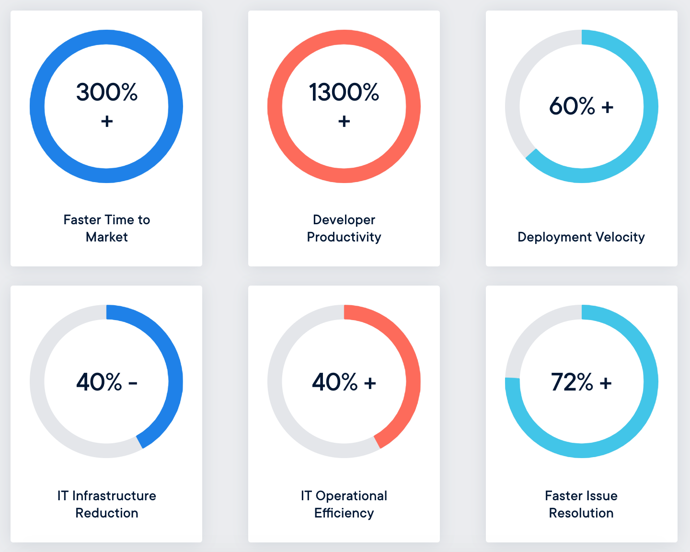
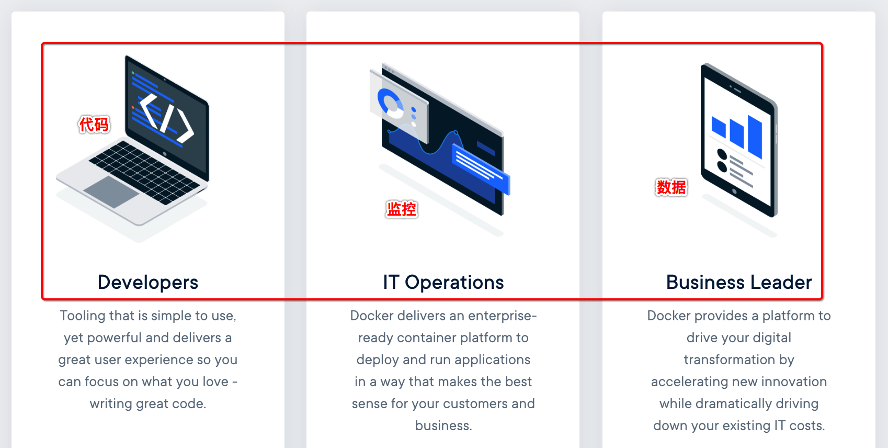
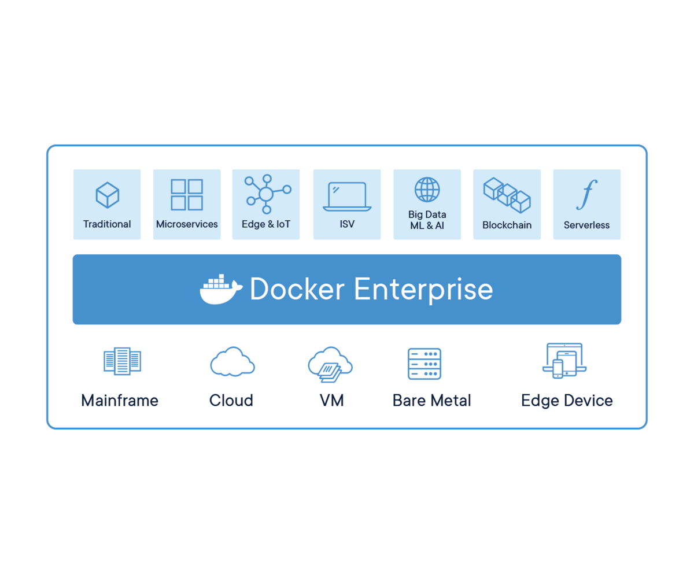

Why Docker?/为何选择Docker
======================
**Docker Containerization Unlocks the Potential for Dev and Ops/容器化解锁Dev和Ops的潜力**

`Freedom of choice, agile operations and integrated container security` for legacy and **cloud-native applications**

[What is a Container/什么是容器](./0.3-what_is_a_container.md)，
[Learn about Container Platforms](https://goto.docker.com/Q218-0625-Content-IDCWhitePaper_LP.html)

## A Modern Platform for All Applications/现代平台
Docker unlocks the potential of your organization by `giving developers and IT the freedom to
build, manage and secure business-critical applications` without the fear of technology or infrastructure lock-in.

By combining its industry-leading **[container engine](https://www.docker.com/products/docker-engine) technology,
[an enterprise-grade container platform](https://www.docker.com/products/docker-enterprise),**
Docker enables you to bring traditional and cloud native applications built on Linux and mainframe into
`an automated and secure supply chain`, advancing `dev to ops collaboration` and reducing time to value.

## What Docker Can Do For Your Business/Docker可以为您的企业做些什么
**The Docker Enterprise container platform** delivers immediate value to your business by
`reducing the infrastructure and maintenance costs` of supporting your existing application portfolio
while accelerating your time to market for new solutions.

## How Docker Works for You/Docker如何为您工作

### Developers
Tooling that is `simple to use`, yet `powerful and delivers a great user experience`
so you can focus on **what you love - writing great code**.

### IT Operations
Docker delivers an **enterprise-ready container platform** to `deploy and run applications in` a way
that makes `the best sense for your customers and business`.

[Get Started](./0.4-get_started_with_docker.md)

## A Complete Solution/完整的解决方案
Docker Enterprise `Manages All of Your Application` Needs

Docker containers are the fastest growing cloud-enabling technology and driving
`a new era of computing and application architecture` with their lightweight approach to
**bundle `applications` and `dependencies` into isolated**, yet **highly portable `application packages`**.

**Docker is `your partner` for digital and cloud initiatives** and we have an enterprise-ready container platform that
harnesses the potential of containers and a methodology that puts you at the center of the journey.
Docker-led transformation **works with the `people, process and technology`** you have today,
integrates to it, and `evolves it at the pace your business needs`.

## Ready to Build Your Containerization Strategy?/准备构建容器化战略
[Drive Your Containerization Strategy with Docker](https://www.docker.com/containerization-strategy)

[官方原文](https://www.docker.com/why-docker)

