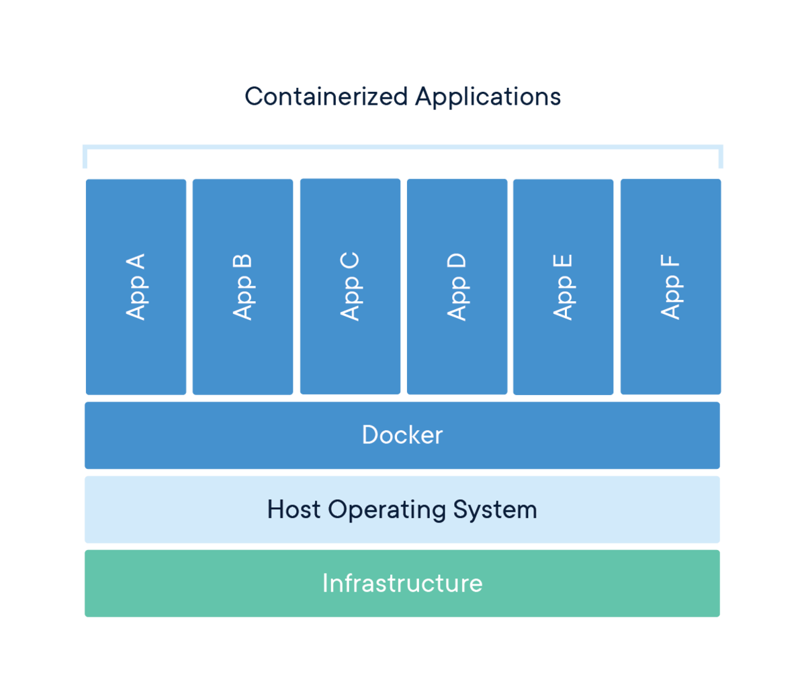
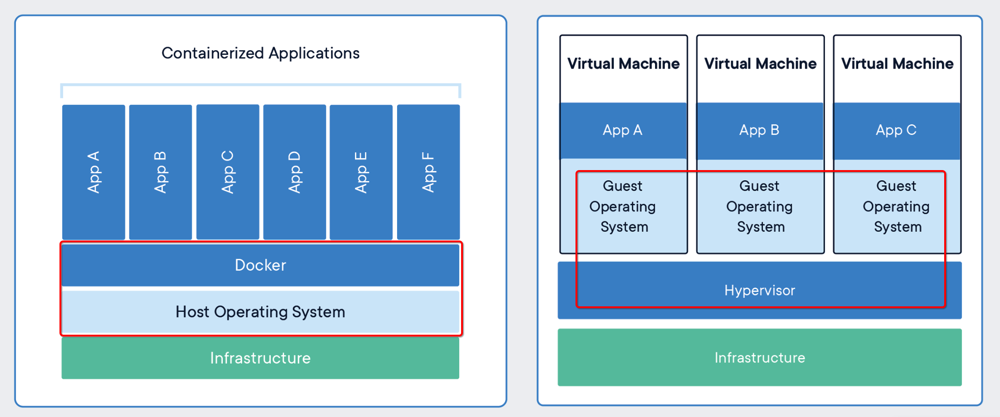
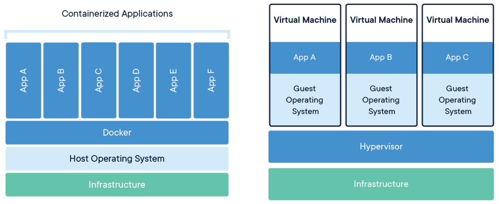

What is a Container/什么是容器
=========================
**A standardized unit of software/标准化的软件单元**

## Package Software into Standardized Units for Development, Shipment and Deployment/将软件打包成标准化单元

A Docker **container image is a lightweight, standalone, executable package of software** that includes
`everything needed to run an application`: **code, runtime, system tools, system libraries and settings**.

**Container images become containers at runtime** and
in the case of Docker containers - images become containers when they run on [Docker Engine](https://www.docker.com/products/docker-engine).
**containerized software will always run the same**, regardless of the infrastructure.
**Containers isolate software from its environment** and
ensure that it **works uniformly** despite differences for instance between development and staging.

Docker containers that run on Docker Engine:
- **Standard**: Docker created _the industry standard for containers_, so they could be portable anywhere
- **Lightweight**: **Containers share the machine’s OS system kernel** and therefore `do not require an OS per application`,
  driving higher server efficiencies and reducing server and licensing costs
- **Secure**: _Applications are **safer** in containers_ and Docker provides **the strongest default isolation capabilities** in the industry

[Learn More](https://www.docker.com/products/docker-engine)

## Docker Containers Are Everywhere: Linux, Data center, Cloud, Serverless, etc./Docker容器无处不在
Docker container technology was launched in `2013` as an open source
[Docker Engine](https://www.docker.com/products/docker-enterprise).

It leveraged `existing computing concepts around containers` and specifically in the Linux world,
primitives known as **cgroups** and **namespaces**. Docker's technology is unique because it
focuses on `the requirements of developers and systems operators to separate application dependencies from infrastructure`.

## Comparing Containers and Virtual Machines/比较容器和虚拟机
Containers and _virtual machines_ have similar `resource isolation and allocation benefits`,
but function differently because **containers virtualize the operating system** instead of _hardware_.
Containers are more `portable` and `efficient`.

### CONTAINERS
**Containers are an abstraction at the `app layer`** that **packages `code` and `dependencies` together**.
`Multiple containers` can **run on the same machine** and **share the OS kernel** with other containers,
**each running as `isolated processes in user space`**.
Containers take up `less space` than VMs (**container images** are typically tens of `MBs` in size),
can handle more applications and require fewer VMs and Operating systems.

### VIRTUAL MACHINES
**Virtual machines (VMs) are an abstraction of `physical hardware`** turning one server into many servers.
**The hypervisor allows `multiple VMs` to run on a single machine.**
**Each VM includes a full copy of an operating system, the application, necessary binaries and libraries** -
taking up tens of `GBs`. VMs can also be `slow to boot`.

## Containers and Virtual Machines Together/容器和虚拟机"在一起"
Containers and VMs used together provide `a great deal of flexibility in deploying and managing app`

## Container Standards and Industry Leadership/容器标准
Docker developed **a Linux container technology** - one that is `portable, flexible and easy to deploy`.
In June 2015, Docker donated **the container image specification and runtime code** now known as `runc`,
to the Open Container Initiative (OCI) to help establish standardization as the container ecosystem grows and matures.

**containerd is an industry-standard container runtime** that leverages runc and was created with
an emphasis on `simplicity, robustness and portability`.
containerd is the core container runtime of the Docker Engine.

[Learn More About containerd](https://containerd.io/)

[官方原文](https://www.docker.com/resources/what-container)

