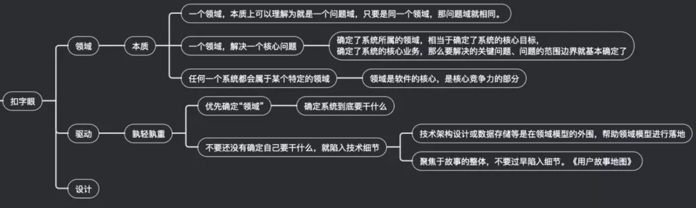

领域驱动设计在重构业务系统中的实践
============================
> 韩宇斌，2019-05-08

本文将结合一些文字和图片，围绕着*领域驱动设计中战略部分*的三个核心概念：
*领域通用语言（UBIQUITOUS LANGUAGE）*，*领域模型（Domain）*和*限界上下文（Bounded Context）*，来分享下心得。

## 1.系统居然不能完全解决业务的问题

### 订单化系统的前世

### 订单化系统不能完全解决业务的问题

### 转折点

## 2.“订单化”系统演变为了“订单交付” 系统
领域驱动设计（DDD）思想指导的开发过程，是一个全程强调“*领域模型*”的开发过程，
首先开发团队要和领域专家去针对业务需求进行充分的讨论沟通，才能确定`真正的问题域和业务期望`。

### 主动与业务的沟通
经过和业务方的多次交流后，我们逐渐提炼和理解了一些“统一语言”，举例如下：
* 订单完整的生命周期：下单，支付，已支付待交付，交付（发货），签收
* 确收：收入和交付数据核对无误，可以确认为财务收入
* 权益：用户购买虚拟商品后，获得可以学习对应课程的权利
* 补偿：该给权益的时候没给，要补上权益

回到领域驱动设计，扣一下字眼。首先，**一个领域，解决一个核心问题**，任何一个系统都会属于某个特定的领域；
确定了系统所属的领域，相当于确定了系统的核心目标；
确定了系统的核心业务，那么要解决的关键问题、问题的范围边界就基本确定了。
**驱动**，我理解的是回答优先级和孰轻孰重，前面的“订单化”系统之所以不能解决业务的问题，就是因为陷入了误区之一“还没有确定自己要干什么，就陷入技术细节”。

### 订单化系统演变为“订单交付系统”

重新确定的领域问题是：订单签约和履约，正确的交付权益。
从全局角度看，就是交易与订单。**交易是行为，订单是契约，交付是履约**。
从得到后端的角度看，核心领域问题是“订单交付”，所以一个“订单交付”系统就呼之欲出了。
几乎在同时，公司也确定了要做一个交易中心的中台服务，去和若干支付系统对接，我把他们起名为“交易生态圈”。

### “订单交付系统”的设计建模
借助DDD的建模思想指导，进行了重新建模，新模型面对的**核心领域模型是“商品”，核心限界上下文是“订单交付”**。

## 3.用限界上下文保护领域
确定了领域后，就要**保护*领域*不能随意被“侵犯”**，而保护的依据，就是“*限界上下文*”。
如下图，*Eric Evans* **用细胞来形容限界上下文**，
因为“**细胞之所以能够存在，是因为细胞膜限定了什么在细胞内，什么在细胞外，并且确定了什么物质可以通过细胞膜。**”
这里，**细胞代表上下文，而细胞膜代表了包裹上下文的边界**。【经典案例】

## 4.总结
DDD思想指导的开发过程，首先是**开发团队要和领域专家去针对业务需求进行充分的讨论沟通**，这一点很重要，
业务线的开发人员有个不好的习惯：被动接受需求，回头再来抱怨业务人员或者产品经理没有表述清楚，
人非圣贤孰能无过，合作的就是要互相补位。

[原文](https://mp.weixin.qq.com/s?__biz=MzIxMzEzMjM5NQ==&mid=2651031977&idx=1&sn=29f79e9ac3b71d3290c9a490a14355ce)

