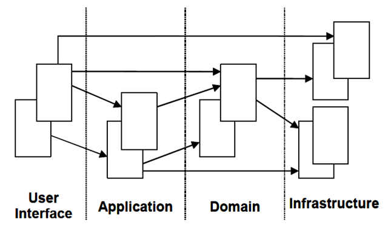
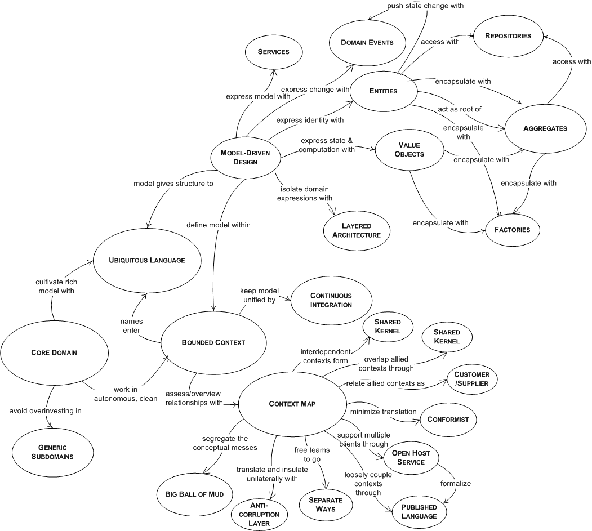

DDD领域驱动设计基本理论知识总结
===================
> 汤雪华，2011-10-10

## 1.领域驱动设计之**领域模型**
2004年**Eric Evans**发表\<**Domain-Driven Design – Tackling Complexity in the Heart of Software/领域驱动设计 - 解决软件核心的复杂性**>，简称Evans DDD。
领域驱动设计分为*两个阶段*：
1. 以一种**领域专家、设计人员、开发人员**都能理解的**通用语言**作为相互交流的工具，在交流的过程中发现**领域概念**，然后将这些概念设计成一个**领域模型**；
2. 由**领域模型驱动软件设计**，用代码来实现该领域模型；

由此可见，**领域驱动设计的核心**是**建立正确的领域模型**。

## 2.为什么建立一个领域模型是重要的
领域驱动设计告诉我们，在通过软件实现一个*业务系统*时，建立一个领域模型是非常重要和必要的，因为**领域模型**具有以下**特点**：
1. 领域模型**是对*具有某个边界的领域*的一个抽象，反映了领域内用户业务需求的本质**；领域模型是`有边界的`，只反应了我们在领域内所关注的部分；
2. 领域模型**只反映业务**，和任何技术实现无关；领域模型不仅能反映领域中的一些*实体概念*，如货物，书本，应聘记录，地址等；还能反映领域中的一些*过程概念*，如资金转账等；
3. 领域模型确保了我们的软件的**业务逻辑都在一个模型中，都在一个地方(高内聚)**；这样对提高软件的可维护性，业务可理解性以及可重用性方面都有很好的帮助；
4. 领域模型能够帮助开发人员*相对平滑地将领域知识转化为软件构造*；
5. 领域模型*贯穿软件分析、设计以及开发的整个过程*；领域专家、设计人员、开发人员*通过领域模型进行交流*，彼此共享知识与信息；因为大家面向的都是同一个模型，所以可以防止需求走样，可以让软件设计开发人员做出来的软件真正满足需求；
6. *要建立正确的领域模型并不简单*，需要领域专家、设计、开发人员积极沟通共同努力，然后才能使大家*对领域的认识不断深入，从而不断细化和完善领域模型*；
7. 为了让领域模型看的见，我们需要用一些方法来表示它；*图是表达领域模型最常用的方式*，但不是唯一的表达方式，代码或文字描述也能表达领域模型；
8. *领域模型是整个软件的核心*，是软件中最有价值和最具竞争力的部分；*设计足够精良且符合业务需求的领域模型*能够更快速地响应需求变化；

## 3.领域通用语言(Ubiquitous Language)
我们认识到由软件专家和领域专家通力合作开发出一个领域的模型是绝对需要的，但是，那种方法通常会由于一些基础交流的障碍而存在难点。
开发人员满脑子都是类、方法、算法、模式、架构等等，总是想将实际生活中的概念和程序工件进行对应。
他们希望看到要建立哪些对象类，要如何对对象类之间的关系建模。
他们会习惯按照封装、继承、多态等面向对象编程中的概念去思考，会随时随地这样交谈，这对他们来说太正常不过了，开发人员就是开发人员。
但是领域专家通常对这一无所知，他们对软件类库、框架、持久化甚至数据库没有什么概念。他们只了解他们特有的领域专业技能。
比如，在空中交通监控样例中，领域专家知道飞机、路线、海拔、经度、纬度，知道飞机偏离了正常路线，知道飞机的发射。
他们用他们自己的术语讨论这些事情，有时这对于外行来说很难直接理解。
如果一个人说了什么事情，其他的人不能理解，或者更糟的是错误理解成其他事情，又有什么机会来保证项目成功呢？

在交流的过程中，需要做翻译才能让其他的人理解这些概念。开发人员可能会努力使用外行人的语言来解析一些设计模式，但这并一定都能成功奏效。
领域专家也可能会创建一种新的行话以努力表达他们的这些想法。在这个痛苦的交流过程中，这种类型的翻译并不能*对知识的构建过程*产生帮助。

领域驱动设计的**一个核心的原则**是**使用一种基于模型的语言**。
因为**模型是软件满足领域的共同点**，它很适合*作为这种通用语言的构造基础*。
使用模型作为语言的核心骨架，要求团队在进行所有的交流时都使用一致的语言，在代码中也是这样。
在共享知识和推敲模型时，团队会使用演讲、文字和图形。
这儿需要确保团队使用的语言在所有的交流形式中看上去都是一致的，这种语言被称为“通用语言(Ubiquitous Language)”。
通用语言应该在建模过程中广泛尝试以推动软件专家和领域专家之间的沟通，从而发现要在模型中使用的主要的领域概念。

## 4.将领域模型转换为代码实现的最佳实践
拥有一个看上去正确的模型不代表模型能被直接转换成代码，或者它的实现可能会违背某些我们所不建议的**软件设计原则**。
我们该如何实现从模型到代码的转换，并让代码具有可扩展性、可维护性，高性能等指标呢？
另外，如实反映领域的模型可能会导致对象持久化的一系列问题，或者导致不可接受的性能问题。
那么我们应该怎么做呢？

我们应该*紧密关联领域建模和设计*，紧密将领域模型和软件编码实现捆绑在一起，模型在构建时就考虑到软件和设计。开发人员会被加入到建模的过程中来。
*主要的想法是选择一个能够恰当在软件中表现的模型*，这样设计过程会很顺畅并且基于模型。
代码和其下的模型紧密关联会让代码更有意义并与模型更相关。有了开发人员的参与就会有反馈。它能保证模型被实现成软件。
如果其中某处有错误，会在早期就被标识出来，问题也会容易修正。写代码的人会很好地了解模型，会感觉自己有责任保持它的完整性。
他们会意识到对代码的一个变更其实就隐含着对模型的变更，另外，如果哪里的代码不能表现原始模型的话，他们会重构代码。
如果分析人员从实现过程中分离出去，他会不再关心开发过程中引入的局限性。最终结果是模型不再实用。
任何技术人员想对模型做出贡献必须花费一些时间来接触代码，无论他在项目中担负的是什么主要角色。
任何一个负责修改代码的人都必须学会用代码表现模型。每位开发人员都必须参与到一定级别的领域讨论中并和领域专家联络。

## 5.领域建模时思考问题的角度
“用户需求”不能等同于“用户”，捕捉“用户心中的模型”也不能等同于“以用户为核心设计领域模型”。
《老子》书中有个观点：有之以为利，无之以为用。在这里，有之利，即建立领域模型；无之用，即包容用户需求。
举些例子，一个杯子要装满一杯水，我们在制作杯子时，制作的是空杯子，即要把水倒出来，之后才能装下水；
再比如，一座房子要住人，我们在建造房子时，建造的房子是空的，唯有空的才能容纳人的居住。
因此，**建立领域模型时也要将用户置于模型之外**，这样才能包容用户的需求。

所以，我的理解是：
1. 我们设计领域模型时不能以用户为中心作为出发点去思考问题，不能老是想着用户会对系统做什么；而应该从一个客观的角度，**根据用户需求挖掘出领域内的相关事物，思考这些事物的本质关联及其变化规律作为出发点去思考问题**。
2. **领域模型是排除了人之外的客观世界模型**，但是领域模型包含人所扮演的参与者角色，但是一般情况下不要让参与者角色在领域模型中占据主要位置；
   如果以人所扮演的参与者角色在领域模型中占据主要位置，那么各个系统的领域模型将变得没有差别，因为软件系统就是一个人机交互的系统，都是以人为主的活动记录或跟踪；
   比如：论坛中如果以人为主导，那么领域模型就是：人发帖，人回帖，人结贴等等；DDD的例子中，如果是以人为中心的话，就变成了托运人托运货物，收货人收货物，付款人付款等等；
   因此，当我们谈及领域模型时，已经默认把人的因素排除开了，因为领域只有对人来说才有意义，人是在领域范围之外的，如果人也划入领域，领域模型将很难保持客观性。
   **领域模型是与谁用和怎样用都无关的客观模型**。归纳起来说就是，**领域建模是建立虚拟模型让我们现实的人使用**，而不是建立虚拟空间，去模仿现实。

以Eric Evans (DDD之父)在他的书中的一个*货物运输系统*为例子简单说明一下。在经过一些用户需求讨论之后，在用户需求相对明朗之后，Eric这样描述领域模型：
1. 一个Cargo(货物)涉及多个Customer(客户，如托运人、收货人、付款人)，每个Customer承担不同的角色；
2. Cargo的运送目标已指定，即Cargo有一个运送目标；
3. 由一系列满足Specification(规格)的Carrier Movement(运输动作)来完成运送目标；

从上面的描述我们可以看出，他完全没有从用户的角度去描述领域模型，而是**以*领域内的相关事物*为出发点，考虑这些事物的本质关联及其变化规律的**。
上述这段描述完全以*货物*为中心，把客户看成是货物在某个场景中可能会涉及到的关联角色，如货物会涉及到托运人、收货人、付款人；货物有一个确定的目标，货物会经过一系列的运输动作到达目的地；
其实，我觉得以用户为中心来思考领域模型的思维只是停留在需求的表面，而没有挖掘出真正的需求的本质；我们在做领域建模时需要努力挖掘*用户需求的本质*，这样才能真正实现用户需求。

关于用户、参与者这两个概念的区分，可以看一下下面的例子：

试想两个人共同玩足球游戏，操作者(用户)是驱动者，它驱使足球比赛领域中，各个“人”(参与者)的活动。
这里立下一个假设，假设操作者A操作某一队员a，而队员a拥有着某人B的信息，那么有以下说法，a是B的镜像，a是领域参与者，A是驱动者。

## 6.领域驱动设计的经典分层架构

### 用户界面/展现层
负责向用户展现信息以及解释用户命令。更细的方面来讲就是：
1. 请求应用层以获取用户所需要展现的数据；
2. 发送命令给应用层要求其执行某个用户命令；

### 应用层
很薄的一层，定义软件要完成的所有任务。对外为展现层提供各种应用功能（包括查询或命令），对内调用领域层（领域对象或领域服务）完成各种业务逻辑，应用层不包含业务逻辑。

### 领域层
负责表达**业务概念、业务状态信息以及业务规则**，**领域模型处于这一层，是业务软件的核心**。

### 基础设施层
本层为其他层提供通用的技术能力，提供了层间的通信，为领域层实现持久化机制；
总之，基础设施层可以通过架构和框架来支持其他层的技术需求。

## 7.领域驱动设计过程中使用的模式

### 所有模式的总揽图

### 关联的设计
关联本身不是一个模式，但它在领域建模的过程中非常重要，所以需要在探讨各种模式之前，先讨论一下**对象之间的关联该如何设计**。
我觉得对象的关联的设计可以遵循如下的一些原则：
1. **关联尽量少**，对象之间的复杂的关联容易形成对象的关系网，这样对于我们理解和维护单个对象很不利，
   同时也很难*划分对象与对象之间的边界*；另外，同时减少关联有助于简化对象之间的遍历；
2. **一对多的关联**也许在业务上是很自然的，通常我们会用一个集合来表示1对多的关系。
   但我们往往也需要考虑到`性能问题`，尤其是当集合内元素非常多的时候，此时往往需要通过单独查询来获取关联的集合信息；
3. 关联**尽量保持单向的关联**；
4. 在建立关联时，我们需要深入去挖掘是否存在*关联的限制条件*，如果存在，那么最好把这个限制条件加到这个关联上；
   往往这样的限制条件能将关联化繁为简，即可以将多对多简化为1对多，或将1对多简化为1对1；

### 1.实体(Entity)
**实体**就是领域中**需要*唯一标识*的领域概念**。因为我们有时需要区分是哪个实体。
有两个实体，如果唯一标识不一样，那么即便实体的其他所有属性都一样，我们也认为他们是两个不同的实体；
因为**实体有生命周期**，实体从被创建后可能会被持久化到数据库，然后某个时候又会被取出来。
所以，如果我们不为实体定义一种可以唯一区分的标识，那我们就无法区分到底是这个实体还是哪个实体。
另外，`不应该给实体定义太多的属性或行为`，而应该**寻找关联，发现其他一些实体或值对象，将属性或行为转移到其他关联的实体或值对象上**。
比如Customer实体，他有一些地址信息，由于地址信息是一个完整的有业务含义的概念，
所以我们可以定义一个Address对象，然后把Customer的地址相关的信息转移到Address对象上。
如果没有Address对象，而把这些地址信息直接放在Customer对象上，
并且如果对于一些其他的类似Address的信息也都直接放在Customer上，会导致Customer对象很混乱，结构不清晰，最终导致它难以维护和理解。

### 2.值对象(Value Object)
在领域中，并不是每一个事物都必须有一个唯一标识，也就是说我们不关心对象是哪个，而只关心`对象是什么`。
就以上面的地址对象Address为例，如果有两个Customer的地址信息是一样的，我们就会认为这两个Customer的地址是同一个。
也就是说只要地址信息一样，我们就认为是同一个地址。用程序的方式来表达就是，
**如果两个对象的所有属性的值都相同我们会认为它们是同一个对象**的话，那么我们就可以把这种对象设计为**值对象**。
因此，`值对象没有唯一标识`，这是它`和实体的最大不同`。
另外值对象在`判断是否是同一个对象时是通过它们的所有属性是否相同`，如果相同则认为是同一个值对象；
而我们在区分`是否是同一个实体时，只看实体的唯一标识是否相同`，而不管实体的属性是否相同；
值对象另外一个明显的特征是`不可变`，即`所有属性都是只读的`。
因为属性是只读的，所以可以被安全的共享；当共享值对象时，一般有复制和共享两种做法，具体采用哪种做法还要根据实际情况而定；
另外，我们应该给值对象设计的尽量简单，不要让它引用很多其他的对象，因为他只是一个值，就像int a = 3;
那么”3”就是一个我们传统意义上所说的值，而值对象其实也可以和这里的”3”一样理解，也是一个值，只不过是用对象来表示。
值对象虽然是只读的，但是可以被整个替换掉。

### 3.领域服务(Domain Service)
领域中的一些概念不太适合建模为对象，即归类到实体对象或值对象，因为它们本质上就是一些*操作*，一些*动作*，而不是事物。
这些操作或动作往往会涉及到多个领域对象，并且需要协调这些领域对象共同完成这个操作或动作。
如果强行将这些操作职责分配给任何一个对象，则被分配的对象就是承担一些不该承担的职责，从而会导致对象的职责不明确很混乱。
但是基于类的面向对象语言规定任何属性或行为都必须放在对象里面。所以我们需要寻找一种新的模式来表示这种跨多个对象的操作，
DDD认为**服务**是一个很自然的范式**用来对应这种跨多个对象的操作**，所以就有了**领域服务**这个模式。
和领域对象不同，领域服务是以动词开头来命名的，比如资金转帐服务可以命名为MoneyTransferService。
当然，你也可以把服务理解为一个对象，但这和一般意义上的对象有些区别。
因为一般的**领域对象**都是有*状态和行为*的，而**领域服务**没有状态只有*行为*。
需要强调的是领域服务`是无状态的`，它**存在的意义**就是**协调领域对象共同完成某个操作**，所有的状态还是都保存在相应的领域对象中。
我觉得**模型(实体)与服务(场景)是对领域的一种划分，模型关注领域的个体行为，场景关注领域的群体行为，模型关注领域的静态结构，场景关注领域的动态功能**。
这也符合了现实中出现的各种现象，有动有静，有独立有协作。

领域服务还有一个*很重要的功能*就是**可以避免领域逻辑泄露到应用层**。
因为如果没有领域服务，那么应用层会直接调用领域对象完成本该是属于领域服务该做的操作，这样一来，领域层可能会把一部分领域知识泄露到应用层。
因为应用层需要了解每个领域对象的业务功能，具有哪些信息，以及它可能会与哪些其他领域对象交互，怎么交互等一系列领域知识。
因此，引入领域服务可以有效的防治领域层的逻辑泄露到应用层。
对于应用层来说，从可理解的角度来讲，通过调用领域服务提供的简单易懂但意义明确的接口肯定也要比直接操纵领域对象容易的多。
这里似乎也看到了领域服务具有Facade的功能。

说到领域服务，还需要提一下软件中一般有三种服务：应用层服务、领域层服务、基础层服务。

#### 应用层服务
1. 获取输入(如一个XML请求)；
2. 发送消息给领域层服务，要求其实现转帐的业务逻辑；
3. 领域层服务处理成功，则调用基础层服务发送短信通知；

#### 领域层服务
1. 获取源帐号和目标帐号，分别通知源帐号和目标帐号进行扣除金额和增加金额的操作；
2. 提供返回结果给应用层；

#### 基础层服务
按照应用层的请求，发送短信通知；

所以，从上面的例子中可以清晰的看出，每种服务的职责。

### 4.聚合及聚合根(Aggregate, Aggregate Root)
**聚合**，它**通过定义对象之间清晰的所属关系和边界来实现领域模型的内聚**，并避免了错综复杂的难以维护的`对象关系网`的形成。
**聚合定义了一组具有内聚关系的相关对象的集合**，我们把聚合看作是**一个修改数据的单元**。

聚合有以下一些*特点*：
1. **每个聚合有一个根和一个边界**，**边界**定义了**一个聚合内部有哪些实体或值对象**，**根**是**聚合内的某个实体**；
2. **聚合内部的对象之间可以相互引用**，但是聚合外部如果要访问聚合内部的对象时，
   必须通过聚合根开始导航，绝对不能绕过聚合根直接访问聚合内的对象，也就是说*聚合根是外部可以保持对它的引用的唯一元素*；
3. 聚合内除根以外的其他实体的唯一标识都是本地标识，也就是只要在聚合内部保持唯一即可，因为它们总是从属于这个聚合的；
4. **聚合根***负责与外部其他对象打交道并维护自己内部的业务规则*；
5. 基于聚合的以上概念，我们可以推论出*从数据库查询时的单元也是以聚合为一个单元*，也就是说我们不能直接查询聚合内部的某个非根的对象；
6. 聚合内部的对象可以保持对其他聚合根的引用；
7. *删除一个聚合根时必须同时删除该聚合内的所有相关对象*，因为他们都同属于**一个聚合，是一个完整的概念**；

**关于如何识别聚合以及聚合根的问题**：

我觉得我们可以先从业务的角度深入思考，然后慢慢分析出有哪些对象是：
1. *有独立存在的意义*，即它是不依赖于其他对象的存在它才有意义的；
2. 可以*被独立访问的*，还是必须通过某个其他对象导航得到的；

#### 如何识别**聚合**？
我觉得这个需要从业务的角度深入分析*哪些对象它们的关系是内聚的*，
即我们会*把他们看成是一个整体来考虑的*；然后这些对象我们就可以把它们放在一个聚合内。
所谓**关系是内聚的**，是**指这些对象之间必须保持一个固定规则，固定规则是指在数据变化时必须保持不变的一致性规则**。
当我们在修改一个聚合时，我们必须在事务级别确保整个聚合内的所有对象满足这个固定规则。
作为一条建议，聚合尽量不要太大，否则即便能够做到在事务级别保持聚合的业务规则完整性，也可能会带来一定的性能问题。
有分析报告显示，通常在大部分领域模型中，有70%的聚合通常只有一个实体，即聚合根，该实体内部没有包含其他实体，只包含一些值对象；
另外30%的聚合中，基本上也只包含两到三个实体。这意味着大部分的聚合都只是一个实体，该实体同时也是聚合根。

#### 如何识别**聚合根**？
如果一个聚合只有一个实体，那么这个实体就是聚合根；如果有多个实体，那么我们可以思考聚合内哪个对象有独立存在的意义并且可以和外部直接进行交互。

### 5.工厂(Factory)
DDD中的**工厂**也是一种体现*封装思想的模式*。DDD中*引入工厂模式的原因是：
有时创建一个**领域对象**是一件比较复杂的事情*，不仅仅是简单的new操作。
正如对象封装了内部实现一样(我们无需知道对象的内部实现就可以使用对象的行为)，
工厂则是*用来封装创建一个复杂对象尤其是**聚合**时所需的知识*，工厂的作用是将创建对象的细节隐藏起来。
客户传递给工厂一些简单的参数，然后工厂可以在内部创建出一个复杂的领域对象然后返回给客户。
领域模型中其他元素都不适合做这个事情，所以需要引入这个新的模式，工厂。
工厂在创建一个复杂的领域对象时，通常会知道该满足什么*业务规则*
(它知道先怎样实例化一个对象，然后再对这个对象做哪些初始化操作，这些知识就是创建对象的细节)，
如果传递进来的参数符合创建对象的业务规则，则可以顺利创建相应的对象；
但是如果由于参数无效等原因不能创建出期望的对象时，应该抛出一个异常，以确保不会创建出一个错误的对象。
当然我们也并不总是需要通过工厂来创建对象，事实上大部分情况下领域对象的创建都不会太复杂，所以我们只需要简单的使用构造函数创建对象就可以了。
隐藏创建对象的好处是显而易见的，这样可以*不会让领域层的业务逻辑泄露到应用层*，
同时也减轻了应用层的负担，它只需要简单的调用领域工厂创建出期望的对象即可。

### 6.仓储(Repository)
1. *仓储被设计出来的目的*是基于这个原因：*领域模型中的对象自从被创建出来后不会一直留在内存中活动的，
   当它不活动时会被持久化到数据库中，然后当需要的时候我们会重建该对象*；
   重建对象就是根据数据库中已存储的对象的状态重新创建对象的过程；所以，可见*重建对象是一个和数据库打交道的过程*。
   从更广义的角度来理解，我们经常会像集合一样从某个类似集合的地方根据某个条件获取一个或一些对象，往集合中添加对象或移除对象。
   也就是说，我们需要提供一种机制，可以提供类似集合的接口来帮助我们**管理对象**。仓储就是基于这样的思想被设计出来的；
2. **仓储里面存放的对象一定是*聚合***，原因是之前提到的领域模型中是*以聚合的概念去划分边界的*；
   *聚合是我们更新对象的一个边界*，事实上我们把整个聚合看成是一个整体概念，要么一起被取出来，要么一起被删除。
   我们永远不会单独对某个聚合内的子对象进行单独查询或做更新操作。因此，我们**只对聚合设计仓储**；
3. 仓储还有*一个重要的特征*就是分为**仓储定义部分和仓储实现部分**，
   在*领域模型*中我们*定义仓储的接口*，而在*基础设施层实现具体的仓储*。
   这样做的原因是：由于仓储背后的实现都是在和数据库打交道，但是我们又不希望客户(如应用层)把重点放在如何从数据库获取数据的问题上，
   因为这样做会导致客户(应用层)代码很混乱，很可能会因此而忽略了领域模型的存在。
   所以我们需要提供一个简单明了的接口，供客户使用，确保客户能以最简单的方式获取领域对象，
   从而可以让它专心的不会被什么数据访问代码打扰的情况下协调领域对象完成业务逻辑。这种通过接口来隔离封装变化的做法其实很常见。
   由于客户面对的是抽象的接口并不是具体的实现，所以我们可以随时替换仓储的真实实现，这有助于我们做单元测试；
4. 尽管仓储可以像集合一样在内存中管理对象，但是仓储一般不负责事务处理。
   一般事务处理会交给一个叫“*工作单元(Unit Of Work)*”的东西。关于工作单元的详细信息我在下面的讨论中会讲到；
5. 另外，仓储在设计查询接口时，可能还会用到规格模式(Specification Pattern)，我见过的最厉害的规格模式应该就是LINQ以及DLINQ查询了。
   一般我们会根据项目中查询的灵活度要求来选择适合的仓储查询接口设计。通常情况下只需要定义简单明了的具有固定查询参数的查询接口就可以了。
   只有在查询条件是动态指定的情况下才可能需要用到Specification等模式；

## 8.设计领域模型的一般步骤
1. 根据需求建立一个初步的领域模型，识别出一些明显的*领域概念以及它们的关联*，关联可以暂时没有方向但需要有（1:1，1:N，M:N）这些关系；
   可以用文字精确的没有歧义的描述出*每个领域概念的涵义*以及*包含的主要信息*；
2. 分析*主要的软件应用程序功能，识别出主要的应用层的类*；这样有助于及早发现哪些是应用层的职责，哪些是领域层的职责；
3. 进一步*分析**领域模型***，识别出哪些是**实体**，哪些是**值对象**，哪些是**领域服务**；
4. *分析**关联***，通过对业务的更深入分析以及各种**软件设计原则**及性能方面的权衡，明确关联的方向或者去掉一些不需要的关联；
5. *找出**聚合边界及聚合根***，这是一件很有难度的事情；因为你在分析的过程中往往会碰到很多模棱两可的难以清晰判断的选择问题，
   所以，需要我们平时一些分析经验的积累才能找出正确的聚合根；
6. *为**聚合根**配备**仓储***，一般情况下是*为一个聚合分配一个仓储*，此时只要设计好仓储的接口即可；
7. *走查**场景***，确定我们设计的领域模型能够有效地解决业务需求；
8. 考虑如何创建**领域实体**或**值对象**，是通过工厂还是直接通过构造函数；
9. *停下来重构**模型***。寻找模型中觉得有些疑问或者是蹩脚的地方，比如思考一些对象应该通过关联导航得到还是应该从仓储获取？
   聚合设计的是否正确？考虑模型的性能怎样，等等；

**领域建模是一个不断重构，持续完善模型的过程**，大家会在讨论中将变化的部分反映到模型中，从而使模型不断细化并朝正确的方向走。
领域建模是领域专家、设计人员、开发人员之间沟通交流的过程，是大家工作和思考问题的基础。

## 9.在分层架构中其他层如何与领域层交互
从经典的领域驱动设计分层架构中可以看出，领域层的上层是应用层，下层是基础设施层。那么领域层是如何与其它层交互的呢？

### 对于会影响领域层中**领域对象状态**的应用层功能
一般应用层会先启动*一个工作单元*，然后：
1. 对于*修改***领域对象**的情况，通过**仓储**获取领域对象，调用领域对象的相关业务方法以完成业务逻辑处理；
2. 对于*新增*领域对象的情况，通过构造函数或工厂创建出领域对象，
   如果需要还可以继续对该新创建的领域对象做一些操作，然后把该新创建的领域对象添加到**仓储**中；
3. 对于*删除*领域对象的情况，可以先把领域对象从仓储中取出来，然后将其从**仓储**中删除，
   也可以直接传递一个要删除的*领域对象的唯一标识*给仓储通知其移除该唯一标识对应的领域对象；
4. 如果*一个业务逻辑涉及到**多个领域对象***，则调用领域层中的相关**领域服务**完成操作；

注意，*以上所说的所有领域对象都是聚合根*，另外在应用层需要获取仓储接口以及领域服务接口时，都可以通过IOC容器获取。
最后通知工作单元提交事务从而将所有相关的领域对象的状态以事务的方式持久化到数据库。

### 关于Unit of Work(工作单元)的几种实现方法
1. 基于*快照*的实现，即领域对象被取出来后，会先保存一个备份的对象，
   然后当在做持久化操作时，将最新的对象的状态和备份的对象的状态进行比较，如果不相同，则认为有做过修改，然后进行持久化；
   这种设计的好处是对象不用告诉工作单元自己的状态修改了，而缺点也是显而易见的，那就是性能可能会低，
   备份对象以及比较对象的状态是否有修改的过程在当对象本身很复杂的时候，往往是一个比较耗时的步骤，
   而且要真正实现对象的深拷贝以及判断属性是否修改还是比较困难的；
2. 不基于快照，而是*在仓储的相关更新或新增或删除接口被调用时，仓储通知工作单元某个对象被新增了或更新了或删除了*。
   这样工作单元在做数据持久化时也同样可以知道需要持久化哪些对象了；
   这种方法理论上不需要ORM框架的支持，对领域模型也没有任何倾入性，同时也很好的支持了工作单元的模式。
   对于不想用高级ORM框架的朋友来说，这种方法挺好；
3. 不基于快照，也不用仓储告诉工作单元数据更改了。而是采用*AOP的思想*，*采用透明代理的方式进行一个拦截*；

### 对于不会影响领域层中领域对象状态的查询功能
可以*直接通过**仓储**查询出所需要的数据*。但一般领域层中的仓储提供的查询功能也许不能满足界面显示的需要，
则可能需要多次调用不同的仓储才能获取所需要显示的数据；其实针对这种查询的情况，我在后面会讲到可以直接通过CQRS的架构来实现。
即对于查询，我们可以在应用层不调用领域层的任何东西，而是直接通过某个其他的用另外的技术架构实现的查询引擎来完成查询，
比如直接通过构造参数化SQL的方式从数据库一个表或多个表中查询出任何想要显示的数据。
这样不仅性能高，也可以减轻领域层的负担。领域模型不太适合为应用层提供各种查询服务，
因为往往界面上要显示的数据是很多对象的组合信息，是一种非对象概念的信息，就像报表。

## 10.为什么面向对象比面向过程更能适应业务变化
对象将需求用类一个个隔开，就像用*储物箱*把*东西*一个个封装起来一样，需求变了，
分几种情况，最严重的是大变，那么每个储物箱都要打开改，这种方法就不见得有好处；
但是这种情况发生概率比较小，大部分需求变化都是局限在一两个储物箱中，
那么我们只要打开这两个储物箱修改就可以，不会影响其他储物箱了。

而面向过程是把所有东西都放在一个大储物箱中，修改某个部分以后，会引起其他部分不稳定，
一个bug修复，引发新的无数bug，最后程序员陷入焦头烂额，如日本东京电力公司员工处理核危机一样，心力交瘁啊。

所以，我们不能粗粒度看*需求变*，认为需求变了，就是大范围变，万事万物都有*边界*。
老子说，无欲观其缴，什么事物都要观察其边界，虽然需求可以用“需求”这个名词表达，
谈到需求变了，不都意味着最大边界范围的变化，这样看问题容易走极端。

其实就是就地画圈圈——**边界**。
我们小时候写作文分老三段也是同样道理，各自职责明确，划分边界明确，通过过渡句实现承上启下——**接口**。
为什么组织需要分不同部门，同样是边界思维。画圈圈容易，但如何画才难，所以OO中思维非常重要。

*需求变化所引起的变化是有边界的*，如果变化的边界等于整个领域，那么已经是完全不同的项目了。
要掌握边界，是需要大量的领域知识的。否则，走进银行连业务职责都分不清的，如何画圈圈呢？

面向过程是无边界一词的(就算有也只是最大的边界)，它没有要求各自独立，它可以横跨边界进行调用，
这就是容易引起bug的原因，引起bug不一定是技术错误，更多的是逻辑错误。
分别封装就是画圈圈了，*所有边界都以接口实现*。不用改或者小改接口，都不会牵一发动全身。
如果面向过程中考虑边界，那么也就已经上升到OO思维，即使用的不是对象语言，但对象已经隐含其中。
说白了，*面向对象与面向过程最大区别就是：分解。边界的分解*。从需求到最后实现都贯穿。

**面向对象的实质就是边界划分，封装**，不但对需求变化能够量化，缩小影响面；
因为边界划分也会限制出错的影响范围，所以OO对软件后期bug等出错也有好处。

软件世界永远都有bug，bug是清除不干净的，就像人类世界永远都存在不完美和阴暗面，
`问题关键是：上帝用空间和时间的边界把人类世界痛苦灾难等不完美局限在一个范围内`；
而软件世界如果你不采取OO等方法进行边界划分的话，一旦出错，追查起来情况会有多糟呢？

软件世界其实类似人类现实世界，有时出问题了，探究原因一看，原来是两个看上去毫无联系的因素导致的。
古人只好经常求神拜佛，我们程序员在自己的软件上线运行时，大概心里也在求神拜佛别出大纰漏。
如果我们的软件采取OO封装，我们就会坦然些，肯定会出错，但是我们已经预先划定好边界。
所以，不会产生严重后果，甚至也不会出现难以追查的魔鬼bug。

## 11.领域驱动设计的其他一些主题
上面只是涉及到DDD中最基本的内容，DDD中还有很多其他重要的内容在上面没有提到，如：
1. 模型上下文、上下文映射、上下文共享；
2. 如何将分析模式和设计模式运用到DDD中；
3. 一些关于柔性设计的技巧；
4. 如何保持模型完整性，以及持续集成方面的知识；
5. 如何精炼模型，识别核心模型以及通用子领域；

这些主题都很重要，因为篇幅有限以及我目前掌握的知识也有限，并且为了突出这篇文章的重点，
所以不对他们做详细介绍了，大家有兴趣的可以自己阅读一下。

## 12.一些相关的扩展阅读

### CQRS架构
**核心思想**是**将应用程序的查询部分和命令部分完全分离**，这两部分可以用完全不同的模型和技术去实现。
比如命令部分可以通过领域驱动设计来实现；查询部分可以直接用最快的非面向对象的方式去实现，比如用SQL。
这样的思想有很多好处：
1. 实现命令部分的领域模型不用经常为了领域对象可能会被如何查询而做一些折中处理；
2. 由于命令和查询是完全分离的，所以这两部分可以用不同的技术架构实现，包括数据库设计都可以分开设计，每一部分可以充分发挥其长处；
3. 高性能，命令端因为没有返回值，可以像消息队列一样接受命令，放在队列中，慢慢处理；
   处理完后，可以通过异步的方式通知查询端，这样查询端可以做数据同步的处理；

### Event Sourcing(事件溯源)
对于DDD中的*聚合*，不保存聚合的当前状态，而是*保存对象上所发生的每个事件*。
当要重建一个聚合对象时，可以通过回溯这些事件(即让这些事件重新发生)来让对象恢复到某个特定的状态；
因为有时一个聚合可能会发生很多事件，所以如果每次要在重建对象时都从头回溯事件，会导致性能低下，
所以我们会在一定时候为聚合创建一个*快照*。这样，我们就可以基于某个快照开始创建聚合对象了。

### DCI架构
DCI架构强调，软件应该真实的模拟现实生活中对象的交互方式，代码应该准确朴实地反映用户的心智模型。
在DCI中有：*数据模型、角色模型*、以及*上下文*这三个概念。
*数据模型表示程序的结构*，目前我们所理解的DDD中的*领域模型*可以很好的表示数据模型；
*角色模型表示数据如何交互*，一个角色定义了某个“身份”所具有的交互行为；
*上下文对应业务场景，用于实现业务用例*，注意是业务用例而不是系统用例，业务用例只与业务相关；
软件运行时，根据用户的操作，系统创建相应的场景，并把相关的数据对象作为场景参与者传递给场景，
然后场景知道该为每个对象赋予什么角色，当对象被赋予某个角色后就真正成为有交互能力的对象，然后与其他对象进行交互；
这个过程与现实生活中我们所理解的对象是一致的。

DCI的这种思想与DDD中的*领域服务*所做的事情是一样的，但实现的角度有些不同。
DDD中的领域服务被创建的出发点是当一些职责不太适合放在任何一个领域对象上时，
这个职责往往对应领域中的某个活动或转换过程，此时我们应该考虑将其放在一个服务中。
比如资金转帐的例子，我们应该提供一个资金转帐的服务，用来对应领域中的*资金转帐*这个*领域概念*。
但是*领域服务内部做的事情是协调多个领域对象完成一件事情*。
因此，在DDD中的领域服务在协调领域对象做事情时，领域对象往往是处于一个被动的地位，
领域服务通知每个对象要求其做自己能做的事情，这样就行了。
这个过程中我们似乎看不到对象之间交互的意思，因为整个过程都是由领域服务以面向过程的思维去实现了。
而DCI则通过引入角色，赋予角色以交互能力，然后让角色之间进行交互，从而可以让我们看到对象与对象之间交互的过程。
但前提是，对象之间确实是在交互。因为现实生活中并不是所有的对象在做交互，
比如有A、B、C三个对象，A通知B做事情，A通知C做事情，此时可以认为A和B，A和C之间是在交互，但是B和C之间没有交互。
所以我们需要分清这种情况。资金转帐的例子，A相当于转帐服务，B相当于帐号1，C相当于帐号2。
因此，资金转帐这个业务场景，用领域服务比较自然。有人认为DCI可以替换DDD中的领域服务，我持怀疑态度。

### 四色原型分析模式
#### 时刻-时间段原型(Moment-Interval Archetype)
表示*在某个时刻或某一段时间内发生的某个活动*。使用粉红色表示，简写为MI。

#### 参与方-地点-物品原型(Part-Place-Thing Archetype)
表示*参与某个活动的人或物*，*地点则是活动的发生地*。使用绿色表示。简写为PPT。

#### 描述原型(Description Archetype)
表示*对PPT的本质描述*。它不是PPT的分类！Description是从PPT抽象出来的不变的共性的属性的集合。
使用蓝色表示，简写为DESC。

举个例子，有一个人叫张三，如果某个外星人问你张三是什么？你会怎么说？
可能会说，张三是个人，但是外星人不知道“人”是什么。然后你会怎么办？
你就会说：张三是个由一个头、两只手、两只脚，以及一个身体组成的客观存在。
虽然这时外星人仍然不知道人是什么，但我已经可以借用这个例子向大家说明什么是“Description”了。
在这个例子中，张三就是一个PPT，而“由一个头、两只手、两只脚，以及一个身体组成的客观存在”
就是对张三的Description，头、手、脚、身体则是人的本质的不变的共性的属性的集合。
但我们人类比较聪明，很会抽象总结和命名，已经把这个Description用一个字来代替了，那就是“人”。
所以就有所谓的张三是人的说法。

#### 角色原型(Role Archetype)
*角色*就是我们平时所理解的“*身份*”。使用黄色表示，简写为Role。
为什么会有角色这个概念？因为有些活动，只允许具有特定角色(身份)的PPT(参与者)才能参与该活动。
比如一个人只有具有教师的角色才能上课(一种活动)；一个人只有是一个合法公民才能参与选举和被选举；
但是有些活动也是不需要角色的，比如一个人不需要具备任何角色就可以睡觉(一种活动)。
当然，其实说人不需要角色就能睡觉也是错误的，错在哪里？
因为我们可以这样理解：一个客观存在只要具有“人”的角色就能睡觉，其实这时候，我们已经把DESC当作角色来看待了。
所以，其实角色这个概念是非常广的，不能用我们平时所理解的狭义的“身份”来理解，
因为“教师”、“合法公民”、“人”都可以被作为角色来看待。
因此，应该这样说：*任何一个活动，都需要具有一定角色的参与者才能参与*。

用一句话来概括**四色原型**就是：**一个什么样的人或组织或物品以某种角色在某个时刻或某段时间内参与某个活动**。
其中“什么样的”就是DESC，“人或组织或物品”就是PPT，“角色”就是Role，而”某个时刻或某段时间内的某个活动"就是MI。

以上这些东西如果在学习了DDD之后再去学习会对DDD有更深入的了解，但我觉得DDD相对比较基础，
如果我们在已经了解DDD的基础之上再去学习这些东西会更加有效和容易掌握。

希望本文对大家有所帮助。

[原文](https://www.cnblogs.com/netfocus/archive/2011/10/10/2204949.html)

