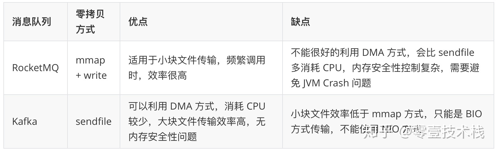

零拷贝原理
======
> https://www.cnblogs.com/frankltf/p/12662401.html

**零拷贝（Zero-copy）技术指在计算机执行操作时，CPU 不需要先将数据从一个内存区域复制到另一个内存区域，从而可以减少上下文切换以及 CPU 的拷贝时间。
它的作用是在数据报从网络设备到用户程序空间传递的过程中，减少数据拷贝次数，减少系统调用，实现 CPU 的零参与，彻底消除 CPU 在这方面的负载。
实现零拷贝用到的最主要技术是 DMA 数据传输技术和内存区域映射技术。**

* 零拷贝机制可以减少数据在内核缓冲区和用户进程缓冲区之间反复的 I/O 拷贝操作。
* 拷贝机制可以减少用户进程地址空间和内核地址空间之间因为上下文切换而带来的 CPU 开销。

### 1. 物理内存和虚拟内存

由于操作系统的进程与进程之间是共享 CPU 和内存资源的，因此需要一套完善的内存管理机制防止进程之间内存泄漏的问题。
为了更加有效地管理内存并减少出错，现代操作系统提供了一种对主存的抽象概念，即是虚拟内存（Virtual Memory）。
虚拟内存为每个进程提供了一个一致的、私有的地址空间，它让每个进程产生了一种自己在独享主存的错觉（每个进程拥有一片连续完整的内存空间）。

### 2. 内核空间和用户空间
操作系统的核心是内核，独立于普通的应用程序，可以访问受保护的内存空间，也有访问底层硬件设备的权限。
为了避免用户进程直接操作内核，保证内核安全，操作系统将虚拟内存划分为两部分，一部分是内核空间（Kernel-space），一部分是用户空间（User-space）。
在 Linux 系统中，内核模块运行在内核空间，对应的进程处于内核态；而用户程序运行在用户空间，对应的进程处于用户态。

### 3. Linux的内部层级结构

### 4. Linux I/O读写方式
Linux 提供了轮询、I/O 中断以及 DMA 传输这 3 种磁盘与主存之间的数据传输机制。
其中轮询方式是基于死循环对 I/O 端口进行不断检测。
I/O 中断方式是指当数据到达时，磁盘主动向 CPU 发起中断请求，由 CPU 自身负责数据的传输过程。
DMA 传输则在 I/O 中断的基础上引入了 DMA 磁盘控制器，由 DMA 磁盘控制器负责数据的传输，降低了 I/O 中断操作对 CPU 资源的大量消耗。

#### 4.1. I/O中断原理
在 DMA 技术出现之前，应用程序与磁盘之间的 I/O 操作都是通过 CPU 的中断完成的。
每次用户进程读取磁盘数据时，都需要 CPU 中断，然后发起 I/O 请求等待数据读取和拷贝完成，每次的 I/O 中断都导致 CPU 的上下文切换。

#### 4.2. DMA传输原理
DMA 的全称叫直接内存存取（Direct Memory Access），是一种允许外围设备（硬件子系统）直接访问系统主内存的机制。
也就是说，基于 DMA 访问方式，系统主内存于硬盘或网卡之间的数据传输可以绕开 CPU 的全程调度。
目前大多数的硬件设备，包括磁盘控制器、网卡、显卡以及声卡等都支持 DMA 技术。

整个数据传输操作在一个 DMA 控制器的控制下进行的。
CPU 除了在数据传输开始和结束时做一点处理外（开始和结束时候要做中断处理），在传输过程中 CPU 可以继续进行其他的工作。
这样在大部分时间里，CPU 计算和 I/O 操作都处于并行操作，使整个计算机系统的效率大大提高。

### 5. 传统I/O方式
为了更好的理解零拷贝解决的问题，我们首先了解一下传统 I/O 方式存在的问题。
在 Linux 系统中，传统的访问方式是通过 write() 和 read() 两个系统调用实现的，
通过 read() 函数读取文件到缓存区中，然后通过 write() 方法把缓存中的数据输出到网络端口，伪代码如下：

```
read(file_fd, tmp_buf, len);
write(socket_fd, tmp_buf, len);
```

下图分别对应传统 I/O 操作的数据读写流程，整个过程涉及 2 次 CPU 拷贝、2 次 DMA 拷贝总共 4 次拷贝，以及 4 次上下文切换，
下面简单地阐述一下相关的概念。

上下文切换：当用户程序向内核发起系统调用时，CPU 将用户进程从用户态切换到内核态；
当系统调用返回时，CPU 将用户进程从内核态切换回用户态。

**CPU拷贝**：由 CPU 直接处理数据的传送，数据拷贝时会一直占用 CPU 的资源。

**DMA拷贝**：由 CPU 向DMA磁盘控制器下达指令，让 DMA 控制器来处理数据的传送，数据传送完毕再把信息反馈给 CPU，从而减轻了 CPU 资源的占有率。

### 6. 零拷贝方式
在 Linux 中零拷贝技术主要有 3 个实现思路：用户态直接 I/O、减少数据拷贝次数以及写时复制技术。

用户态直接 I/O：应用程序可以直接访问硬件存储，操作系统内核只是辅助数据传输。
这种方式依旧存在用户空间和内核空间的上下文切换，硬件上的数据直接拷贝至了用户空间，不经过内核空间。
因此，直接 I/O 不存在内核空间缓冲区和用户空间缓冲区之间的数据拷贝。

减少数据拷贝次数：在数据传输过程中，避免数据在用户空间缓冲区和系统内核空间缓冲区之间的CPU拷贝，
以及数据在系统内核空间内的CPU拷贝，这也是当前主流零拷贝技术的实现思路。

写时复制技术：写时复制指的是当多个进程共享同一块数据时，如果其中一个进程需要对这份数据进行修改，
那么将其拷贝到自己的进程地址空间中，如果只是数据读取操作则不需要进行拷贝操作。

#### 6.2. mmap + write
一种零拷贝方式是使用 mmap + write 代替原来的 read + write 方式，**减少了 1 次 CPU 拷贝操作**。
mmap 是 Linux 提供的一种内存映射文件方法，即将一个进程的地址空间中的一段虚拟地址映射到磁盘文件地址，
mmap + write 的伪代码如下：

```
tmp_buf = mmap(file_fd, len);
write(socket_fd, tmp_buf, len);
```

**使用 mmap 的目的是将内核中读缓冲区（read buffer）的地址与用户空间的缓冲区（user buffer）进行映射，
从而实现内核缓冲区与应用程序内存的共享，省去了将数据从内核读缓冲区（read buffer）拷贝到用户缓冲区（user buffer）的过程，
然而内核读缓冲区（read buffer）仍需将数据到内核写缓冲区（socket buffer）**，大致的流程如下图所示：

基于 mmap + write 系统调用的零拷贝方式，整个拷贝过程会发生 4 次上下文切换，1 次 CPU 拷贝和 2 次 DMA 拷贝，
用户程序读写数据的流程如下：

mmap 主要的用处是提高 I/O 性能，特别是针对大文件。
对于小文件，内存映射文件反而会导致碎片空间的浪费，因为内存映射总是要对齐页边界，
最小单位是 4 KB，一个 5 KB 的文件将会映射占用 8 KB 内存，也就会浪费 3 KB 内存。

mmap 的拷贝虽然减少了 1 次拷贝，提升了效率，但也存在一些隐藏的问题。
当 mmap 一个文件时，如果这个文件被另一个进程所截获，那么 write 系统调用会因为访问非法地址被 SIGBUS 信号终止，
SIGBUS 默认会杀死进程并产生一个 coredump，服务器可能因此被终止。

#### 6.3. sendfile
sendfile 系统调用在 Linux 内核版本 2.1 中被引入，目的是**简化通过网络在两个通道之间进行的数据传输过程**。
sendfile 系统调用的引入，不仅**减少了 CPU 拷贝的次数，还减少了上下文切换的次数**，
它的伪代码如下：

```
sendfile(socket_fd, file_fd, len);
```

通过 sendfile 系统调用，**数据可以直接在内核空间内部进行 I/O 传输，从而省去了数据在用户空间和内核空间之间的来回拷贝**。
与 mmap 内存映射方式不同的是， sendfile 调用中 I/O 数据对用户空间是完全不可见的。
也就是说，这是一次完全意义上的数据传输过程。

基于 sendfile 系统调用的零拷贝方式，整个拷贝过程会发生 2 次上下文切换，1 次 CPU 拷贝和 2 次 DMA 拷贝，
用户程序读写数据的流程如下：

相比较于 mmap 内存映射的方式，sendfile 少了 2 次上下文切换，但是仍然有 1 次 CPU 拷贝操作。
sendfile 存在的问题是用户程序不能对数据进行修改，而只是单纯地完成了一次数据传输过程。

#### 6.4. sendfile + DMA gather copy

Linux 2.4 版本的内核对 sendfile 系统调用进行修改，为 DMA 拷贝引入了 gather 操作。
它**将内核空间（kernel space）的读缓冲区（read buffer）中对应的数据描述信息（内存地址、地址偏移量）记录到相应的网络缓冲区（ socket buffer）中，
由 DMA 根据内存地址、地址偏移量将数据批量地从读缓冲区（read buffer）拷贝到网卡设备中**，这样就**省去了内核空间中仅剩的 1 次 CPU 拷贝操作**，
sendfile 的伪代码如下：

```
sendfile(socket_fd, file_fd, len);
```

在硬件的支持下，sendfile 拷贝方式不再从内核缓冲区的数据拷贝到 socket 缓冲区，取而代之的仅仅是**缓冲区文件描述符和数据长度的拷贝**，
这样 DMA 引擎直接利用 gather 操作将页缓存中数据打包发送到网络中即可，本质就是和虚拟内存映射的思路类似。

基于 sendfile + DMA gather copy 系统调用的零拷贝方式，整个拷贝过程会发生 **2 次上下文切换、0 次 CPU 拷贝以及 2 次 DMA 拷贝**，
用户程序读写数据的流程如下：

sendfile + DMA gather copy 拷贝方式同样存在用户程序不能对数据进行修改的问题，
而且本身需要硬件的支持，它只适用于将数据从文件拷贝到 socket 套接字上的传输过程。

#### 6.5. splice
sendfile 只适用于将数据从文件拷贝到 socket 套接字上，同时需要硬件的支持，这也限定了它的使用范围。
Linux 在 2.6.17 版本引入 splice 系统调用，不仅不需要硬件支持，还实现了**两个文件描述符之间的数据零拷贝**。
splice 的伪代码如下：

```
splice(fd_in, off_in, fd_out, off_out, len, flags);
```

splice 系统调用可以**在内核空间的读缓冲区（read buffer）和网络缓冲区（socket buffer）之间建立管道（pipeline）**，从而**避免了两者之间的 CPU 拷贝操作**。

基于 splice 系统调用的零拷贝方式，整个拷贝过程会发生 2 次上下文切换，0 次 CPU 拷贝以及 2 次 DMA 拷贝，
用户程序读写数据的流程如下：

splice 拷贝方式也同样存在用户程序不能对数据进行修改的问题。
除此之外，它使用了 Linux 的管道缓冲机制，可以用于任意两个文件描述符中传输数据，但是它的两个文件描述符参数中有一个必须是管道设备。

#### 6.6. 写时复制
在某些情况下，内核缓冲区可能被多个进程所共享，如果某个进程想要这个共享区进行 write 操作，
由于 write 不提供任何的锁操作，那么就会对共享区中的数据造成破坏，写时复制的引入就是 Linux 用来保护数据的。

写时复制指的是当多个进程共享同一块数据时，如果其中一个进程需要对这份数据进行修改，那么就需要将其拷贝到自己的进程地址空间中。
这样做并不影响其他进程对这块数据的操作，每个进程要修改的时候才会进行拷贝，所以叫写时拷贝。
这种方法在某种程度上能够降低系统开销，如果某个进程永远不会对所访问的数据进行更改，那么也就永远不需要拷贝。

#### 6.7. 缓冲区共享
缓冲区共享方式完全改写了传统的 I/O 操作，因为传统 I/O 接口都是基于数据拷贝进行的，要避免拷贝就得去掉原先的那套接口并重新改写，
所以这种方法是比较全面的零拷贝技术，目前比较成熟的一个方案是在 Solaris 上实现的 fbuf（Fast Buffer，快速缓冲区）。

fbuf 的思想是每个进程都维护着一个缓冲区池，这个缓冲区池能被同时映射到用户空间（user space）和内核态（kernel space），
内核和****用户共享这个缓冲区池，这样就避免了一系列的拷贝操作。

缓冲区共享的难度在于管理共享缓冲区池需要应用程序、网络软件以及设备驱动程序之间的紧密合作，
而且如何改写 API 目前还处于试验阶段并不成熟。

### 7. Linux零拷贝对比
无论是传统 I/O 拷贝方式还是引入零拷贝的方式，2 次 DMA Copy 是都少不了的，因为两次 DMA 都是依赖硬件完成的。
下面从 CPU 拷贝次数、DMA 拷贝次数以及系统调用几个方面总结一下上述几种 I/O 拷贝方式的差别。

### 8. Java NIO零拷贝实现
在 Java NIO 中的通道（Channel）就相当于**操作系统的内核空间（kernel space）的缓冲区**，
而**缓冲区（Buffer）**对应的相当于**操作系统的用户空间（user space）中的用户缓冲区（user buffer）**。

**通道（Channel）是全双工的（双向传输）**，它既可能是**读缓冲区（read buffer）**，也可能是**网络缓冲区（socket buffer）**。
**缓冲区（Buffer）分为堆内存（HeapBuffer）和堆外内存（DirectBuffer）**，这是通过 malloc() 分配出来的**用户态内存**。
堆外内存（DirectBuffer）在使用后需要应用程序手动回收，而堆内存（HeapBuffer）的数据在 GC 时可能会被自动回收。
因此，在使用 HeapBuffer 读写数据时，为了避免缓冲区数据因为 GC 而丢失，
NIO 会先把 HeapBuffer 内部的数据拷贝到一个临时的 DirectBuffer 中的本地内存（native memory），
这个拷贝涉及到 sun.misc.Unsafe.copyMemory() 的调用，背后的实现原理与 memcpy() 类似。
最后，将临时生成的 DirectBuffer 内部的数据的内存地址传给 I/O 调用函数，这样就避免了再去访问 Java 对象处理 I/O 读写。

#### 8.1. MappedByteBuffer
MappedByteBuffer 是 NIO 基于内存映射（mmap）这种零拷贝方式的提供的一种实现，它继承自 ByteBuffer。
FileChannel 定义了一个 map() 方法，它可以把一个文件从 position 位置开始的 size 大小的区域映射为内存映像文件。
抽象方法 map() 方法在 FileChannel 中的定义如下：

#### 8.2. DirectByteBuffer
DirectByteBuffer 的对象引用位于 Java 内存模型的堆里面，JVM 可以对 DirectByteBuffer 的对象进行内存分配和回收管理，
一般使用 DirectByteBuffer 的静态方法 allocateDirect() 创建 DirectByteBuffer 实例并分配内存。

DirectByteBuffer 内部的字节缓冲区位在于堆外的（用户态）直接内存，
它是通过 Unsafe 的本地方法 allocateMemory() 进行内存分配，底层调用的是操作系统的 malloc() 函数。

由于使用 DirectByteBuffer 分配的是系统本地的内存，不在 JVM 的管控范围之内，
因此直接内存的回收和堆内存的回收不同，直接内存如果使用不当，很容易造成 OutOfMemoryError。

#### 8.3. FileChannel
FileChannel 是一个用于**文件读写、映射和操作的通道**，同时它在并发环境下是线程安全的，
基于 FileInputStream、FileOutputStream 或者 RandomAccessFile 的 getChannel() 方法可以创建并打开一个文件通道。

### 9. 其它的零拷贝实现
#### 9.1. Netty零拷贝
Netty 中的零拷贝和上面提到的操作系统层面上的零拷贝不太一样, 
我们所说的 Netty 零拷贝完全是基于（Java 层面）用户态的，它的更多的是偏向于数据操作优化这样的概念，
具体表现在以下几个方面：

Netty 通过 DefaultFileRegion 类对 java.nio.channels.FileChannel 的 transferTo() 方法进行包装，
在文件传输时可以将文件缓冲区的数据直接发送到目的通道（Channel）

#### 9.2. RocketMQ和Kafka对比
RocketMQ 选择了 **mmap + write** 这种零拷贝方式，适用于**业务级消息这种小块文件的数据持久化和传输**；
而 Kafka 采用的是 **sendfile** 这种零拷贝方式，适用于系统日志消息这种高吞吐量的大块文件的数据持久化和传输。
但是值得注意的一点是，**Kafka 的索引文件**使用的是 mmap + write 方式，**数据文件**使用的是 sendfile 方式。



### 小结
本文开篇详述了 Linux 操作系统中的物理内存和虚拟内存，内核空间和用户空间的概念以及 Linux 内部的层级结构。
在此基础上，进一步分析和对比传统 I/O 方式和零拷贝方式的区别，然后介绍了 Linux 内核提供的几种零拷贝实现，
包括内存映射 mmap、sendfile、sendfile + DMA gather copy 以及 splice 几种机制，并从系统调用和拷贝次数层面对它们进行了对比。
接下来从源码着手分析了 Java NIO 对零拷贝的实现，主要包括基于内存映射（mmap）方式的 MappedByteBuffer 以及基于 sendfile 方式的 FileChannel。
最后在篇末简单的阐述了一下 Netty 中的零拷贝机制，以及 RocketMQ 和 Kafka 两种消息队列在零拷贝实现方式上的区别。

