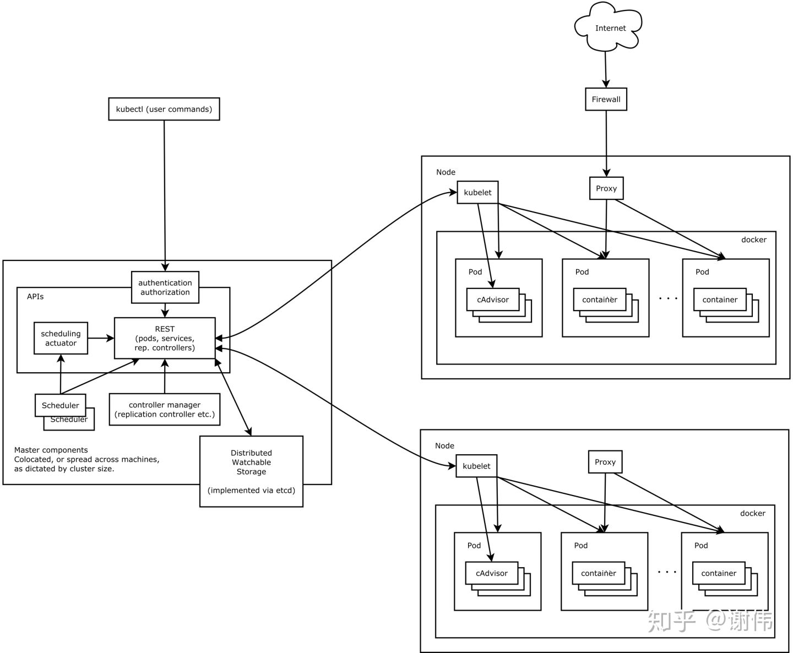

Kubernetes面试题总结
======

Kubernetes 角色是“操作系统”

Kubernetes底层操作的具体资源是**容器**。
**容器的本质是进程，相当于在操作系统上运行的实例。**

> 容器是一等公民。

Kubernetes是一个跨主机集群的开源容器调度平台，可以自动化的应用容器的部署、扩展和操作，提供以容器为中心的基础架构。

操作系统会包含哪些知识？

* 计算：资源管理
* 存储：外部的、内部的存储
* 网络：应用之间互联
* 扩展：如何安装各种各样的软件
* 配置：配置文件
* 权限：对用户操作资源进行权限认证

整体上来说，k8s 包含两个部分：Master 节点， Node 节点。各节点完成不同的任务。

Master 节点包含4个部分：
* APIServer: 内部的 web 服务，资源操作的入口
* Scheduler: 调度器：负责资源的调度，比如把部署的应用部署在哪个节点上
* Controller manager: 负责集群的状态，比如故障诊断、自动扩展等
* etcd 保存集群的整个信息

Node 节点主要包含：
* kubelet: 节点代理，维护容器的生命周期（整个操作过程中，我们都不太会显式的操作 kubelet)
* kube_proxy: 转发代理，负责服务的发现和负载均衡
* docker: 容器

### POD
POD 表示容器组（包含一个或者多个容器），一般把相关的容器定义在一个 POD 内，这样的组合关系，使其共同服务于集群。

POD 是 k8s 调度的最基本的单位。

### 控制器
ReplicaSet (副本)
Deployment：适合无状态的服务部署
StatefullSet：适合有状态的服务部署
DaemonSet：一次部署，所有的node节点都会部署
Job：一次性的执行任务
Cronjob：周期性的执行任务

