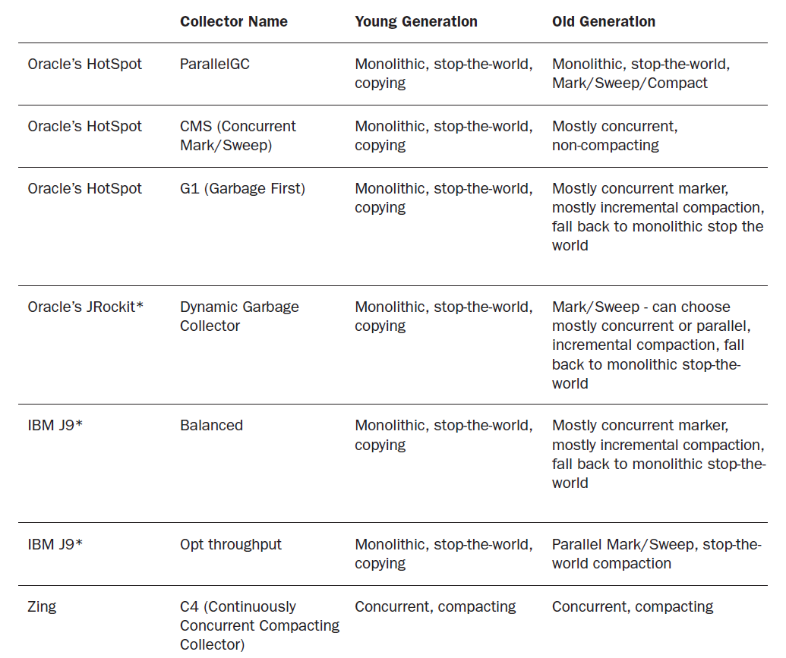

初探GC算法 | 深入探究JVM
===============================
> sczyh30,Eric Zhao，2015-07-01

**GC算法**的思想主要有三种：
* Mark-Sweep
* Mark-Compact
* Copying

另外，当前JVM的GC一般都是**分代收集，几种垃圾回收算法进行组合**。


## 1.分代收集
根据分代收集的模型，一般将*内存区域*分为**新生代(Young Generation)**和**老年代(Old Generation)**。

**新生代**对应那些**新产生的，存活时间较短的对象**。
如果一个对象在新生代内经历了一定次数(默认15)的收集后，它就会晋升至老年代(*大对象*也可以直接进入老年代，可以调参数)。
一般会把新生代划分为**Eden区**和**Survivor区**，在HotSpot JVM中*E:2S=8:2*。
后面会说到，新生代一般使用*基于复制的GC算法*。新生代GC对应*Minor GC*。

**老年代**对应那些**存活时间较长，容量较大的对象**。老年代GC对应*Full/Major GC*，此时需要*STW(stop-the-world)*。

JDK1.8之前还存在*永久代(PermGen)*，它用于**存放类的元数据和常量**，这里偶尔也会发生GC(回收`无用的类`和常量等)。
由于`永久代经常会OOM`，JDK1.8移除了永久代，用**Metaspace**代替PermGen。
具体可以看我之前总结的[探秘Metaspace | 深入探究JVM](https://www.sczyh30.com/posts/Java/jvm-metaspace/)。


## 2.基于*标记-清理*的GC
基于**标记-清理(Mark-Sweep)**的GC是比较基础的一种实现，它的**思想**比较简单，
首先**根据*可达性分析*对*不可达的对象*进行标记，标记完成后统一清理这些对象**。它的`缺点`有两个：
* 标记和清理的效率都不算高
* 会产生`大量的内存碎片`，如果这时候有*大对象*需要连续的内存空间进行分配，很可能会因为没有足够的连续内存空间而又触发一次GC

注解
```
处理对象：不可达的对象
内存空间：一块内存
时间复杂度：第一遍标记，第二遍清理
```

基于Mark-Sweep的GC多用于**老年代**。


## 3.基于*标记-压缩*的GC
基于**标记-压缩(Mark-Compact)**的GC可以`解决内存碎片的问题`。它的**思想**是，
**在标记好*待回收对象*后，将*存活的对象*移至一端(reallocate)，然后对剩余的部分进行回收**。
这个过程需要进行**remapping**，即**修复线程与对象之间的引用映射关系**。

注解
```
处理对象：存活的对象
内存空间：一块内存
时间复杂度：第一遍标记，第二遍移动存活的对象并remapping
```

基于Mark-Compact的GC多用于**老年代**。


## 4.基于*复制*的GC
基于**复制(Copy)**的GC比较`高效`，它的**思路**是，**将内存容量划分为相同的两份，每次只用一块。
当这一块内存用完了，就把还*存活的对象*移到另一块内存，然后对这一块内存(整个半区)进行清理操作。**
这样**内存分配**时也就`不用考虑内存碎片`了，**只需要移动指针，按顺序分配即可**(实现简单)。
但是这种算法是`拿空间换时间`，而且一下子就是50%的内存空间，一般受不了。并且这种算法需要`频繁GC`。
而*新生代的对象*一般是**存活时间较短的对象，GC频率较高，占内存较少**，因此**新生代**一般都采用基于复制的GC。

注解
```
处理对象：存活的对象
内存空间：两块大小相同的内存
时间复杂度：第一遍移动存活的对象
```

HotSpot JVM将**新生代**划分为**一个Eden区和两个Survivor区**，默认比例为8:2，其中**对象可使用1E+1S，留出空闲的1S**。
每次进行GC的时候收集器就会**将*存活对象*移至那个空闲S区，然后将其余的部分进行回收**，这样默认`空间利用率可达90%`。
当然也有很多时候`一个S区无法容纳所有的存活对象`，那么某些对象就需要通过*分配担保机制(Handle Promotion)* 直接进入**老年代**。


## 5.当前商用实现
这是现有的商用GC对应的算法：




## 6.参考资料
* 《深入理解Java虚拟机：JVM高级特性与最佳实践》，周志明 著
* Garbage Collection Understanding Java, Azul


[原文](https://www.sczyh30.com/posts/Java/jvm-gc-method-types/)

