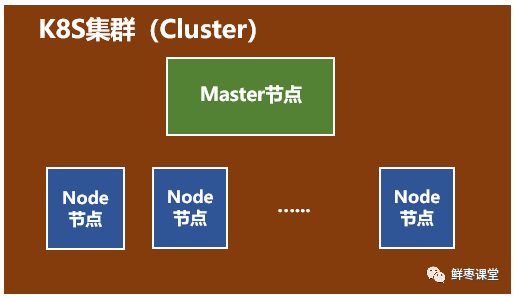

10分钟看懂Docker和K8s
================
> 鲜枣课堂，2018-12-25

上文：[10分钟看懂Docker](../docker/1.10分钟看懂Docker和K8s.md)

好了，说完了Docker，我们再把目光转向K8s。

就在`Docker容器技术`被炒得热火朝天之时，大家发现，`【问题】想要将Docker应用于具体的业务实现，是存在困难的——编排、管理和调度等各个方面，都不容易`。于是，人们`迫切需要一套管理系统，对Docker及容器进行更高级更灵活的管理`。

就在这个时候，K8s出现了。

**K8s**，就是**基于`容器`的集群管理平台**，它的全称是**Kubernetes**。

Kubernetes这个单词来自于希腊语，含义是**舵手**或**领航员**。K8s是它的缩写，用“8”字替代了“ubernete”这8个字符。

和Docker不同，K8s的创造者，是众人皆知的行业巨头——**Google**。

然而，K8s并不是一件全新的发明。它的前身，是Google自己捣鼓了十多年的**Borg系统**。([Large-scale cluster management at Google with Borg](https://research.google.com/pubs/archive/43438.pdf))

**K8s**是**2014年6月**由Google公司正式公布出来并宣布开源的。

同年7月，微软、Red Hat、IBM、Docker、CoreOS、Mesosphere和Saltstack等公司，相继加入K8s。

之后的一年内，VMware、HP、Intel等公司，也陆续加入。

**2015年7月**，Google正式加入OpenStack基金会。与此同时，**Kubernetes v1.0**正式发布。

目前，Kubernetes的版本已经发展到`v1.13`。(最新版本为`v1.14`)

K8s的架构，略微有一点复杂，我们简单来看一下。

一个K8s系统，通常称为一个**K8s集群（Cluster）**。

这个集群主要包括两个部分：
* **一个Master节点（主节点）**
* **一群Node节点（计算节点）**

一看就明白：**`Master节点`主要还是`负责管理和控制`。`Node节点`是`工作负载节点`，里面是具体的`容器`。**

深入来看这两种节点。

首先是**Master节点**。

Master节点包括`API Server、Scheduler、Controller manager、etcd`。
* **API Server是`整个系统的对外接口`**，供客户端和其它组件调用，相当于“营业厅”。
* **Scheduler负责对集群内部的`资源`进行`调度`**，相当于“调度室”。
* **Controller manager负责`管理控制器`**，相当于“大总管”。

然后是**Node节点**。

Node节点包括`Docker、kubelet、kube-proxy`、Fluentd、kube-dns（可选），还有就是**Pod**。

**Pod是Kubernetes最基本的操作单元**。`一个Pod`代表着集群中运行的`一个进程`，它`内部封装了一个或多个紧密相关的容器`。除了Pod之外，K8s还有一个**Service**的概念，`一个Service`可以看作`一组提供相同服务的Pod的对外访问接口`。这段不太好理解，跳过吧。

* **Docker**，**创建容器**的。
* **kubelet**，主要负责**监视指派到它所在Node上的Pod**，包括Pod创建、修改、监控、删除等。
* **kube-proxy**，主要负责**为Pod对象提供代理**。
* Fluentd，主要负责日志收集、存储与查询。

是不是有点懵？唉，三言两语真的很难讲清楚，继续跳过吧。

Docker和K8s都介绍完了，然而文章并没有结束。

-------------------

接下来的部分，是**写给核心网工程师甚至所有通信工程师看的**。

从几十年前的1G，到现在的4G，再到将来的5G，移动通信发生了翻天覆地的变化，核心网亦是如此。

但是，如果你仔细洞察这些变化，会发现，所谓的**核心网**，其实**本质上**并没有发生改变，无非**就是很多的服务器**而已。不同的核心网网元，就是不同的服务器，不同的计算节点。

变化的，是这些“服务器”的形态和接口：形态，从机柜单板，变成机柜刀片，从机柜刀片，变成X86通用刀片服务器；接口，从中继线缆，变成网线，从网线，变成光纤。

就算变来变去，还是服务器，是计算节点，是CPU。

既然是服务器，那么就势必会和IT云计算一样，走上虚拟化的道路。毕竟，虚拟化有太多的优势，例如前文所说的低成本、高利用率、充分灵活、动态调度，等等。

前几年，大家以为虚拟机是核心网的终极形态。目前看来，更有可能是**容器化**。这几年经常说的NFV（网元功能虚拟化），也有可能改口为NFC（网元功能容器化）。

以VoLTE为例，如果按以前2G/3G的方式，那需要大量的专用设备，分别充当EPC和IMS的不同网元。

而采用容器之后，很可能只需要一台服务器，创建十几个容器，用不同的容器，来分别运行不同网元的服务程序。

这些**容器**，`随时`可以`创建`，也可以`随时销毁`。还能够在不停机的情况下，`随意变大，随意变小，随意变强，随意变弱`，`在性能和功耗之间动态平衡`。

简直完美！

5G时代，核心网采用**微服务架构**，也是**和容器完美搭配**——单体式架构（Monolithic）变成微服务架构（Microservices），相当于**一个全能型变成N个专能型**。**每个专能型，分配给一个`隔离的容器`**，赋予了`最大程度的灵活`。

按照这样的发展趋势，在移动通信系统中，除了天线，剩下的部分都有可能虚拟化。核心网是第一个，但不是最后一个。虚拟化之后的核心网，与其说属于通信，实际上更应该归为IT。`核心网的功能，只是容器中普通一个软件功能而已。`

至于说在座的各位核心网工程师，恭喜你们，马上就要成功转型啦！

[原文](https://zhuanlan.zhihu.com/p/53260098)

