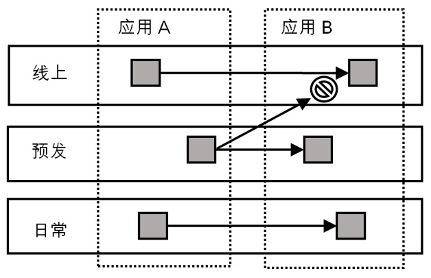
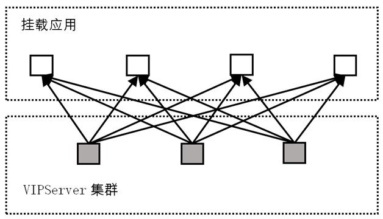
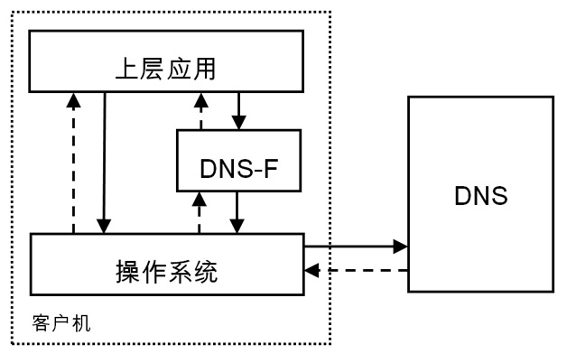
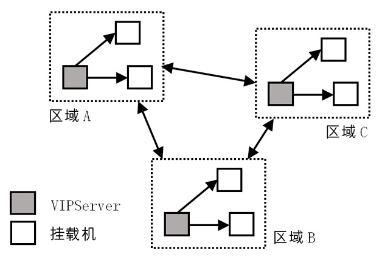
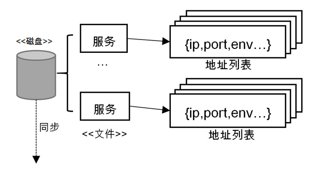
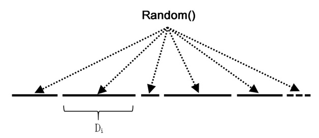

VIPServer：阿里智能地址映射及环境管理系统详解
===========================
> 周遥，阿里技术专家，花名玄胤。六年大型分布式与中间件系统经验，三项国家专利，参加过多次“双十一”。2013年从零开始带出VIPServer，目前已成为集团**环境管理与路由**的标准。
> 王建伟，阿里巴巴工程师，花名正己。目前在阿里中间件技术部软负载小组负责VIPServer系统。
> 
> 2016年10月26日

**VIPServer**是阿里内部使用最广的 **`服务地址`映射及`环境`管理系统**。
本文主要阐述`VIPServer的项目背景、设计目的、架构演变及内部详细实现`。

(VIPServer是阿里中间件团队开发的一个**中间层负载均衡(mid-tier load balancing)**产品，VIPServer是基于`P2P模式`，是一个`七层负载均衡产品`。
VIPServer提供**动态域名解析和负载均衡服务**，支持很多诸如`多业务单元同单元优先、同机房优先、同区域优先`等一系列**流量智能调度和容灾策略**，
支持`多种健康检测协议`，支持精细的权重控制，提供**多级容灾体系**、具有`对称调用、健康阈值保护`等保护功能的解决方案。
是阿里**负载均衡体系、域名服务体系**的一个非常重要的组成部分。)

> 详细架构设计信息参见paper：VIPServer: A System for **Dynamic Address Mapping and Environment Management**


## 背景
**寻址**，`意味着什么？`当系统比较简单时，模块都集中在同一台服务器，调用都在内部——大家同住一个屋檐下，直接调用其接口便行。
但`在大型软件架构中`，`分布式`占据了极其重要位置，`不同的系统被分配到了不同的服务器上`。
首先`相互发现`便成了`问题`，因此业界诞生了许多**配置服务器**，类似的有阿里的**ConfigServer**或外界的**ZooKeeper**（使用其`配置同步功能`）。

但`生产环境的地址映射`并不是一个简单的反向代理，还需要考虑许多`环境及路由策略问题`。
例如，阿里内部将开发环境分为了日常、预发与线上三套环境，`不同环境之间的服务需要做到隔离`（如图1所示），即日常的终端不能拿到其它环境（如预发）的`服务地址`。
与此同时，`线上的服务始终是一个动态的服务`，可能因为各种原因进行调整，如`压测需要引流，灰度发布需要流程隔离`等。

我们**设计VIPServer**，**初衷**仅仅是为了**替换硬件负载均衡设备**，如F5（基于硬件的网络负载均衡设备，早期售价高达上千美元）或者阿里内部的LVS，`主要原因`如下：
1. 无论LVS还是F5都是`代理的形式`，`必然存在网络瓶颈，对网络RT也有影响（需要中途转发一次）`。
2. LVS、F5都需要`实体机器支撑，不利于快速部署`，需要预算、采购、安装、调试等诸多流程。
3. 它们都需要`大量的资金`来购买设备（虽然LVS相比F5成本已经小了很多）。
4. LVS、F5的`服务面仅在当前网络，在需要跨地域、跨区域服务挂载时会变得非常困难`。
5. LVS、F5是`分散在各个应用中`的，日常的管理也是由应用自己的系统工程维护的，`不利于统一协调、管理`。



开始时，用户并不认可VIPServer，因为当时LVS的管理流程与功能已经相当完备。`仅出于成本或者减少网络延迟考虑并不能支撑一次底层迁移`。
不过，随着业务量发展，集团内的`环境变得越来越复杂`，`单元化、隔离环境、准备环境`层出不穷，上述`LVS弊端`便慢慢显现。
后面，我们为VIPServer加入了更多`环境管理`相关功能并逐渐`改造架构——去掉所有（二方及三方）系统依赖与服务下沉成为基础中的基础产品`，这使得VIPServer如今成为了`环境认识/识别/感知、变更与维护`的权威。


## 架构
### 初始架构
最早，我们的**首要目的是去除LVS及F5这类网关类型的反向代理结点，使内部应用调用都是以(IP)直连的形式进行。**在这种构想下，终端向一个**服务**发起请求有以下步骤：
1. 终端依赖**VIPServer客户端**；
2. 向VIPServer客户端提供`服务标识`；
3. `客户端向服务发起查询`并定期更新此标识对应的数据以保证`服务地址的状态`正确；
4. 客户端`根据服务标识策略性地返回一个健康的地址`给终端，这里`健康与否由VIPServer服务端检测`；
5. 终端根据地址直接发起服务调用，完成整个请求。

上述过程涉及四个模块：**客户端**、**服务地址管理**（添加、删除、存储）、**服务状态检测**以及**服务地址返回/路由策略**。

#### 客户端
**客户端**本不知道服务端地址，因此向服务端的请求本身也是个`服务发现过程`，存在“先有蛋还是先有鸡”的问题。
为了解决这个`循环依赖`，我们引入了一个称为“**地址服务器**”的模块，其本质就是**将一个静态包含`VIPServer服务端IP地址列表`的文件放至于一个Web服务上**（我们使用的是Nginx），**再申请一个`DNS域名`，用于`发现此Web服务器地址`**，这样客户端便能得到`VIPServer服务端的地址列表`。我们不能简单使用DNS，因此`VIPServer本身也需要区分各种环境`，在Web服务上，我们会根据请求客户端的IP地址列表(IP网段)来返回对应环境的服务端地址列表。

#### 服务端
**服务端**是**管理服务地址与状态**的地方。首先，VIPServer本身也是集群应用，因此`数据如何在集群内同步并保持一致性`便是个很大的问题。
我们选择了内部的**Diamond**（阿里的`持久配置中心`，采用RESTful接口，支持`订阅、通知与按标识聚合数据`，在集团内部已广泛使用）作为VIPServer的“NOSQL数据库”，原因是：

1. `地址数据并不是经常变动`且`查询条件简单`，适合NOSQL数据库。
2. Diamond能够`向集群服务进行同步数据`并`提供“最终一致性”保证`。
3. `服务与服务地址是个聚合与被聚合关系`，Diamond本身提供这个功能，免去关联查询的操作。
4. Diamond本身支持非结构化数据。

相比之下，`服务地址的状态则会变化相当频繁`，比如`系统发布、机器故障、A/B测试`等等都会造成`服务状态改变`，而且这种`数据`是具有`时效性`的，因此我们`没有存储与同步地址状态数据`，而是让`服务端进行实时检测`。在1.0架构中，状态数据如果通过Diamond进行同步则会给其造成很大的压力，外加上前期我们`挂载的地址数量不多`，因此我们选择`让每台服务器都进行全量检测`，如图2所示。




### 演进架构
初始架构虽然确实能实现最基本的需求，但随着`挂载应用的增加`，`全量检测便引出一个非常重要的难题：无法横向扩容来提高服务机器挂载数量`。
另外我们在推进`客户端接入`时，也发现`用户不愿意以通过修改代码的方式来接入`，因为以前**LVS**通过提供`一个VIP`（`Virtual IP Address`，类似`网关IP`，终端通过调用这个IP地址，LVS就会把流量均匀地分配到后端挂载的机器上），`使用方只要像调用普通机器一样调用LVS`就可以，至于`流量的转发、目标机的故障情况都不用关心`。所以在中期，我们重点做了两件事：**分量检测与DNS-F客户端**研发。

#### 分量检测
如果`每台服务器都进行全量检测`，确实是一个简单易行的方式，在这种情况`服务器之间不需要同步状态数据`，当一台机器挂掉后也不需要进行迁移，因为`每台机器都是对等的`。
不过，随着`挂载机器的增多`(1万级上的机器挂载量)，如果`一台机器已经没有能力检测所有挂载机器`，那么所有其它服务器也会遇到同样的结果，而这样的性能瓶颈是不能通过扩充机器解决的。

我们通过`将挂载机器的检测任务进行切分`来解决这个问题。简单来说就是`将n个检测任务平分到m台机器上，每台机器负责n/m个任务`。还必须考虑到以下要素：
1. 分配的任务尽量平均分配。
2. `当一台机器宕机时，检测任务能平滑再分配到其它机器`。
3. `VIPServer服务器的扩缩容都能自动感知并重新进行检测任务分配`。
4. 在已有架构上进行最小变更。

我们通过`将标识列表按服务器数量取模`以散列至所有服务器上，同时每台服务器定期向Diamond指定标识（Diamond称为DataID）发送自己的IP地址与当前时间截，这个DataID被我们配置成聚合数据，也就是说`每台服务器发送的IP地址与时间截`都会被聚合成一个列表，**服务端**`通过这个列表中的时间截与当前时间的时间差`来`判断其它服务器是否存活`。然后`将存活的IP地址按自然顺序排序`便能得到自己`在列表中的位子`，假设为p。那么如果在`所有域名集合`Ω={D1，D2，D3，……，Dn} 中，若某域名D∈Ω对应的序列为i，即Di。`若 i mod m = p，则此域名因由本机负责检测`，若不是则由其它机器检测，这台机器不用关注。(变形的轮询算法)

代码1 分量检测算法逻辑
```
set m=VIPServer机器数量
set n=sizeof(所有标识集合Ω)
set list=sort(接收到的存活的机器列表)
set p=list.indexof(当前机器地址)

for i=0 till i>=n do
    if i mod m = p then
        checkDomain(Ω.get(i));
    else
        // do nothing
    end
end
```

由于`每台服务器定期更新自己的时间截`，那么当有`新机器加入`时`列表就会更新`；而有`机器宕机`时，`时间差就会大于预设值`。通过以上方法，我们便实现了`对检测域名的动态分量检测`，如果检测达到瓶颈，我们只需要简单的加机器就能解决问题。(线性扩展)

最后，`每台机器的检测结果`我们仍`使用Diamond来同步到其它机器`。

#### DNS-F
前面提过`用户希望以最小的成本从原有的LVS上迁移至VIPServer(推广心声)`，而`LVS`采用的是`VIP`方式。我们还发现VIP并不是直接使用，而是`通过传统的DNS进行映射`的。
因此我们考虑这个`DNS是不是能返回我们提供的地址`，这样一来，`DNS解析过程`就相当于`VIPServer客户端的地址请求过程`。
因此我们设计了**DNS-F**，即**DNS Filter来拦截用户的DNS请求**，`当发现请求的域名存在于VIPServer系统中时，便优先返回其中的地址数据`。这个拦截过程是通过向“`/etc/resolv.conf`”文件注入一个本地DNS地址`127.0.0.1`并设置其为首选DNS，如代码2所示。

代码2 DNS配置文件内容示例
```
search tbsite.net aliyun.com
options attempts:1 timeout:1
nameserver 127.0.0.1
nameserver 10.195.29.17
nameserver 10.195.29.33
```

这样设计有诸多**巧妙之处**：首先如果`VIPServer出现故障`，我们可以`优雅地容灾到原有的LVS上`，因为`DNS解析`在`超时`设置的timeout还没有收到返回消息时就`会自动重试下一个DNS服务器`，也就是说`会走到原来的逻辑`；其实`用户不需要改变原来的使用逻辑(适配)`，我们`透明地将VIP替换成了真实的IP地址`。
不过这样的设计也存在`一些问题`：首先是用户`需要运行一个单独的进程提供本地DNS服务`（即我们的DNS-F程序）；其次`对“/etc/resolv.conf”会影响到所有进程`，这个问题后期我们会考虑`将DNS-F做成Linux内核模块，只对特定的进程与域名起作用`。
事实证明**DNS-F是个极成功的构想**，现在其安装量为VIPServer第二大客户端。



类似的原理，Google的Kubernetes至少半年后才出现。


### 高阶架构
VIPServer发展到后期，我们已经面临`10万级上的机器挂载量`，并且`分布在世界各个机房`。之前的`设计构架并没有考虑到跨地域跨国家`这种问题，`检测`虽然分布但都是`集中式`的。
`一些检测由于距离太远而出现了检查不准`的问题，另一方面，`断网演练的时候如果断的是VIPServer所处的机房，那么所有机房的服务健康检测都会失败`，即使此次断网并未影响到它们。

#### 区域化检测
我们引入了**区域化**的概念，即**每个区域都有一个VIPServer集群专门负责检测**，同时也会`尽力检测其它区域的部分域名`，之所以还需要`检测其它区域`的是因为某些特定场景下`存在跨区域调用`，同时还要求`客户端优先连接本区域的VIPServer集群`，这样一来，`客户端得到的总是最准确检测数据，因为访问与检测链路是相同`，如图4所示。



在**区域模型**下，`挂载机的状态在每个区域是独立的`，也就是说如果存在A、B、C三个区域，其中A与B断网，那么A对B中挂载机的检测结果为故障，B由于并未与C断网，因此结果需要为正常。这样情况下，`检测结果的同步也需要区域化`，因此原来使用Diamond来进行全局同步便不再适合了。
由于`检测状态只需要在区域内部同步`，鉴于其`量小、延迟小`的特点，我们使用了“**Gossip一致性协议**”（**Gossip的同步原理**就像“`八卦新闻`”，每个人都将自己获得的八卦传递给周围其它人以最终获得同步，优点是简单易懂，`缺点`则是`收敛时间不能控制`，当然目前已经存在诸多优化变种）来进行同步。
**Gossip是一种`轻量`及`最终一致性`的同步协议**，最大的优点在于算法实现简单，`每个结点只需要周期性地向其它结点广播自己的数据`就可以了，顺序以时间截为准，虽然不是很精准但我们对顺序的要求并不高。
试想一下，如果`一台机器收到了错误的状态`，由于`检测是一直在进行`，同时检测机也在不停地向外发送正确状态，因此即便是某次状态错了，接下来也会逐渐纠正过来。(机器挂载量规模？)

#### 去依赖
随着`环境与区域的增加，VIPServer的集群部署变得越来越频繁`，很多`区域`都是`独立`或者`隔离`的，并没有我们需要的依赖，因此如果我们希望VIPServer向最基础的“**环境管理及路由**”方向发展，我们不能依赖应用，因为我们是`环境搭建第一要素`。
去Diamond是我们首先要做的，因为不少环境，如“私有云”，并没有它。之前我们已经将检测结果同步从其中分离出来并使用Gossip来解决，这里我们还需要`将挂载机器的配置信息也独立出来`。

这里我们使用的是“**Raft一致性协议**”（`Raft的诞生`就是`为了解决Paxos过于复杂且难以实现的难题`，这里有个很好的说明动画：http://thesecretlivesofdata.com/raft/）并`针对VIPServer的场景做了裁剪/减法`。
我们之所以`不使用Gossip`是因为`其无法保证顺序操作`，由于`机器的挂载与下线都是一次性的，没有机会修正`。在Raft协议中，所有操作必须在Master上进行，变更均由Master同步至其它服务器，这样就能保证顺序，然后我们`将同步的数据都持久化到磁盘上`，这样做的`好处`在于`每台机器都有全量的数据，具有很高的容灾能力`。

#### 下沉
后期由于`环境的大量增加，造成调用关系越来越复杂`：`“同机房”、“同网段”、“同城”、“冷备隔离”、“小流量隔离”`等等层出不穷。鉴于此我们提出**VIPServer下沉**，`承担更多类似SDN的责任`。
为了支持更多`网络层的路由`，我们开放了`环境标识导入接口，以标识每个挂载的机器的各种属性`——如所在`机房、城市、网络、使用类型`等等——以确定其在网络的中角色与位置。
如此一来，用户想要的`任何路由规则`，只要对应的`标识`是存在的，我们都可以计算出来。例如我们想`“同机房”调用`，每次在返回`服务地址列表`时只需要将调用者的机房信息与服务提供方的机房信息进行简单的对比即可。
如此一来，`整个网络的调用链`就变得相当`灵活`。例如“冷备环境”，平时我只需要返回标签为正常环境的机器列表，只有当正常环境的健康机器比下降到一定程度（如20%）时，才返回“冷备环境”的机器列表；又例如做“`灰度发布`”，只需要简单地调整权重，便可以只把少量流量分配到新版本的服务器上。


### 数据结构&存储
VIPServer维护的是**服务地址映射关系**，因此`基础数据`就是**每个地址的信息**，这里包括：`IP、端口，权重`以及若干`机器环境相关信息`（如机房名、所在城市等）。
我们**将每个地址的信息以非结构化数据的方式存储**，`原因是服务的附加属性是复杂多变的`：随着`环境`的增加，`地址配置、标签`会越来越多。如“初始架构”一节所述，前期我们使用Diamond的聚合数据功能来存储`地址与服务信息`，后期我们使用直接存磁盘的方式，因此每个聚合维度便变成了一个文件，即**一个文件就是一个服务，里面的每一行就是一个地址信息**。

这样设计有诸多**好处**，首先**写入时不会影响到其它`服务目录`**；然后因为**以`文件`的形式存在**，`备份`是一件相当容易的事，只需要复制整个目录即可；最后`排查问题`也方便，如果想检视服务数据，只需要简单地将文件打印出来即可。



`每台服务器都存全量数据，它们之间的数据同步通过Raft进行`，构成完整的存储体系。这样做的**好处**在于`数据不依赖于任何一台服务器，只要有一台数据还在，整个VIPServer体系的数据就在`，因此具有很高的**容灾**特性。


### 实现细节
#### 权重计算
权重计算经历两个阶段的发展，`整数阶段和浮点数阶段`。在整数阶段，标识中的`服务地址权重`是整型的，其计算方式是在列表中`按权重展开`，这样一来权重大的便有较多的机会被选中，例如有两个地址为“A1、A2”，如果A1的权重为1，A2的权重为2，展开后的列表便为“A1、A2、A2”，然后最终再随机选择一个地址，这样A2被选中的概率就高些，当然这是个很简单的实现。
到了后期，其`不灵活`的问题就越来越明显了，例如如果我想把一个地址的流量切换成总流量的0.1%，按原来的方式，得将其它地址的权重都设置成1000才行，先不说要如何才能更改这么多地址的权重，`关键的问题`在于展开的地址扩大了多少倍，如果有10个地址，那么调整后展开的大小即为：9*1000+1＝9001，扩大了近100倍，如果列表中有100个地址，那显然内存会溢出。所以后期我们设计了“`浮点权重`”，其计算算法为：

1. 对所有地址（ip）的权重求和，即：

2. 那么每个地址的权重就把sum划分成了一个的区间Di。
3. 在[0,sum]间随机取浮点值，f = random(0, sum)。
4. 查找满足条件的地址m，使得m ∈ Di即可。

这种算法最大的优点在于如果我们想把一个地址的流量切为原来的10%，只需要将其权重变成10%即可。



#### 容灾手段
**路由信息**在`调用链`中是至关重要的角色，如果获取不到则会直接导致调用失败，**容灾工作首要的目标**就是**保证用户在最差的情况下都有路由信息可用**。

为此，我们在`服务端与客户端`都放置了`容灾逻辑`。
`服务端`方面，有以下措施：
1. `每台机器都具有全量数据`，当`一台机器宕机`时`客户端可以随时切换到另一台`。
2. 每台服务器都需要定期向其它服务器发送心跳，以确保其仍然正常。
3. 当其中一台`心跳失效`时，按“清单1分量检测算法逻辑”对检测任务进行重新分配。
4. 增设`各类阈值`进行保护，如正常服务器比例下降到一定程度时`停止健康检测`（因为此时每台服务器分担的检测任务比正常情况下大太多），又如当标识对应的机器列表中正常机器小于配置的比例（如0.3）时便返回`所有服务地址`。
5. 使用`异步Servlet`将所有`API接口异步化`并配置`隔离请求队列`，这样当一个`API慢`时不会影响到其它。
6. Raft协议会在Master失去响应时重新进行`选举`，保证可以随时进行机器挂载及其它操作。(自恢复，集群高可用性)
7. 增设`各类开关`，可以随时`关闭非核心功能`，进行**降级保护**（如机器列表同步）。

`客户端`方面，则有以下措施：
1. `每次更新地址后都需要向磁盘写入缓存`，在`不能连接`或者`更新`时使用。(本地缓存文件)
2. 客户端的`更新线程`与API处理线程`隔离`，做到`不能`因为任何情况而`阻塞业务线程`。
3. 客户端`每次更新以轮询的方式向服务端请求更新数据(拉模式)`，这样做不但有利于`服务端的负载平衡`，还保证`客户端不会受部分服务端宕机影响`。
4. 如果客户端收到`空数据`，则`拒绝更新`，这个我们称为“`推空保护`”。


### 未来工作
由于VIPServer毕竟不同于传统`网关`类似的`负载均衡设备`，因此我们认为其重点不在单个应用的负载均衡。
未来我们将投入更多精力在**网络调用治理**上，形成**以VIPServer为基础的SDN平台**。
现代大型企业应用中，`整套生产环境是非常复杂的`，它包含了`众多细分环境与调用关系`，所以在`部署一个新环境`时，`首要头痛的问题`便是`环境的搭建`。
如果整个环境都运行在以SDN为基础的网络上，那么`最终的形态`将是`所有的环境都浮在云端`，不与任何物理设备挂钩，可以随意将一个“机房”移动到另一个区域，`所有的环境变更操作都可以瞬间执行完成`，这对产品运维的帮助是巨大的，也是`云上环境`最需要的。


### 参考资料
1. In Search of an Understandable Consensus Algorithm https://ramcloud.atlassian.net/wiki/download/attachments/6586375/raft.pdf
2. Linux Virtual Server https://github.com/alibaba/LVS
3. Paxos Made Simple http://research.microsoft.com/en-us/um/people/lamport/pubs/paxos-simple.pdf
4. Gossip Algorithm http://www.inf.u-szeged.hu/~jelasity/cikkek/gossip11.pdf


[原文](https://blog.csdn.net/heyc861221/article/details/80126013)

