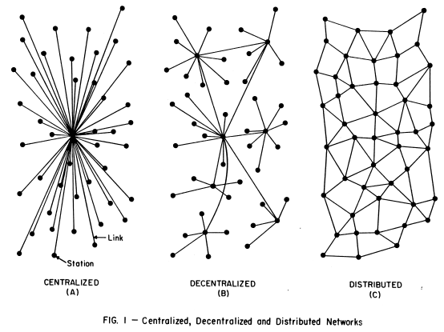
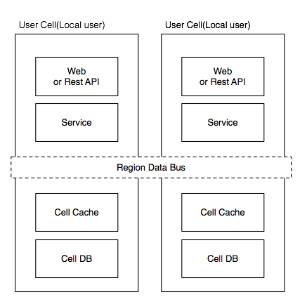

# 单元化与分布式架构的切分问题
Tim Yang-杨卫华，2013-12-16

**单元化**是**将一个`系统的架构`按`某种数据特征维度`进行`垂直`的`划分`**(架构层面的垂直拆分)。
比如网站有100万用户，如按照用户维度进行划分，则可以分成10个单元，每个单元存储10万用户资料。
单元化的一些收益如下：
* 由于`每个单元数据规模可控`，相关维度内的所有资料可放在`一个数据库`中(如上例中的用户资料)，
不需要复杂的Sharding分库分表逻辑，存储及缓存访问得到极大的简化。
同时开发也变得简单，工程师不需要有丰富的“大规模高并发系统”开发经验。
* 同时由于`计算离存储更近`，也可以`让数据离用户更近`。
比如用户`数据存储在地理上靠近用户的位置`，数据有了更好的局部性(locality)，因此也会获得更好的访问性能。
`部署`上相关单元的前端、缓存、数据库、数据挖掘等节点可`在同一个机柜`，架构上让大数据的访问变得低廉，也在部分程度上让大数据更为快速及敏捷。
* 可以自然支持`不同用户分片支持不同的功能特性`，天然的`A/B testing试验场`。

`分布式`是**将一个`系统的数据`分布到`多个单元`，以便使`系统`能够`scale out`(横向扩展)，具有更好的`可扩展性`**。
当今大型网站基本上是分布式设计的。分布式系统除了机房内的，
考虑到`系统扩展性、用户访问的便捷性、机房规模的物理限制、异地容灾`（比如2013年4月及8月的微信机房故障）等需要，
大型系统也会考虑地理分布在多个机房。

> 自己的理解：**单元化架构数据纵向划分，分布式架构功能横向划分**。

数据库垂直拆分与水平拆分补充：
> 当我们使用`读写分离、缓存`后，数据库的压力还是很大的时候，这就需要使用到`数据库拆分`。
> **数据库拆分**，是指**通过`某种特定的条件`，按照`某个维度`，将我们存放在`同一个数据库`中的`数据分散`
> 存放到`多个数据库(主机)`上面以达到`分散单库(主机)负载`的效果**。
> 垂直拆分，专库专用，数据表`列`的拆分；水平拆分，数据表`行`的拆分。
> [数据库垂直拆分与水平拆分](http://blog.csdn.net/jerome_s/article/details/52492616)、
> [MySQL大表优化方案调研](https://github.com/tangr1/doc/wiki/MySQL大表优化方案调研)

但是在社交网络中，由于`数据的网状访问`，单元化会碰到较难选择合适的`单元化切分维度的问题`。
比如按用户或按内容进行单元化不能很好的适应数据访问局部性的问题，同时地理分布式也面临相似问题，
由于社交网络中用户的页面需要访问的，`所有地理分布的机房都同步需要全量数据`，导致`部署和维护成本较高`。

假定系统中存在一个`跨单元的数据访问总线`，并且总线的访问满足：
1. `局部性`：单元内的访问，大部分的数据可以在单元内命中。
2. `封装性`：单元内的应用程序使用统一的方法访问数据，不需要关注数据的具体位置。

那么这个`数据总线应该如何设计`？`放在哪个层级比较合适`？
比如Service Layer, Cache or Storage (e.g. Google Spanner, 蚂蚁金服的OceanBase)?

[原文](https://timyang.net/architecture/cell-distributed-system/)

