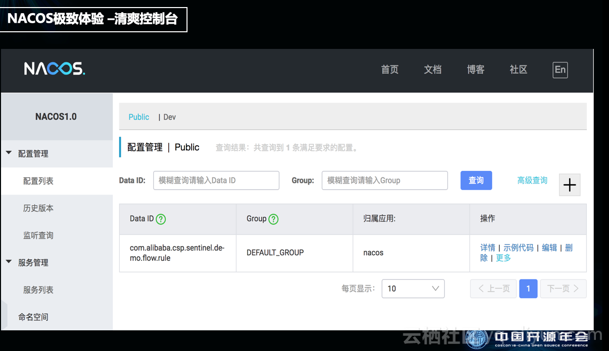
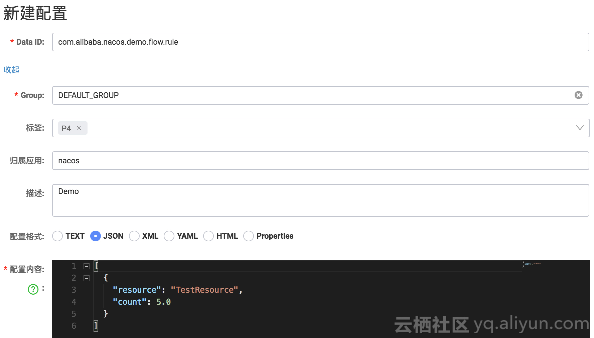
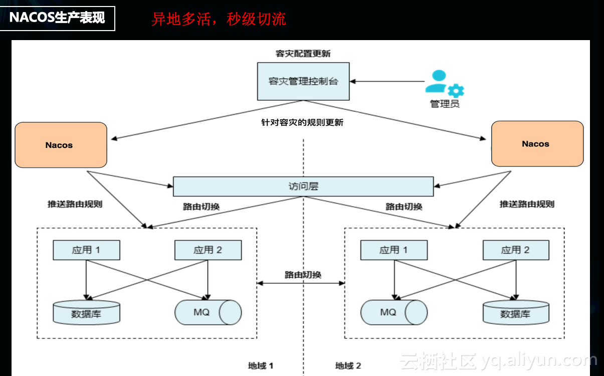

从内部自用到对外服务，配置管理的演进和设计优化实践
=========================
> 超哥，2018-12-07

本文整理自阿里巴巴中间件技术专家彦林在中国开源年会上的分享，通过此文，您将了解到：

* 微服务给配置管理所带来的变化
* 配置管理演进过程中的设计思考
* 配置管理开源后的新探索
* 配置中心控制台设计实践

> “`为什么`相对于传统的软件开发模式，`微服务要强调配置中心`，`是出于什么样的诉求`需要我们专门设计一个配置中心？
> 理清了这些问题，我们就知道`如何去设计配置中心`，并获得一个`比较好的用户体验`，和一个`生产可用的结果`。

## 微服务给配置管理所带来的变化
在`单机`的情况下，我们`把配置放在代码里`边，发布的时候直接重启，非常`轻量`，`但在微服务的情况下，出现了两个新的场景`：

第一个是出现了`多台设备`，之前改一台设备就OK了，但是现在`需要改多个设备`，`业务量大`的时候，可能要改几十甚至几百台设备。
显然，通过手动来完成这些设备的配置是不切实际的。所以说**微服务**之后，产生了一个`新的难题，设备的配置变更管理难了`。
(`跨应用的基础服务的公共配置`)

第二个是微服务之后，出现了`路由规则`。并且，服务A找服务B的过程中，`路由规则、重试策略和熔断机制`，都是`动态变化`的。
例如，我们`发现下游依赖的一个服务不可用`，需要把它`降级`，这样`对整个业务的资损影响才是最小的`。
通过更改一个`配置`，就可以`实时地推到业务的进程`里边，让它立马生效，进行降级。
这就是我们微服务架构下要做配置中心的另一大原因。(动态配置)

## 配置管理演进过程中的设计思考
`面对微服务架构下对配置中心的新诉求，我们该如何去满足呢？`

我们的**解法**就是`针对分散的管理模式`，**设计一个`集中`的管控平台**，即**配置中心**。当有配置变更的时候，就可以在配置中心上来实现。
**配置管理的策略**就是**集中管控和动态推送**，以解决`分散的问题`。
其中，**动态推送**是微服务里边`配置管理的核心`，改一个配置时，确保每台机器可以收到配置更新，并实时生效。

除此之外，我们还做了一个**发布管控**。就是在变更之前，找线上的一台机器，先把变更发布下去，如果没有问题再去全网推。
同时，对于已发布的配置变更可以`一键逆操作`，就是相当于给了一次吃后悔药的机会，因为很可能，
我们推错的时候，忘了更改前的参数，那么可以`通过一键逆操作来缩短恢复时间，在机制上降低了配置管理的风险`。

**随后，在我们做`配置中心的云化产品`的过程中，也就是从服务集团内部客户走向`服务外部企业用户`的时候，我们遇到了`新的挑战`。**

服务集团内部用户的时候，我们会搭`几套物理集群`。但是产品云化后，为每一个云计算的用户去搭一个环境，成本就太高了。
于是我们设计了一套集群去支撑云上的用户，及其`多个使用环境`，例如`日常测试环境、预发环境和生产环境`。

其次，为了进一步`降低用户的使用成本`，我们提供了一个**逻辑隔离的能力**。
这和K8s的体系是一样的，就是在整个**配置体系**下面，新增一个`命名空间`或是`租户`。
在启动的过程中动态传一些参数进去，然后`把所有的配置隔离在不同的命名空间之下`，这样大家就相互不影响了。
我们看到的都是一个key，但实际上是在前面`动态`的`添加`了一个`逻辑参数`，即**命名空间**。

此外，在某一个环境里边，如果某个用户或者一个环境里边的一个租户变更配置很频繁，或者是把权限搞错了，这个影响会是全局的。
之前，我们的一个专有云用户遇到了一个问题，就是`写了大量的配置变更数据，几百万条，最后把数据库写爆了`。
因此，为了`避免因为某个租户更改配置影响到全局`的事情发生，我们设计了**流量管控和容量管控**。
即一个用户默认最多创建100条或者200条数据，上限由管理员来设置。
进一步的，我们把这个管控封装成一个接口作为云产品的一个特性。

以上就是整个`配置中心设计的演进过程`，伴随着我们`对配置中心的理解和用户的需求而来`，
从**配置管理**到**集中管控**，到配置发布前的自动校验，到**发布管控**，再到**流量和容量管控**。

## 配置管理演进过程中的设计思考
当我们对配置中心进行开源（开源项目名称：Nacos）的时候，有了`新的思考`。

项目开源初期，在宣讲的时候我们会强调Nacos的性能，例如经受了双11的流量考验，支持每天上亿次的配置推送，
但在开源过程中和一些开发者沟通下来，大家其实并不会太考虑开源产品的性能，因为大部分开发者所处的企业，其`流量规模根本没有那么大`，
大家更关心的是`产品的易用性`，开发者用爽了，才会谈性能的问题、安全的问题和容量的问题。

所以，我们在之后的`产品设计策略`上做了些调整。就是`只要用户能看的到地方，就会用心去设计`，
等满足了`简单易用`，满足了中小企业对配置中心的需求后，再去强调Nacos的性能。

`简单易用`分为两个维度，一个是`各类基础设计`，包括`模型和接口`等，另一个是`控制台的使用体验设计`。

先看下我们在`接口设计方面的模型`。

这张图展示的是一个最简单的配置模型，一个配置文件里边填value。
按大家最正常的理解来说，一个DataId，一个Content（一个key和一个value就可以了），为什么还出现了`Namespace、Group`这些设置呢。
`原因`是，做了微服务之后，大家的`配置集中管控`了。`集中管控遇到的第一个问题`就是，当`多个应用去做拆分`的时候，会有一个`隔离的需求`。

比如一个应用A的开发，和一个应用B的开发，希望他们两个的`配置是相互隔离的`，通过各自的应用，能很快地实现相应的配置变更。
所以我们在一个key-value的基础上又加了一个Group，这个`Group`就是一个`逻辑分组`的概念，
一般我们推荐填写它的`应用名称`或者`模块名称`，便于大家`把不同应用的配置分开`，也方便后边进行`权限管控`。

那`Namespace是干嘛的呢？`如果是一家规模较小的企业，可能连测试环境也没有，这时候Namespace是没有任何意义的，我默认是你隐藏的，它是一个空串。
如果说你是一家中型的或者更大一点的公司，有`很多环境`，测试、预发和生产等多个环境，线上还有一些梯度环境，
这时候我们就可以通过一个`Namespace`，让你`连到不同的环境`上了，就是`进入不同的逻辑区域`。
**`Namespace`是用在`环境`上的，`Group`是`应用`**，DataId里边就是一个key-value。

这样一看，模型就很简单了。

第二个是在`通信协议`的选型上，有gRPC，HTTP和RSocket等，最终选择了`HTTP`。
因为我们认为配置管理是一个非常通用的需求，不仅Java需要，包括淘系的C语言、Note.JS都有同样的需求，前端的一些动态文案，需要动态去更改。
所以出于对多语言的兼容，我们选择了HTTP接口。

第三个是`SDK设计上的优化`，对Java而言，`用户关心的是体验`，例如Spring的用户最关心的是本地开发的体验。
我在刚才那个property文件里边写一个东西，通过@Value注册进来，它拉的是本地的一个配置，解决了`本地配置的一个易用性问题`。
即如果配置中心里边有，从配置中心里边选可配置的key，没有的话就用本地的，我们就是`通过SDK无缝地去解决了这个问题`。

以上是我们`在基础设计做的一些设计和思考`，接下来我们分享下`在控制台体验上的设计`。

## 配置中心控制台设计实践
#### 交互界面的颜色选定
我们把选择权交给了社区，通过设置一个issue话题和投票，我们最终采用了经典`黑+蓝色点缀的方案`。

#### 控制台的使用体验
我们增强了`控制台的易用性`，比如提供Properties或者JSON格式校验的方法来避免，增删改查过程中可能会出现的一些人为错误。

此外，在一个分布式系统中，我们是需要协作的。创建完配置，需要让大家知道`创建者为何要创建这个配置，目的是什么`。
为了解决这个问题，我们给`配置`打了一些`元信息`。

举个例子，在阿里巴巴，我们把`变更风险`分为四级，P1,P2,P3和P4，P1是风险最高。今天的这个demo基本没有风险，我就写个P4。
这个`标签`就是用来说明这个变更风险不大。但如果是P1或者P2的配置，我就会去做一个`管控`，一旦有修改是需要创建者来审评的，以降低变更风险。

#### 性能体验
在历经了阿里N代程序员的开发，配置变更最终才沉淀出`性能强、容量大和高可用体系`完美结合的产品。
当时，我们中间件最大的leader给我们提一个`诉求，“快递三日达，配置推送一秒达”`，就是一变更，一秒就能将配置变更推送到几十万台机器，这就是我们当时产品主要的迭代方向之一。
那为什么，我们对配置变更的性能要求如此之高呢？

举个例子，上图左边的是机房a，右边的是机房b，其中user 1和user 2是不同的`用户ID`，当尾号为0的用户访问Region1，当尾号为1的用户访问Region2。
但是突然我发现线上不知道谁做了变更，没查到原因，发生Region2尾号为1的所有用户访问全出现异常了。那是不是我要改变路由规则，让所有的用户，不管ID尾号是0是1都去访问Region1。
要实现这个，就需要通过配置变更来实现。且实现的越快，对用户的感知影响就越小。这是Nacos在`异地多活的动态路由`的典型应用场景。

以上就是我分享的关于配置中心演进、演进过程中的思考以及我们在服务集团内部用户，上云后服务企业用户和开源后服务开发者的一些思考和探索。

[原文](https://yq.aliyun.com/articles/675658)

